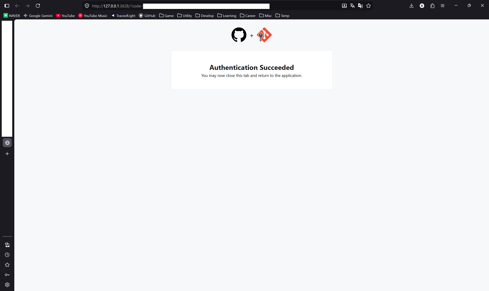
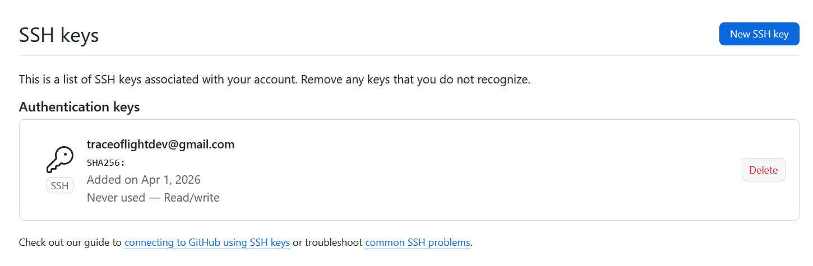

### 1. Project Abstract

개발 워크스테이션을 구성하고, Docker와 Git의 기본 동작을 직접 검증한 결과를 정리한 문서

- 터미널 조작 로그를 남기고 파일/디렉터리 권한 의미를 확인
- Docker 설치 상태, 이미지/컨테이너 운영 명령, `hello-world`, `ubuntu`, 커스텀 Nginx 이미지를 검증
- 포트 매핑, 바인드 마운트, 볼륨 영속성을 각각 실행 결과로 확인
- 외부 Git 통신과 commit, GitHub 로그인/연동

> 프로젝트 디렉토리 구조를 나눈 기준

- `app/`: 이미지에 포함될 실제 웹 정적 파일을 모아 Docker build 컨텍스트를 단순하게 유지
- `bind-mount-site/`: 이미지에 복사되는 파일과 분리해서, 바인드 마운트 실험 시 호스트 변경 반영 여부만 독립적으로 검증
- `docs/plans/`: 설계/실행 계획 문서를 분리해 README 본문은 결과 중심으로 유지
- 루트의 `Dockerfile`, `docker-compose.yml`, `.env`: 실행 진입점을 루트에 두어 평가자가 저장소 최상위에서 바로 빌드/실행 가능하게 구성

> 포트/볼륨을 재현 가능하게 정리한 방식

- 단일 컨테이너 실습은 `-p 4000:80`, `-p 4001:80`, `-v ws-data:/data`처럼 명령을 README에 그대로 남겨 같은 결과를 재현할 수 있게 했다.
- Compose 보너스는 `docker-compose.yml`과 `.env`로 분리하여 포트와 보조 서비스 메시지를 설정값으로 빼 두었다.
- 즉, 실행 명령과 설정 파일을 같이 남겨서 "이 저장소를 받은 사람이 같은 순서로 다시 검증할 수 있는가"를 기준으로 정리했다.

### 2. Runtime Environment

#### 실행 환경

Windows 11 IoT LTSC

WezTerm + Nushell 기반 터미널에서 처리 (일부분은 보기 편하도록 bash/zsh 기반 명령어로 의역) 

> docker version
```
> docker version
Client:
 Version:           29.3.1
 API version:       1.54
 Go version:        go1.25.8
 Git commit:        c2be9cc
 Built:             Wed Mar 25 16:16:33 2026
 OS/Arch:           windows/amd64
 Context:           desktop-linux

Server: Docker Desktop 4.66.1 (222799)
 Engine:
  Version:          29.3.1
  API version:      1.54 (minimum version 1.40)
  Go version:       go1.25.8
  Git commit:       f78c987
  Built:            Wed Mar 25 16:13:48 2026
  OS/Arch:          linux/amd64
  Experimental:     false
 containerd:
  Version:          v2.2.1
  GitCommit:        dea7da592f5d1d2b7755e3a161be07f43fad8f75
 runc:
  Version:          1.3.4
  GitCommit:        v1.3.4-0-gd6d73eb8
 docker-init:
  Version:          0.19.0
  GitCommit:        de40ad0
```

> git version

```
> git --version
git version 2.50.1.windows.1
```

### 3. Checklist

#### 저장소 및 기술 문서

- Repo Link 제출 (V)
  - `https://github.com/TraceofLight/1_month_crunch`
- README
  - 기술 문서에서 수행 결과 확인 가능 (V)
  - 프로젝트 개요 (V)
  - 실행 환경 (V)
  - 수행 항목 체크리스트 (V)
  - 검증 방법 및 결과 위치 / 증거 링크 (V)
- 기술 문서 내 명령 및 출력을 코드 블럭으로 정리할 것 (V)

#### 검증 방법 및 결과 위치

- 권한 실습: `### 5. 권한 실습`
- Docker 설치 및 점검: `### 6. Docker 설치 및 기본 점검`
- Docker 운영 명령: `### 7. Docker 기본 운영 명령 수행`
- 컨테이너 실행 실습: `### 8. 컨테이너 실행 실습`
- 커스텀 이미지 / 포트 매핑: `### 9. Dockerfile 기반 커스텀 이미지 제작`, `### 10. 포트 매핑 접속 증거`
- 볼륨 영속성: `### 11. Docker 볼륨 영속성 검증`
- Git 설정: `### 12. Git 설정 및 Github 연동`
- 브라우저 접속 이미지: `html_load.png`

#### 터미널 조작 로그 기록

- 터미널로 수행한 뒤, 명령어와 출력 결과를 기술 문서에 기록 (V)
  - 현재 위치 확인 (V)
  - 목록 확인 (숨김 파일 포함) (V)
  - 이동 (V)
  - 생성 (V)
  - 복사 (V)
  - 이동 / 이름 변경 (V)
  - 삭제 (V)
  - 파일 내용 확인 (V)
  - 빈 파일 생성 (V)

#### 권한 실습 및 증거 기록

- 확인/변경하는 명령을 수행하고, 전후 비교를 기술 문서에 남길 것 (V)
  - 파일 (V)
  - 디렉토리 (V)

#### Docker 설치 및 기본 점검

- Docker 버전 확인 결과 기록 (V)
- Docker Daemon 동작 여부 확인 결과 기록 (V)

#### Docker 기본 운영 및 명령 수행

- 이하의 수행 명령과 출력 결과를 기술 문서에 남길 것 (V)

  - 이미지: 다운로드 / 목록 확인 (V)
  - 컨테이너: 실행 / 중지 / 목록 확인 (V)
  - 운영: 로그 확인 (V)

#### 컨테이너 실행 실습

- hello-world 실행 성공 기록 (V)
- ubuntu 컨테이너 실행 후 내부 진입하여 간단 명령의 수행 결과 기록 (V)
- 컨테이너 종료 / 유지의 차이를 스스로 관찰하고 간단히 정리 (V)

#### Dockerfile 기반 커스텀 이미지 제작

- 웹 서버 베이스 이미지 활용 + 정적 콘텐츠/설정만 교체 (V)
  - 커스텀 이미지 빌드 성공 및 컨테이너 실행 성공 (V)
    - 어떤 베이스 사용했는지 (V)
    - 내가 적용한 커스텀 포인트 (V)
    - 빌드 / 실행 명령 + 핵심 결과 (V)

#### 포트 매핑 및 접속 증거

- 브라우저 접속 화면 첨부 (V)

#### Docker Volume 영속성 검증

- 볼륨 생성 후 컨테이너 연결, 삭제 전후로 데이터의 유지를 증명하여 기술 문서에 기재할 것 (V)

#### Git 설정 및 Github 연동

- Git 사용자 정보 / 기본 브랜치 설정 완료하고 git config --list 결과를 기록 (V)
- Github 로그인 및 저장소 연동을 완료하고, 연동 증거를 기술 문서에 첨부할 것 (V)

#### 보안 및 개인정보 보호

- Key 포함되지 않도록 마스킹되었는지 추후 확인할 것 (V)

#### Bonus

- docker-compose.yml의 기본 구조를 학습 후 단일 서비스를 Compose로 실행 (V)
- Compose 멀티 컨테이너를 활용하여 컨테이너 간의 네트워크 통신이 가능한지 확인 (V)
- Compose 운영 명령어 사용하고 관련 내용 기록 (V)
  - up (V)
  - down (V)
  - ps (V)
  - logs (V)
- 환경 변수 활용 (V)
- Github SSH 키 설정 (V)
  - SSH Push 처리를 위한 Key 등록 후 동작 확인 (V)

### 4. 터미널 조작 로그

> pwd: 현 위치 조회

```
d:\Projects\Github\1_month_crunch
```

> ls & ls -a: 목록 확인

```
❯ ls
 e1-1   README.md
❯ ls -a
 .   ..   .git   e1-1   README.md
```

> mv: 이동 / 이름 변경

```
1. 단순 이동
❯ ls
 app   control_this.txt   Dockerfile   docs   html_load.png   README.md
❯ mv control_this.txt app\
❯ ls
 app   Dockerfile   docs   html_load.png   README.md
❯ cd app\
❯ ls
 control_this.txt   index.html

2. 이름 변경
❯ ls
 index.html
❯ cd ..
❯ ls
 app   control_this.txt   Dockerfile   docs   html_load.png   README.md
❯ mv control_this.txt app\rename_this.txt
❯ ls
 app   Dockerfile   docs   html_load.png   README.md
❯ cd app\
❯ ls
 index.html   rename_this.txt
```

> touch: 빈 파일 생성

```
❯ ls
 app   Dockerfile   docs   html_load.png   README.md
❯ touch control_this.txt
❯ ls
 app   control_this.txt   Dockerfile   docs   html_load.png   README.md
```

> cp: 복사

```
❯ ls
 index.html
❯ cd ..
❯ ls
 app   control_this.txt   Dockerfile   docs   html_load.png   README.md
❯ cp control_this.txt app\
❯ cd app\
❯ ls
 control_this.txt   index.html
```

> rm: 삭제

```
❯ ls
 index.html   rename_this.txt
❯ rm rename_this.txt
❯ ls
 index.html
```

> cat: 파일 내용 출력

```
❯ ls
 index.html
❯ vi show_me.txt (vim을 활용하여 내부에 내용 입력)
❯ ls
 index.html   show_me.txt
❯ cat show_me.txt
Hello, Codyssey!
```

> \> / \>>: Redireaction Command를 활용한 내용 있는 파일 작성

```
❯ ls
 index.html
❯ "hello, world!" >> a.txt
❯ ls
 a.txt   index.html
❯ cat a.txt
hello, world!
```

### 5. 권한 실습

Git Bash의 `chmod` 결과가 POSIX 퍼미션 비트와 완전히 동일하게 보이지 않아, Ubuntu 컨테이너 내부에서 파일 1개와 디렉토리 1개를 대상으로 권한 변경을 검증

> 파일/디렉토리 권한 변경 전후 비교

```powershell
> docker run --rm ubuntu bash -lc "mkdir -p /perm-lab/dir && touch /perm-lab/file.txt && chmod 600 /perm-lab/file.txt && chmod 700 /perm-lab/dir && echo '[before]' && ls -l /perm-lab/file.txt && ls -ld /perm-lab/dir && chmod 644 /perm-lab/file.txt && chmod 755 /perm-lab/dir && echo '[after]' && ls -l /perm-lab/file.txt && ls -ld /perm-lab/dir"
[before]
-rw------- 1 root root 0 Apr  1 07:48 /perm-lab/file.txt
drwx------ 2 root root 4096 Apr  1 07:48 /perm-lab/dir
[after]
-rw-r--r-- 1 root root 0 Apr  1 07:48 /perm-lab/file.txt
drwxr-xr-x 2 root root 4096 Apr  1 07:48 /perm-lab/dir
```

> 해석

- `600`: 소유자만 읽기/쓰기 가능
- `700`: 소유자만 읽기/쓰기/실행 가능
- `644`: 소유자 `rw-`, 그룹 `r--`, 기타 `r--`
- `755`: 소유자 `rwx`, 그룹 `r-x`, 기타 `r-x`

> 절대 경로와 상대 경로 선택 기준

- 절대 경로는 시작 위치와 무관하게 같은 파일을 가리켜야 할 때 사용한다.
  - 예: `D:\Projects\Github\1_month_crunch\bind-mount-site`
- 상대 경로는 현재 작업 디렉터리가 분명하고, 저장소를 다른 환경으로 옮겨도 구조만 같으면 그대로 쓰고 싶을 때 사용한다.
  - 예: `.\app`, `.\bind-mount-site`
- 이번 미션에서는 README 설명과 Docker 명령은 재현성을 위해 상대 경로 중심으로 적고, 위치 설명이 필요할 때만 절대 경로를 함께 언급했다.

### 6. Docker 설치 및 기본 점검

> docker --version

```powershell
> docker --version
Docker version 29.3.1, build c2be9cc
```

> docker info

```powershell
> docker info
Server:
 Containers: 4
 Images: 5
 Server Version: 29.3.1
 Storage Driver: overlayfs
 Operating System: Docker Desktop
 OSType: linux
 Architecture: x86_64
 CPUs: 32
 Total Memory: 30.2GiB
 Name: docker-desktop
```

### 7. Docker 기본 운영 명령 수행

> 이미지 다운로드 / 목록 확인

```powershell
> docker pull hello-world
Status: Image is up to date for hello-world:latest

> docker pull ubuntu
Status: Downloaded newer image for ubuntu:latest

> docker images
IMAGE                          ID             DISK USAGE   CONTENT SIZE
hello-world:latest             452a468a4bf9       25.9kB         9.49kB
nginx:latest                   7150b3a39203        240MB         65.8MB
ubuntu:latest                  186072bba1b2        119MB         31.7MB
workstation-nginx:1.0          ac2096f33c30        237MB           63MB
```

> 컨테이너 목록 확인

```powershell
> docker ps -a
CONTAINER ID   IMAGE         COMMAND                  STATUS
8fe9caba7f2f   hello-world   "/hello"                 Exited (0)
80c2bf45be08   e1-1-nginx    "/docker-entrypoint.…"   Exited (255)
820c30233329   nginx         "/docker-entrypoint.…"   Exited (255)
5e71add1324b   nginx         "/docker-entrypoint.…"   Exited (0)
```

> 로그 확인

```powershell
> docker logs ws-web
/docker-entrypoint.sh: Configuration complete; ready for start up
172.17.0.1 - - [01/Apr/2026:07:49:58 +0000] "GET / HTTP/1.1" 200 1277
```

> 리소스 사용량 확인

```powershell
> docker stats --no-stream ws-ubuntu ws-web
CONTAINER ID   NAME        CPU %     MEM USAGE / LIMIT
be47274db30e   ws-ubuntu   0.00%     456KiB / 30.2GiB
541293ed257d   ws-web      0.00%     29.73MiB / 30.2GiB
```

### 8. 컨테이너 실행 실습

> hello-world 실행

```powershell
> docker run --name ws-hello hello-world
Hello from Docker!
This message shows that your installation appears to be working correctly.
```

> ubuntu 컨테이너 실행 후 내부 명령 수행

```powershell
> docker run -d --name ws-ubuntu ubuntu sleep infinity
be47274db30e56e607c865c55923fe644e78ec3a4c86131442e811bea576e1ef

> docker exec ws-ubuntu bash -lc "ls / | head -n 8 && echo inside-container && cat /etc/os-release | sed -n '1,3p'"
bin
boot
dev
etc
home
lib
lib64
media
inside-container
PRETTY_NAME="Ubuntu 24.04.4 LTS"
NAME="Ubuntu"
VERSION_ID="24.04"
```

> attach / exec 차이 관찰

```powershell
> docker create --name ws-attach-demo ubuntu bash -lc "echo attach-demo && exit 0"

> docker start -ai ws-attach-demo
attach-demo

> docker ps -a --filter name=ws-attach-demo
CONTAINER ID   IMAGE    COMMAND                  STATUS
338687ed3d09   ubuntu   "bash -lc 'echo ...'"   Exited (0)
```

- `attach`: 컨테이너의 기본 프로세스에 직접 붙는다. 기본 프로세스가 끝나면 컨테이너도 종료된다.
- `exec`: 이미 실행 중인 컨테이너 안에 별도 프로세스를 띄운다. 그래서 `sleep infinity` 기반 컨테이너는 계속 유지된다.

### 9. Dockerfile 기반 커스텀 이미지 제작

> 선택한 베이스

- 베이스 이미지: `nginx:latest`
- 선택 이유: 정적 웹 서버 실습, 포트 매핑, 바인드 마운트 검증을 한 번에 연결하기 쉬움

> 적용한 커스텀 포인트

- 기본 Nginx 정적 파일 제거
- `app/` 폴더의 HTML 파일을 이미지 안으로 복사
- 컨테이너 내부 `80` 포트를 외부와 연결 가능하게 노출

> Dockerfile

```dockerfile
FROM nginx:latest

RUN rm -rf /usr/share/nginx/html/*

COPY app/ /usr/share/nginx/html/

EXPOSE 80
```

> 빌드 / 실행 명령 및 핵심 결과

```powershell
> docker build -t workstation-nginx:1.0 .
#8 naming to docker.io/library/workstation-nginx:1.0 done
#8 DONE 0.3s

> docker run -d --name ws-web -p 4000:80 workstation-nginx:1.0
541293ed257d6cea8e887b1d73232881e233d346fdcdaf7d2437c8481119baa0

> (Invoke-WebRequest "http://localhost:4000").Content
<!DOCTYPE html>
...
<h1>Nginx is running</h1>
...
```

> 이미지와 컨테이너의 차이

- 이미지: `docker build` 결과로 만들어지는 읽기 전용 설계도다. `app/` 파일을 바꾸더라도 이미 빌드된 이미지는 자동으로 바뀌지 않는다.
- 컨테이너: 이미지를 `docker run`으로 실행한 인스턴스다. 실행 중 로그, 프로세스, 임시 파일시스템 상태는 컨테이너마다 달라질 수 있다.
- 빌드 관점: Dockerfile을 바꾸면 새 이미지를 다시 빌드해야 한다.
- 실행 관점: 같은 이미지로도 포트, 볼륨, 환경 변수에 따라 여러 컨테이너를 다르게 실행할 수 있다.
- 변경 관점: 컨테이너 내부에서 생긴 변경은 컨테이너 삭제 시 사라질 수 있지만, 이미지는 다시 빌드하기 전까지 동일하다.

### 10. 포트 매핑 접속 증거

> HTTP 응답 확인

```powershell
> (Invoke-WebRequest "http://localhost:4000").Content
<h1>Nginx is running</h1>
This page is bundled from app/ inside the Docker image and exposed through localhost:4000.
```

> 브라우저 접속 화면


> 정리

- `-p 4000:80`은 호스트 `4000` 포트를 컨테이너 `80` 포트에 연결한다.
- 매핑이 없으면 브라우저에서 컨테이너 내부 웹 서버에 직접 접근할 수 없다.

### 11. Docker 볼륨 영속성 검증

> 생성 / 연결 / 검증

```powershell
> docker volume create ws-data
ws-data

> docker run -d --name ws-volume-1 -v ws-data:/data ubuntu sleep infinity
4929452a82b023f8e9d05d068d3d418daf28796ba55d70df8fa3fcbcf285322e

> docker exec ws-volume-1 bash -lc "echo persistent-note > /data/hello.txt && cat /data/hello.txt"
persistent-note

> docker rm -f ws-volume-1
ws-volume-1

> docker run -d --name ws-volume-2 -v ws-data:/data ubuntu sleep infinity
02d448d145438edf126e8ed6da0d20a147623dced3dc439fc8c38ce61cae580b

> docker exec ws-volume-2 bash -lc "cat /data/hello.txt"
persistent-note
```

> 바인드 마운트 반영 검증

```powershell
> docker run -d --name ws-bind -p 4001:80 -v "${PWD}\bind-mount-site:/usr/share/nginx/html:ro" nginx:latest
ce4711b1e42c5da5a7b43ed6a4144edb9f439c3a6576542f213352c1f9aee6f6

> (Invoke-WebRequest "http://localhost:4001").Content
<h1>Bind mount initial content</h1>
<p>Host file version: v1</p>

> (호스트의 bind-mount-site/index.html 수정 후)
> (Invoke-WebRequest "http://localhost:4001").Content
<h1>Bind mount updated content</h1>
<p>Host file version: v2</p>
```

> 정리

- 볼륨은 컨테이너를 삭제해도 데이터가 유지된다.
- 바인드 마운트는 호스트 파일 수정이 컨테이너 응답에 즉시 반영된다.

> 컨테이너 삭제 후 데이터 손실을 방지하는 대안

- 가장 기본적인 대안은 named volume을 사용해 데이터 저장 위치를 컨테이너 생명주기와 분리하는 것이다.
- 개발 중 설정 파일이나 코드처럼 호스트에서 직접 수정해야 하는 경우에는 bind mount가 유리하다.
- 운영 관점에서는 볼륨만으로 끝내지 않고, 주기적인 백업과 복구 절차를 같이 준비해야 데이터 유실 리스크를 더 줄일 수 있다.
- 즉 "삭제돼도 다시 만들 수 있는 것"은 이미지로, "삭제되면 안 되는 것"은 볼륨이나 외부 저장소로 분리하는 것이 핵심이다.

### 12. Git 설정 및 Github 연동

> git config --local --list

```powershell
> git config init.defaultBranch main

> git config --local --list
core.repositoryformatversion=0
core.filemode=false
core.bare=false
core.logallrefupdates=true
core.symlinks=false
core.ignorecase=true
remote.origin.url=https://github.com/TraceofLight/1_month_crunch.git
remote.origin.fetch=+refs/heads/*:refs/remotes/origin/*
branch.main.remote=origin
branch.main.merge=refs/heads/main
init.defaultbranch=main
```

> git config --list --show-origin

```powershell
> git config --list --show-origin | Select-String "user.name|user.email|init.defaultbranch|branch.main|remote.origin.url"
file:C:/Users/.../.gitconfig user.email=r***@gmail.com
file:C:/Users/.../.gitconfig user.name=T***********
file:.git/config remote.origin.url=https://github.com/TraceofLight/1_month_crunch.git
file:.git/config branch.main.remote=origin
file:.git/config branch.main.merge=refs/heads/main
file:.git/config init.defaultbranch=main
```

> Git 과 GitHub 역할 차이

- Git: 로컬 버전 관리 도구
- GitHub: 원격 저장소 및 협업 플랫폼

> Github 로그인 / VSCode 연동



> Github SSH Key 등록



> HTTPS 원격을 SSH 원격으로 변경

```powershell
> git remote -v
origin  https://github.com/TraceofLight/1_month_crunch.git (fetch)
origin  https://github.com/TraceofLight/1_month_crunch.git (push)

> git remote set-url origin git@github.com:TraceofLight/1_month_crunch.git

> git remote -v
origin  git@github.com:TraceofLight/1_month_crunch.git (fetch)
origin  git@github.com:TraceofLight/1_month_crunch.git (push)
```

> 프로젝트 로컬 키 사용 설정 및 검증

```powershell
> git config core.sshCommand "ssh -i ./e1-1/github_ed25519.key -o IdentitiesOnly=yes -o StrictHostKeyChecking=accept-new"

> git config --local --get core.sshCommand
ssh -i ./e1-1/github_ed25519.key -o IdentitiesOnly=yes -o StrictHostKeyChecking=accept-new

> git ls-remote origin
e4370764935ea09b2d82764ad9fde89f75818337    HEAD
e4370764935ea09b2d82764ad9fde89f75818337    refs/heads/e1-1
```

> 정리

- 공개키를 GitHub에 등록한 뒤 원격 저장소 URL을 HTTPS에서 SSH로 변경했다.
- 이 저장소는 저장소 루트 기준 상대 경로 `./e1-1/github_ed25519.key`를 사용하도록 `core.sshCommand`를 설정했다.
- `git ls-remote origin`이 성공했으므로 SSH 인증으로 원격 저장소를 읽을 수 있음을 확인했다.

### 13. Docker Compose 기초

`docker-compose.yml` 하나에 `profiles`를 두고 단일 서비스와 멀티 컨테이너 구성을 같이 관리했다.

> 환경 변수

```dotenv
WEB_PORT=4100
API_MESSAGE=hello-from-compose-env
```

> 단일 서비스용 Compose 설정 확인

```powershell
> docker compose --profile single config
name: 1_month_crunch
services:
  web:
    profiles:
      - single
      - multi
    build:
      context: D:\Projects\Github\1_month_crunch
      dockerfile: Dockerfile
    ports:
      - published: "4100"
        target: 80
```

> 단일 서비스 실행

```powershell
> docker compose --profile single up -d --build
[+] Running 1/1
 ✔ Container 1_month_crunch-web-1  Started

> (Invoke-WebRequest "http://localhost:4100").Content
<!DOCTYPE html>
...
<h1>Nginx is running</h1>
...
```

### 14. Docker Compose 멀티 컨테이너

`multi` 프로필에서는 `web`, `echo`, `probe` 3개 서비스를 함께 실행했다.

- `web`: 기존 Nginx 웹 서버
- `echo`: `hashicorp/http-echo` 기반 보조 서비스
- `probe`: 내부 네트워크에서 다른 서비스로 `curl`을 보내는 검증용 컨테이너

> 멀티 컨테이너 설정 확인

```powershell
> docker compose --profile multi config
name: 1_month_crunch
services:
  echo:
    image: hashicorp/http-echo:1.0.0
    command:
      - -listen=:5678
      - -text=hello-from-compose-env
  probe:
    image: curlimages/curl:8.12.1
  web:
    build:
      context: D:\Projects\Github\1_month_crunch
      dockerfile: Dockerfile
```

> 멀티 컨테이너 실행 및 서비스 디스커버리 확인

```powershell
> docker compose --profile multi up -d --build
[+] Running 3/3
 ✔ Container 1_month_crunch-echo-1   Started
 ✔ Container 1_month_crunch-web-1    Started
 ✔ Container 1_month_crunch-probe-1  Started

> docker compose --profile multi exec -T probe curl -s http://echo:5678
hello-from-compose-env

> docker compose --profile multi exec -T probe curl -s http://web
<!DOCTYPE html>
<html lang="ko">
...
<h1>Nginx is running</h1>
...
```

### 15. Compose 운영 명령어

> `ps`

```powershell
> docker compose --profile multi ps
NAME           IMAGE                       COMMAND                  SERVICE   STATUS
1_month_crunch-echo-1    hashicorp/http-echo:1.0.0   "/http-echo -listen=…"   echo      Up
1_month_crunch-probe-1   curlimages/curl:8.12.1      "/entrypoint.sh sh -…"   probe     Up
1_month_crunch-web-1     1_month_crunch-web          "/docker-entrypoint.…"   web       Up
```

> `logs`

```powershell
> docker compose --profile multi logs web echo --tail=20
web-1   | 172.18.0.4 - - [01/Apr/2026:08:16:32 +0000] "GET / HTTP/1.1" 200 1277 "-" "curl/8.12.1" "-"
echo-1  | 2026/04/01 08:16:28 [INFO] server is listening on :5678
echo-1  | 2026/04/01 08:16:32 echo:5678 172.18.0.4:57562 "GET / HTTP/1.1" 200 23 "curl/8.12.1"
```

> `down`

```powershell
> docker compose --profile multi down
[+] Running 4/4
 ✔ Container 1_month_crunch-probe-1  Removed
 ✔ Container 1_month_crunch-echo-1   Removed
 ✔ Container 1_month_crunch-web-1    Removed
 ✔ Network 1_month_crunch_default    Removed

> docker compose --profile multi ps -a
NAME      IMAGE     COMMAND   SERVICE   CREATED   STATUS    PORTS
```

### 16. 환경 변수 활용

Compose에서 `.env`를 읽어 포트와 보조 서비스 응답 문구를 바꿨다.

> `.env`

```dotenv
WEB_PORT=4100
API_MESSAGE=hello-from-compose-env
```

> 적용 결과

- `WEB_PORT=4100` 이므로 단일/멀티 Compose 실행 시 웹 서버가 `http://localhost:4100` 으로 열렸다.
- `API_MESSAGE=hello-from-compose-env` 이므로 `probe` 컨테이너에서 `http://echo:5678`로 요청했을 때 동일한 문자열이 반환됐다.
- 즉, 설정값을 이미지 수정 없이 Compose 환경 변수로 분리할 수 있음을 확인했다.

### 17. 트러블슈팅

> 1. Docker 데몬 연결 실패

- 문제: 처음 `docker info` 실행 시 Docker API 연결 오류가 발생했다.
- 원인 가설: Docker Desktop 엔진이 아직 시작되지 않았을 수 있다.
- 확인: `failed to connect to the docker API at npipe:////./pipe/dockerDesktopLinuxEngine` 오류 확인
- 해결: Docker Desktop 실행 후 `docker info` 재실행으로 정상 응답 확인

> 2. Windows에서 chmod 결과가 기대와 다르게 표시됨

- 문제: Git Bash에서 `chmod 600`, `chmod 700`을 적용해도 출력이 POSIX 환경처럼 변하지 않았다.
- 원인 가설: NTFS 권한 모델과 Git Bash의 퍼미션 표현이 완전히 일치하지 않는다.
- 확인: 권한 변경 전후 `ls -l` 출력이 동일했다.
- 해결: Ubuntu 컨테이너 내부에서 동일 실습을 수행해 `600/700 -> 644/755` 결과를 확인했다.

> 3. 호스트 포트가 이미 사용 중일 때 진단 순서

- 1단계: `docker run -p 4000:80 ...` 또는 `docker compose up` 시 포트 충돌 오류 문구를 먼저 확인한다.
- 2단계: `docker ps`로 이미 같은 포트를 쓰는 다른 컨테이너가 있는지 본다.
- 3단계: 컨테이너가 아니라 호스트 프로세스가 점유했을 가능성을 보고 `netstat -ano | findstr 4000` 같은 명령으로 점유 PID를 찾는다.
- 4단계: 찾은 PID를 작업 관리자나 `Get-Process -Id <PID>`로 확인해 어떤 프로그램인지 식별한다.
- 5단계: 필요하면 기존 프로세스를 종료하거나, 과제용 컨테이너 포트를 `4001`, `4100`처럼 다른 값으로 바꿔 재실행한다.
- 이 순서를 쓰는 이유는 "컨테이너 충돌인지, 호스트 프로세스 충돌인지"를 먼저 나눠야 불필요한 재빌드를 줄일 수 있기 때문이다.

> 4. 이번 미션에서 가장 어려웠던 지점과 해결 과정

- 가장 어려웠던 지점은 Windows 호스트 환경에서 Linux 권한/경로/컨테이너 동작을 그대로 설명 가능한 형태로 남기는 것이었다.
- 가설: 호스트 NTFS와 Git Bash 출력만으로는 과제에서 요구하는 POSIX 퍼미션 의미를 충분히 증명하기 어렵다.
- 확인: 실제로 `chmod` 전후 출력이 기대처럼 바뀌지 않았고, 이 상태로는 "권한 규칙을 이해했다"는 근거가 약했다.
- 조치: Ubuntu 컨테이너 내부에서 동일 실험을 다시 수행해 Linux 기준 결과를 확보했고, README에는 왜 호스트 대신 컨테이너에서 검증했는지까지 같이 설명했다.
- 이 과정에서 단순히 명령이 실행됐다는 사실보다, "평가자가 봤을 때 해석 가능한 증거인가"를 기준으로 문서를 보강해야 한다는 점을 배웠다.
