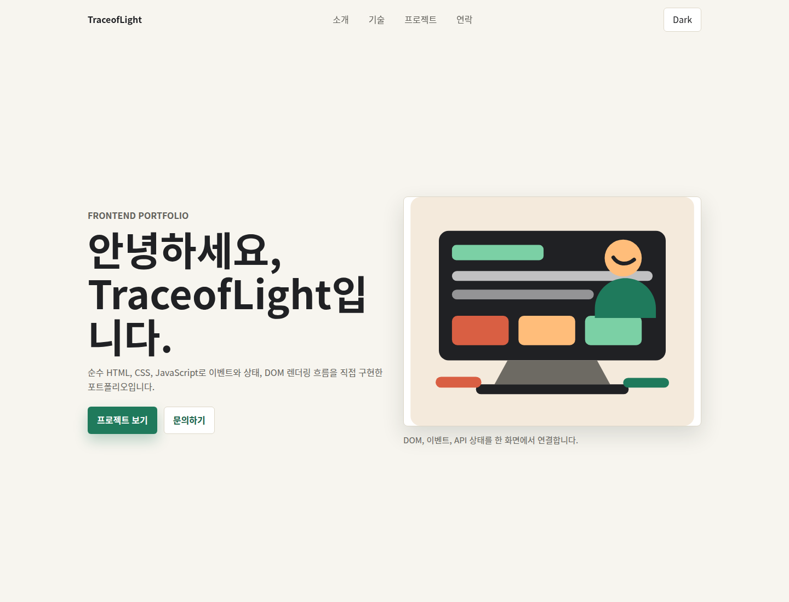
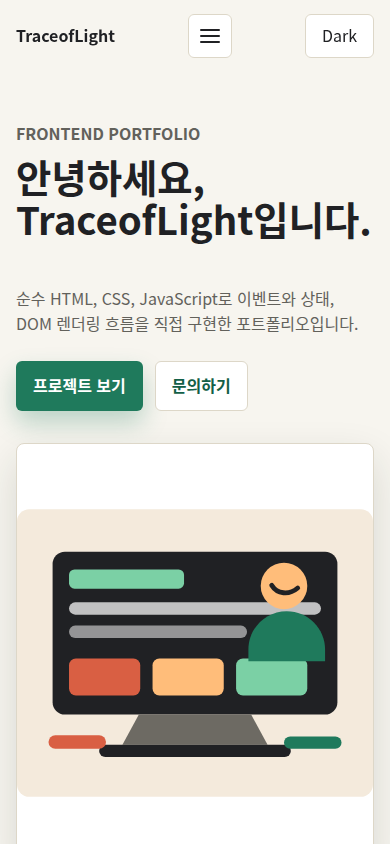
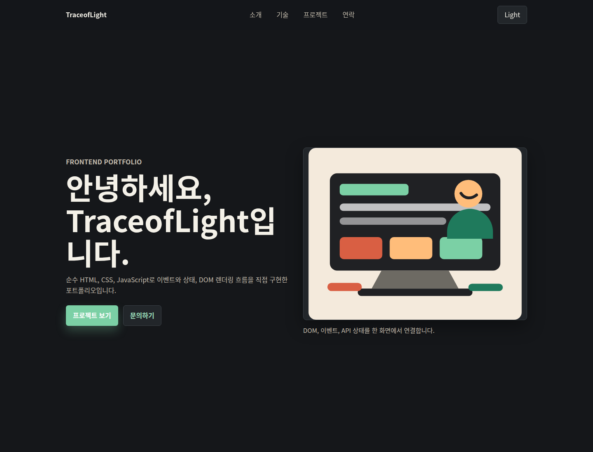

# TraceofLight 반응형 포트폴리오

순수 HTML, CSS, JavaScript만으로 만든 개인 포트폴리오 웹사이트다. React, Vue, jQuery, Bootstrap, Tailwind CSS를 사용하지 않고 브라우저 기본 기능으로 시맨틱 마크업, 반응형 레이아웃, 사용자 이벤트, DOM 조작, 비동기 API 상태 처리를 구현했다.

GitHub 저장소 URL: https://github.com/TraceofLight/ai-assignment

배포 URL: https://traceoflight.github.io/ai-assignment/

2026-06-08 검증 시점에 배포 URL은 HTTP 200을 반환했고 현재 산출물의 식별자인 `TraceofLight Portfolio` 또는 `Frontend Portfolio`를 포함했다. 확인 결과는 `evidence/pages-check.txt`에 저장했다. 현재 저장소에는 `.github/workflows/pages.yml`이 포함되어 있으며, 브랜치가 푸시되면 GitHub Pages로 정적 파일을 배포하도록 구성했다.

## 스크린샷

데스크톱 화면



모바일 화면



다크 모드 화면



## 파일 구조

```text
.
├── index.html
├── css/
│   └── style.css
├── js/
│   └── main.js
├── images/
│   └── profile.svg
├── scripts/
│   └── run.py
├── evidence/
│   ├── desktop.png
│   ├── mobile.png
│   ├── dark-mode.png
│   ├── github-api-response.json
│   ├── pages-check.txt
│   └── run-log.txt
├── .github/
│   └── workflows/
│       └── pages.yml
└── Dockerfile
```

`index.html`은 메인 페이지, `css/style.css`는 전체 스타일과 반응형 레이아웃, `js/main.js`는 이벤트와 상태 렌더링, `images/profile.svg`는 프로필 시각 자료를 담당한다. 파일을 분리한 이유는 관심사를 나누기 위해서다. HTML은 문서 구조와 의미, CSS는 시각 표현과 반응형 규칙, JavaScript는 이벤트 처리와 상태 변경을 맡으면 한 파일을 고칠 때 다른 역할의 코드까지 함께 읽지 않아도 된다. 브라우저도 HTML을 먼저 파싱하고 외부 CSS와 `defer` JavaScript를 별도로 가져오므로, 구조와 표현과 동작의 책임을 파일 단위로 나누는 방식이 웹의 실행 흐름과도 맞다. `scripts/run.py`는 구조 검사, GitHub API 호출, 스크린샷 캡처, evidence 저장을 한 번에 실행하는 단일 검증 진입점이다.

## 실행 방법

로컬에서 빠르게 확인할 때는 VS Code Live Server로 `index.html`을 열면 된다. Live Server는 정적 파일을 개발 서버로 제공하므로 브라우저 새로고침 없이 HTML, CSS, JavaScript 변경 결과를 확인하기 쉽다.

재현 검증은 Docker로 실행한다.

```bash
docker build -t portfolio-site .
docker run --rm -v "$PWD:/app" -w /app portfolio-site
```

PowerShell에서는 다음 명령을 사용할 수 있다.

```powershell
docker build -t portfolio-site .
docker run --rm -v ${PWD}:/app -w /app portfolio-site
```

`Dockerfile`은 `ubuntu:24.04` 이미지를 digest로 고정하고, 검증에 필요한 `python3`, Chrome, 한글 렌더링용 `fonts-noto-cjk`를 설치한다. 프론트엔드 런타임에는 외부 라이브러리나 패키지 의존성이 없다.

## 구현 기능

| 요구사항 | 구현 위치 | 내용 |
| --- | --- | --- |
| Hero, About, Skills, Projects, Contact, Footer | `index.html` | 모든 주요 섹션을 포함한다. |
| 시맨틱 태그 | `index.html` | `header`, `nav`, `main`, `section`, `article`, `footer`를 사용한다. |
| 반응형 내비게이션 | `css/style.css`, `js/main.js` | 모바일에서는 햄버거 버튼, 데스크톱에서는 가로 메뉴를 사용한다. |
| 다크 모드 | `css/style.css`, `js/main.js` | `[data-theme="dark"]` 변수와 `localStorage` 저장을 사용한다. |
| 부드러운 스크롤 | `js/main.js` | 앵커 클릭 시 `scrollIntoView`로 이동한다. |
| 스크롤 탑 버튼 | `js/main.js` | 스크롤 300px 이상에서 표시된다. |
| 헤더 스타일 변경 | `js/main.js` | 스크롤 60px 이상에서 `scrolled` 클래스가 적용된다. |
| 스크롤 애니메이션 | `js/main.js` | `IntersectionObserver`의 `threshold`를 0.25로 설정했다. |
| GitHub API 연동 | `js/main.js` | `https://api.github.com/users/TraceofLight/repos`를 `fetch`와 `async/await`로 호출한다. |
| API 상태 UI | `index.html`, `js/main.js` | 로딩, 성공, 에러, 빈 상태를 렌더링한다. |
| 프로젝트 필터링 | `js/main.js` | 언어 목록을 만들고 `filter`로 프로젝트를 걸러낸다. |
| 문의 폼 검증 | `js/main.js` | 이름, 이메일, 메시지 필수값과 이메일 형식을 검사한다. |
| 타이핑 효과 | `js/main.js` | Hero 제목에 한 글자씩 표시되는 효과를 적용했다. |

## HTML 설계 기준

시맨틱 태그는 브라우저, 검색 엔진, 보조 기술이 페이지의 역할과 구조를 더 정확히 해석하게 만든다. 이 사이트는 상단 영역을 `header`, 이동 링크를 `nav`, 본문 흐름을 `main`, 기능별 구획을 `section`, 독립적으로 읽을 수 있는 소개와 프로젝트 카드를 `article`, 저작권과 외부 링크를 `footer`로 나눴다.

모든 섹션에는 내비게이션 앵커가 연결되어 있다. 프로필 이미지는 장식이 아니라 콘텐츠 의미를 전달하므로 `alt`에 “노트북 앞에서 웹 페이지를 설계하는 개발자 일러스트”를 넣었다. 문의 폼의 `label`은 각각 `for`와 입력 요소 `id`가 일치하도록 연결했다.

## CSS 설계 기준

CSS 변수는 색상, 폰트, 간격, 그림자, 반지름을 한곳에서 관리하기 위해 `:root`에 정의했다. 다크 모드는 같은 토큰 이름을 `[data-theme="dark"]`에서 다시 정의해 JavaScript가 `data-theme` 값만 바꾸면 전체 화면 색상이 바뀌도록 설계했다.

Flexbox와 Grid의 차이는 축의 수다. Flexbox는 기본적으로 한 방향의 흐름을 정렬하는 도구라서 로고, 메뉴, 다크 모드 버튼처럼 같은 줄에서 좌우 배치와 간격 조절이 중요한 내비게이션에 맞다. Grid는 행과 열을 동시에 설계하는 도구라서 Projects 카드처럼 카드 수와 화면 너비에 따라 여러 열이 생기고 다음 줄로 자연스럽게 넘어가야 하는 목록에 맞다. 내비게이션을 Grid로 만들 수도 있지만 한 줄 정렬만 필요한 곳에서는 규칙이 불필요하게 커진다. 반대로 프로젝트 목록을 Flexbox만으로 만들면 각 행의 열 너비를 균일하게 유지하는 제어가 Grid보다 번거롭다. 카드 목록은 `repeat(auto-fit, minmax(240px, 1fr))`로 작성해 화면 너비에 따라 열 수가 자동으로 바뀐다.

모바일 퍼스트를 선택한 이유는 제약이 큰 화면을 기본값으로 삼기 위해서다. 작은 화면에서는 내비게이션이 접혀야 하고, 텍스트와 카드가 한 열로 쌓여야 하며, 터치 영역도 충분히 커야 한다. 이 조건을 기본 스타일로 먼저 만족시키면 넓은 화면에서는 768px 이상에서 2열 레이아웃을 추가하고 1024px 이상에서 데스크톱 내비게이션을 펼치는 식으로 확장만 하면 된다. 데스크톱 스타일을 먼저 작성한 뒤 모바일에서 덜어내는 방식보다 중복 override가 적고, 실제 사용자가 모바일에서 처음 접속해도 핵심 콘텐츠가 먼저 안정적으로 보인다. 버튼과 카드에는 `transition`, `hover`, `box-shadow`를 적용해 클릭 가능한 요소와 정보 카드가 시각적으로 구분되도록 했다.

## JavaScript 흐름

DOM 선택은 `querySelector`와 `querySelectorAll`을 사용한다. 선택한 요소에는 HTML의 `onclick` 속성을 쓰지 않고 `addEventListener`로 `click`, `submit`, `scroll`, `input` 이벤트를 연결했다. `onclick`은 동작을 HTML 속성에 직접 섞는다. 그러면 마크업을 읽는 사람이 화면 구조와 실행 로직을 동시에 해석해야 하고, 같은 요소에 같은 이벤트의 여러 처리를 붙이기도 어렵다. `addEventListener`는 JavaScript 파일 안에서 이벤트 연결을 관리하므로 HTML은 구조에 집중하고 JavaScript는 동작에 집중한다. 또한 한 요소에 여러 리스너를 붙일 수 있고, `querySelectorAll`로 고른 여러 앵커에 `forEach`로 같은 스크롤 동작을 반복 연결할 수 있어 메뉴 링크와 CTA 링크를 일관되게 처리하기 쉽다. 이벤트 핸들러는 상태 객체를 바꾸고, 렌더링 함수가 `textContent`, `innerHTML`, `classList.add`, `classList.remove`, `classList.toggle`로 화면을 갱신한다.

화살표 함수는 짧은 이벤트 핸들러와 렌더링 헬퍼를 간결하게 표현하기 위해 사용했다. 구조분해 할당은 GitHub 저장소 객체에서 `name`, `description`, `html_url`, `language`, `stargazers_count`, `updated_at` 같은 필드를 꺼낼 때 사용했다. `map`은 저장소 배열을 프로젝트 카드 HTML로 변환하고, `filter`는 fork 저장소 제외와 언어 필터에 사용하며, `forEach`는 여러 링크와 폼 입력에 이벤트를 연결할 때 사용한다.

## 상태와 렌더링

다크 모드 흐름은 사용자가 토글 버튼을 클릭하면 `state.theme`이 바뀌고, `localStorage`에 저장된 뒤 `renderTheme`이 문서의 `data-theme`와 버튼 문구를 갱신한다. 새로고침 후에는 `localStorage` 값을 먼저 읽고, 없으면 `prefers-color-scheme` 결과를 사용한다.

프로젝트 흐름은 `loadProjects`가 시작될 때 `state.projectStatus`를 `loading`으로 바꾸고 로딩 문구를 표시한다. GitHub API 응답이 성공하면 저장소 배열을 별 개수와 이름 기준으로 정렬한 뒤 카드 목록을 렌더링한다. 응답이 실패하면 `error` 상태와 재시도 버튼을 표시한다. 필터 결과가 없으면 “표시할 프로젝트가 없습니다.” 문구를 보여준다.

폼 흐름은 `input` 이벤트마다 현재 `FormData`를 검사해 `state.formErrors`를 갱신하고, `renderFormErrors`가 각 입력 필드 근처의 오류 문구와 `aria-invalid`를 갱신한다. 제출 이벤트에서는 `event.preventDefault()`로 브라우저 기본 제출을 막고, 오류가 없을 때만 성공 메시지를 표시한다.

단순 변수 여러 개로 흩어지면 어떤 값이 현재 화면을 결정하는지 추적하기 어렵다. 예를 들어 `theme`, `projects`, `projectStatus`, `activeLanguage`, `formErrors`가 서로 다른 위치의 개별 변수로 존재하면 API 재시도나 필터 클릭처럼 여러 값이 함께 바뀌는 순간에 일부 값만 갱신되는 실수가 생기기 쉽다. 이 사이트는 `state` 객체를 화면의 현재 상태를 담는 단일 기준으로 두고, 이벤트 핸들러가 `state`를 바꾼 뒤 렌더링 함수를 호출한다. 이 구조는 React의 상태 변경 후 렌더링 흐름과 같은 사고방식을 순수 JavaScript에서 직접 확인하게 해 준다.

## API 처리와 예외

GitHub API 엔드포인트는 `https://api.github.com/users/TraceofLight/repos`다. 인증 없이 호출하므로 시간당 60회 제한을 받는다. 짧은 시간에 반복 새로고침하면 403 응답이 발생할 수 있고, 이 경우 Projects 섹션은 “GitHub API 호출 한도에 도달했습니다.” 또는 “프로젝트를 불러올 수 없습니다.” 메시지와 재시도 버튼을 표시한다.

`try/catch` 흐름은 네 단계로 나뉜다. 먼저 `loadProjects`가 `state.projectStatus`를 `loading`으로 바꾸고 `renderProjects`를 호출해 스피너와 “로딩 중...” 문구를 보여준다. 다음으로 `try` 블록에서 `await fetch(API_URL)`로 응답을 기다린다. 응답의 `ok`가 거짓이면 403일 때 레이트 리밋 메시지를 담은 `Error`를 만들고, 그 외 실패는 일반 오류로 `catch`에 넘긴다. 응답이 성공하면 `await response.json()`으로 저장소 배열을 읽고, `filter`로 fork를 제외한 뒤 별 개수와 이름 기준으로 정렬해서 `state.projects`에 저장하고 `state.projectStatus`를 `success`로 바꾼다. 네트워크 오류, 403, 404처럼 실패가 발생하면 `catch`에서 프로젝트 배열을 비우고 `state.projectStatus`를 `error`로 바꾸며 `state.projectError`에 표시할 문구를 넣는다. 마지막에는 성공과 실패 모두 공통으로 `renderProjects`를 호출해 현재 상태에 맞는 카드, 빈 상태, 오류 메시지, 재시도 버튼을 화면에 반영한다.

동적 HTML은 GitHub API에서 받은 텍스트를 `escapeHtml`로 이스케이프한 뒤 `innerHTML`에 넣는다. 저장소 설명이 없을 때는 “저장소 설명이 아직 없습니다.”를 표시한다. fork 저장소는 개인 프로젝트 목록의 노이즈를 줄이기 위해 제외했다.

## 보안과 위협 모델

외부 입력은 GitHub API 응답과 문의 폼 입력이다. GitHub 저장소 이름, 설명, URL, 언어 값은 외부 데이터로 보고 HTML 삽입 전에 이스케이프한다. 문의 폼은 실제 전송을 하지 않으므로 개인정보가 외부 서비스로 나가지 않는다.

API 레이트 리밋과 네트워크 장애는 정상적인 실패 시나리오로 처리한다. `try/catch`에서 실패 상태를 만들고 화면에 오류 메시지와 재시도 버튼을 보여준다. 배포는 정적 파일 기반 GitHub Pages라 서버 측 세션, 데이터베이스, 비밀 키가 없다. GitHub Actions workflow에는 Pages 배포에 필요한 `contents: read`, `pages: write`, `id-token: write` 권한만 선언했다.

## 검증 증거

| 증거 파일 | 내용 |
| --- | --- |
| `evidence/run-log.txt` | Docker 컨테이너에서 실행한 자동 검증 로그다. 정적 요구사항 검사, GitHub API 응답, 스크린샷 캡처가 통과했다. |
| `evidence/github-api-response.json` | `TraceofLight` 계정의 GitHub 저장소 API 원본 응답이다. 검증 시점에는 저장소 25개가 반환됐다. |
| `evidence/desktop.png` | 1440px 데스크톱 화면 캡처다. |
| `evidence/mobile.png` | 390px 모바일 화면 캡처다. |
| `evidence/dark-mode.png` | 다크 모드 화면 캡처다. |
| `evidence/pages-check.txt` | GitHub Pages API와 공개 URL 확인 결과다. |

최근 검증 로그 요약:

```text
정적 요구사항 검사: 통과
GitHub API 응답 성공: HTTP 200, 저장소 25개
desktop.png 캡처 완료
mobile.png 캡처 완료
dark-mode.png 캡처 완료
모든 자동 검증 항목 통과
```

## 문제 해결

프로젝트 카드가 보이지 않으면 먼저 브라우저 개발자 도구의 Network 탭에서 `https://api.github.com/users/TraceofLight/repos` 응답을 확인한다. 403이면 인증 없는 GitHub API 호출 한도에 걸린 상태이므로 시간을 두고 다시 시도한다. 네트워크 오류면 Projects 섹션의 재시도 버튼을 누른다.

다크 모드가 새로고침 후 유지되지 않으면 개발자 도구 Application 탭에서 `localStorage`의 `theme` 값을 확인한다. 값은 `dark` 또는 `light`여야 한다. 잘못된 값이 있으면 삭제하고 다시 토글한다.

모바일 메뉴가 보이지 않으면 화면 너비가 1024px 미만인지 확인한다. 1024px 이상에서는 데스크톱 메뉴가 항상 보이고 햄버거 버튼은 숨겨진다.

문의 폼이 제출되지 않으면 입력 필드 아래 오류 메시지를 확인한다. 이름, 이메일, 메시지는 모두 필수이며 이메일은 `name@example.com` 형식이어야 한다.

스크린샷 검증에서 한글이 네모로 보이면 Docker 이미지가 최신인지 확인한다. `Dockerfile`에는 `fonts-noto-cjk`가 포함되어 있으므로 이미지를 다시 빌드하면 한글 폰트가 설치된다.
