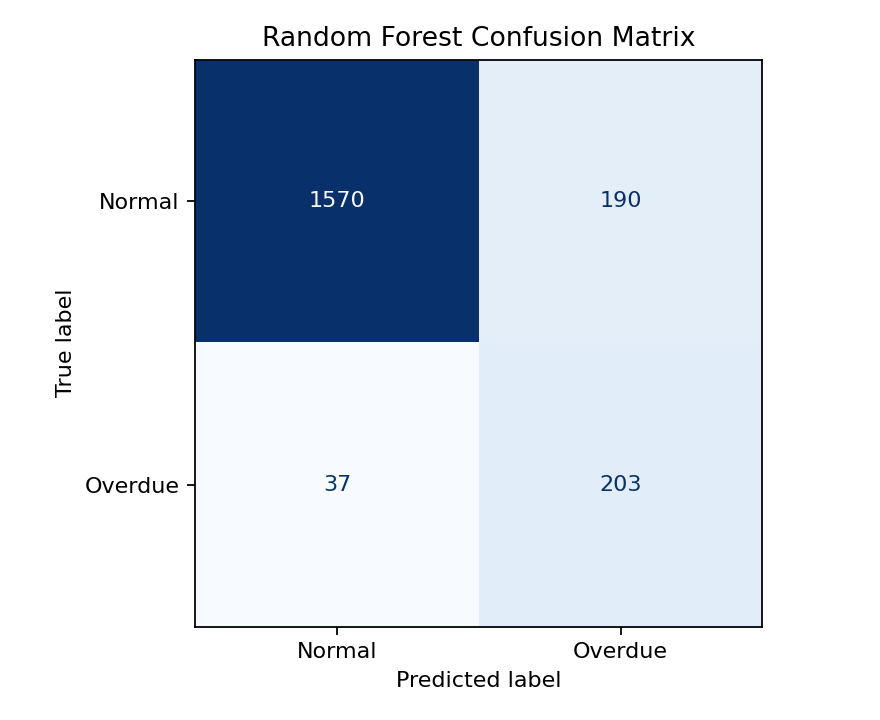
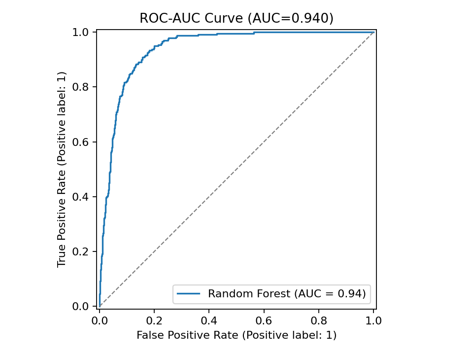
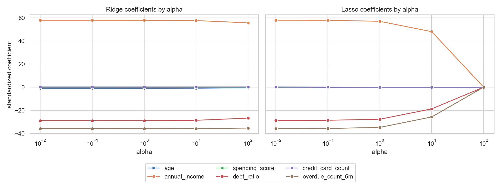
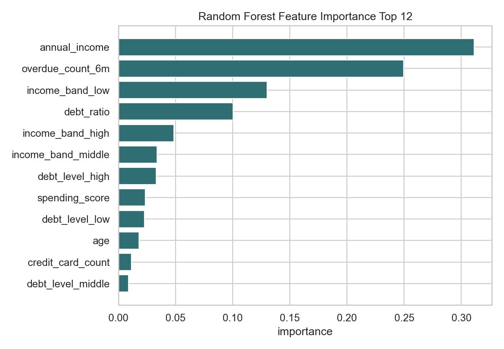

# 금융 리스크 관리 AI 시스템

은행 대출 심사 상황을 가정해 고객 10,000명의 금융 데이터를 생성하고, 규칙 기반 베이스라인과 지도학습 모델을 비교한다. 같은 6개 입력 변수로 신용 점수 회귀와 연체 위험 분류를 모두 수행하며, 전처리부터 학습, 평가, 시각화 저장까지 `scripts/run.py` 하나로 재현된다.

## 실행 방법

Python 3.10 이상에서 실행한다.

```bash
python -m venv .venv
.venv\Scripts\activate
pip install -r requirements.txt
python data_gen.py
python scripts/run.py
```

빠른 구조 검증만 필요하면 Random Forest 탐색 조합을 줄인다.

```bash
python scripts/run.py --fast
```

주요 옵션은 다음과 같다.

| 옵션 | 용도 |
| --- | --- |
| `--generate-data` | 실행 전에 `finance_data.csv`를 다시 생성한다. |
| `--data-path` | 기본값 대신 다른 CSV 경로를 읽는다. |
| `--evidence-dir` | 성능 표와 그래프 저장 위치를 바꾼다. |
| `--fast` | 빠른 점검용으로 GridSearchCV 후보를 줄인다. |

## 산출물 구조

```text
.
├── data_gen.py
├── scripts/run.py
├── src/finance_risk/
│   ├── data.py
│   ├── experiment.py
│   └── modeling.py
├── tests/test_finance_risk_pipeline.py
├── evidence/
│   ├── metrics.json
│   ├── classification_comparison.csv
│   ├── classification_confusion_matrix.png
│   ├── classification_roc_curve.png
│   ├── regression_metrics.csv
│   ├── regression_coefficients.png
│   └── feature_importance.png
├── requirements.txt
└── .gitignore
```

`finance_data.csv`는 실행 시 생성되는 데이터 파일이므로 `.gitignore`에 의해 저장소 업로드 대상에서 제외된다. `evidence/`의 표와 이미지는 평가 근거로 보존한다.

## 데이터

데이터는 과제에서 제공한 생성 로직을 `data_gen.py`와 `src/finance_risk/data.py`에 구현해 만든다. 외부 데이터는 사용하지 않았다.

| 항목 | 값 |
| --- | --- |
| 샘플 수 | 10,000 |
| 입력 변수 | `age`, `annual_income`, `spending_score`, `debt_ratio`, `credit_card_count`, `overdue_count_6m` |
| 회귀 타겟 | `credit_score` |
| 분류 타겟 | `is_overdue` |
| 연체 비율 | 12.01% |
| 신용 점수 범위 | 78점 ~ 676점 |

연체 비율이 12.01%라서 단순 Accuracy만 보면 다수 클래스 예측이 과대평가될 수 있다. 분류 평가는 Accuracy와 함께 Precision, Recall, F1-Score, AUC를 같이 사용했다.

## 데이터 파이프라인

학습과 평가는 `train_test_split(test_size=0.2, stratify=is_overdue, random_state=42)`로 나눈 뒤 수행한다. 결과 데이터 기준 학습 세트 8,000건, 테스트 세트 2,000건이며 학습 세트 연체 비율은 12.0125%, 테스트 세트 연체 비율은 12.00%다.

전처리는 Scikit-learn `Pipeline`과 `ColumnTransformer`로 구성했다.

| 처리 대상 | 처리 방식 |
| --- | --- |
| 수치형 6개 원본 변수 | `SimpleImputer(strategy="median")` 후 `StandardScaler` |
| 파생 범주형 변수 | `SimpleImputer(strategy="most_frequent")` 후 `OneHotEncoder(handle_unknown="ignore")` |
| 파생 범주형 | `income_band`, `debt_level`, `age_band` |

`CustomerRiskFeatureAdder`는 `BaseEstimator`, `TransformerMixin`을 상속한 사용자 정의 변환기다. 파생 범주형 변수는 소득, 부채 비율, 연령 구간을 구간화해 만든다. 이 변환기와 스케일러, 인코더는 모두 모델 `Pipeline` 내부에 있으므로 테스트 세트로 `fit`되지 않는다.

분류 모델에는 `credit_score`를 입력하지 않았다. `is_overdue`가 `credit_score` 하위 분위와 무작위 노이즈로 만들어졌기 때문에, `credit_score`를 분류 입력 변수로 넣으면 실제 대출 심사 입력보다 과도하게 쉬운 데이터 누수가 발생한다.

## 규칙 기반 베이스라인

베이스라인은 `if-else` 조건 6개로 연체 위험을 판단한다.

1. 최근 6개월 연체 횟수가 3회 이상이면 고위험
2. 부채 비율이 75% 이상이고 연 소득이 5,000만원 미만이면 고위험
3. 연 소득이 2,500만원 미만이고 최근 연체가 1회 이상이면 고위험
4. 신용카드가 8개 이상이고 소비 점수가 80점 이상이면 고위험
5. 부채 비율이 60% 이상이고 신용카드가 7개 이상이면 고위험
6. 30세 미만이면서 부채 비율이 70% 이상이고 소비 점수가 70점 이상이면 고위험

규칙 기반 방식은 설명이 쉽고 감사 대응이 빠르지만, 변수 간 상호작용과 확률적 경계를 학습하지 못한다. 이번 실험에서도 Recall은 0.7458로 나쁘지 않았지만 Precision이 0.2968에 머물러 정상 고객을 고위험으로 분류하는 비용이 컸다.

## 분류 모델

불균형 처리는 `class_weight="balanced"`를 선택했다. SMOTE는 합성 샘플을 만들기 때문에 작은 과제 데이터에서는 경계가 인위적으로 바뀔 수 있고, 이번 데이터는 원본 생성 과정 자체가 명확하므로 클래스 가중치로 손실 기여도를 보정했다.

Random Forest는 `GridSearchCV(scoring="roc_auc", cv=5)`로 튜닝했다. 후보 조합은 54개로 100개 이하를 유지했다.

| 파라미터 | 후보 |
| --- | --- |
| `n_estimators` | 80, 120, 160 |
| `max_depth` | 4, 8, None |
| `min_samples_leaf` | 1, 3, 5 |
| `max_features` | sqrt, None |

최적 조합은 `max_depth=8`, `max_features="sqrt"`, `min_samples_leaf=5`, `n_estimators=160`이며 5-fold CV AUC는 0.9467이다.

앙상블은 여러 개의 약한 학습기를 결합해 단일 모델의 불안정성을 줄이는 방식이다. Random Forest는 bootstrap 샘플과 무작위 feature subset으로 서로 다른 결정나무를 학습한 뒤 평균 또는 다수결로 예측하므로, 개별 나무의 높은 분산이 서로 상쇄된다. `max_depth`와 `min_samples_leaf`를 튜닝하면 너무 깊은 나무의 과대적합을 줄이고, 너무 얕은 나무의 편향 증가를 완화할 수 있다. 이번 데이터에서는 소득, 부채 비율, 최근 연체 횟수의 비선형 조합이 존재하므로 Random Forest가 규칙 기반 임계값보다 넓은 위험 패턴을 포착했다.

### 베이스라인 vs 머신러닝 성능

근거 파일: `evidence/classification_comparison.csv`, `evidence/metrics.json`

| 모델 | Accuracy | Precision | Recall | F1-Score | AUC |
| --- | ---: | ---: | ---: | ---: | ---: |
| 규칙 기반 베이스라인 | 0.7575 | 0.2968 | 0.7458 | 0.4247 | 0.7525 |
| Logistic Regression (balanced) | 0.8810 | 0.5024 | 0.8833 | 0.6405 | 0.9492 |
| Random Forest (GridSearchCV) | 0.8865 | 0.5165 | 0.8458 | 0.6414 | 0.9403 |

Random Forest는 베이스라인 대비 Accuracy가 0.7575에서 0.8865로 17.03%, F1-Score가 0.4247에서 0.6414로 51.03% 개선됐다. Logistic Regression은 AUC가 0.7525에서 0.9492로 26.15% 개선됐다. 선형 모델은 데이터 생성 규칙의 선형성이 강해 AUC가 가장 높았고, Random Forest는 F1-Score와 Accuracy가 가장 높아 승인/보류 운영 지표에 유리했다.

혼동 행렬 근거: `evidence/classification_confusion_matrix.png`



테스트 세트 2,000건에서 Random Forest 혼동 행렬은 TN 1,570건, FP 190건, FN 37건, TP 203건이다. 연체 고객 240명 중 203명을 탐지해 Recall 0.8458을 달성했지만, 정상 고객 190명을 고위험으로 분류했다. 실제 은행 운영에서는 이 구간을 즉시 거절보다 보류/추가 심사로 연결하는 편이 적절하다.

ROC-AUC 근거: `evidence/classification_roc_curve.png`



## 회귀 모델

회귀는 같은 6개 입력 변수로 `credit_score`를 예측한다. Ridge와 Lasso 모두 alpha 후보 `0.01, 0.1, 1, 10, 100`을 적용했다. 예측값은 신용 점수의 유효 범위인 0~1000으로 clip했다.

근거 파일: `evidence/regression_metrics.csv`, `evidence/regression_coefficients.csv`, `evidence/regression_coefficients.png`

| 모델 | Alpha | RMSE | MAE | R² |
| --- | ---: | ---: | ---: | ---: |
| Lasso | 0.01 | 30.1183 | 23.9195 | 0.8613 |
| Lasso | 0.10 | 30.1208 | 23.9223 | 0.8612 |
| Ridge | 0.01 | 30.1208 | 23.9216 | 0.8612 |
| Ridge | 0.10 | 30.1208 | 23.9216 | 0.8612 |
| Ridge | 1.00 | 30.1208 | 23.9213 | 0.8612 |
| Ridge | 10.00 | 30.1215 | 23.9191 | 0.8612 |
| Ridge | 100.00 | 30.1627 | 23.9360 | 0.8608 |
| Lasso | 1.00 | 30.2203 | 23.9769 | 0.8603 |
| Lasso | 10.00 | 35.2368 | 28.2139 | 0.8101 |
| Lasso | 100.00 | 80.8737 | 64.7302 | -0.0004 |

Lasso alpha 0.01이 RMSE 30.1183, MAE 23.9195, R² 0.8613으로 가장 낮은 오차를 보였다. Ridge는 alpha가 커져도 계수를 0으로 만들지 않아 성능이 안정적이었고, Lasso는 alpha 10에서 16개 변환 변수 중 13개를 0으로 제거했다. Lasso alpha 100에서는 모든 계수가 0이 되어 평균 예측에 가까워졌고 R²가 -0.0004로 붕괴했다.



회귀 지표는 점수 예측 오차의 크기를 직접 설명한다. RMSE는 큰 오차를 더 강하게 벌하고, MAE는 평균적인 점수 차이를 직관적으로 보여주며, R²는 타겟 분산을 얼마나 설명했는지 나타낸다. 분류 지표인 AUC나 F1-Score는 임계값과 양성 클래스 탐지 품질을 다루므로 신용 점수 회귀 모델의 품질을 직접 설명하지 못한다.

## 특징 중요도

근거 파일: `evidence/feature_importance.csv`, `evidence/feature_importance.png`



| 순위 | 변수 | Importance |
| ---: | --- | ---: |
| 1 | `annual_income` | 0.3112 |
| 2 | `overdue_count_6m` | 0.2494 |
| 3 | `income_band_low` | 0.1301 |
| 4 | `debt_ratio` | 0.1005 |
| 5 | `income_band_high` | 0.0486 |

소득과 최근 연체 횟수가 전체 판단의 핵심 변수로 나타났다. `income_band_low`의 중요도가 높아 단순 선형 소득 값뿐 아니라 저소득 구간 여부가 분류 경계에 영향을 준다. `age`, `credit_card_count`의 중요도는 낮아 규칙 기반 시스템이 이 변수들을 강하게 사용하면 불필요한 오탐을 만들 수 있다.

## 지도학습 파이프라인 해석

규칙 기반 시스템은 정책을 사람이 직접 통제할 수 있다는 장점이 있다. 반대로 규칙 사이의 우선순위와 예외가 누적되면 임계값이 경직되고, 실제 데이터 분포가 바뀌었을 때 성능 저하를 빨리 감지하기 어렵다.

머신러닝 모델은 Train Set에서 변수별 기여도와 상호작용을 학습해 확률 또는 점수를 출력한다. 이번 결과처럼 F1-Score와 AUC가 규칙 기반보다 높아질 수 있지만, 데이터 생성 규칙과 운영 환경이 다르면 모델도 함께 흔들린다. 따라서 모델 출력은 승인/거절을 자동 확정하는 단일 근거가 아니라, 승인/보류/추가 심사 정책의 입력으로 사용해야 한다.

데이터 누수 방지 원칙은 다음과 같다.

| 위험 | 통제 |
| --- | --- |
| 테스트 세트 정보로 스케일러나 인코더가 fit됨 | `Pipeline` 내부 전처리만 사용하고 분할 이후 학습 세트로만 fit |
| 분류 feature에 `credit_score` 포함 | 분류 입력을 6개 원본 변수로 제한 |
| 튜닝 결과를 테스트 세트에 반복 반영 | GridSearchCV는 학습 세트 내부 5-fold로 수행하고 테스트 세트는 최종 평가에만 사용 |
| 불균형 데이터에서 Accuracy만 보고 선택 | Precision, Recall, F1-Score, AUC를 함께 비교 |

## 운영 리스크와 보완책

모델 선택은 성능과 예측 속도 중 성능 우선으로 운영한다. 은행 대출 심사에서는 예측 1건의 지연이 수십 ms 늘어나는 비용보다 연체 고객 미탐으로 발생하는 부실 대출 비용과 정상 고객 오탐으로 발생하는 민원 비용이 더 크다. 따라서 최종 심사 배치와 상담원 심사 지원에는 F1-Score와 Recall이 높은 Random Forest를 사용하고, 실시간 사전 조회처럼 응답 시간이 엄격한 화면에서는 Logistic Regression을 빠른 1차 스크리닝 모델로 둔다. 두 모델의 예측이 크게 다르거나 위험 확률이 임계값 근처에 있으면 자동 승인/거절 대신 보류 상태로 넘겨 추가 심사를 수행한다.

| 리스크 | 영향 | 보완책 |
| --- | --- | --- |
| 정상 고객의 오탐 | 대출 기회 제한, 민원 증가 | 고위험 확률 구간을 거절이 아니라 보류/추가 심사로 운영 |
| 연체 고객의 미탐 | 부실 대출 증가 | Recall 하한선을 정책 지표로 관리하고 임계값을 정기 재조정 |
| 연령 변수 사용 | 실제 금융 규제와 공정성 이슈 가능 | 운영 전 민감/대리 변수 검토, 필요 시 제거 후 성능 재평가 |
| 데이터 드리프트 | 금리, 경기, 고객군 변화에 따른 성능 저하 | 월별 AUC/F1/승인율 모니터링과 재학습 기준 설정 |
| 설명 가능성 부족 | 심사 결과 이의제기 대응 어려움 | 규칙 기반 사유, 특징 중요도, 로컬 설명 모델을 함께 제공 |
| 개인정보 처리 | 실제 고객 데이터 사용 시 법적 위험 | 최소 수집, 암호화, 접근 로그, 보존 기간 정책 적용 |

## 재현성 체크리스트

| 항목 | 적용 |
| --- | --- |
| 데이터 생성 random state | `RANDOM_STATE=42` |
| 학습/테스트 분할 | 8:2 |
| Stratified split | `is_overdue` 기준 적용 |
| Cross-Validation | Random Forest GridSearchCV 5-fold |
| 전처리 fit 범위 | 학습 세트 내부 Pipeline |
| 불균형 처리 | `class_weight="balanced"` |
| 외부 데이터 | 사용하지 않음 |
| 딥러닝 프레임워크 | 사용하지 않음 |

검증 명령:

```bash
python -m pytest tests/test_finance_risk_pipeline.py -q
python data_gen.py
python scripts/run.py
```

## 문제 해결

| 증상 | 확인 및 조치 |
| --- | --- |
| `finance_data.csv`가 없다는 오류 | `python data_gen.py` 또는 `python scripts/run.py --generate-data` 실행 |
| `ModuleNotFoundError: src...` | 저장소 루트에서 명령 실행, 가상환경 활성화, `pip install -r requirements.txt` 재실행 |
| GridSearchCV 실행이 느림 | `python scripts/run.py --fast`로 구조 검증 후 전체 실행 |
| evidence 이미지가 생성되지 않음 | `evidence/` 쓰기 권한 확인 후 `python scripts/run.py --generate-data` 재실행 |
| 성능 수치가 README와 다름 | `random_state=42`, `requirements.txt` 버전, 기존 CSV 재생성 여부 확인 |
