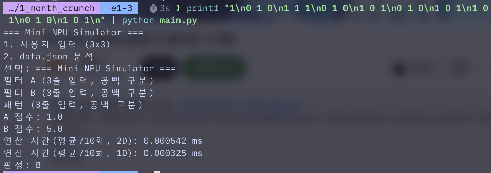
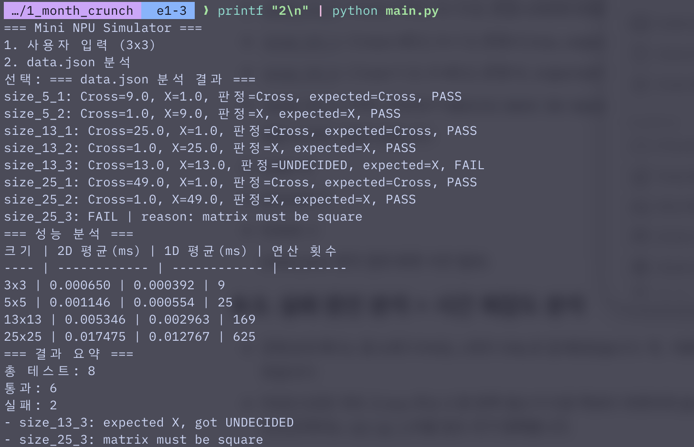
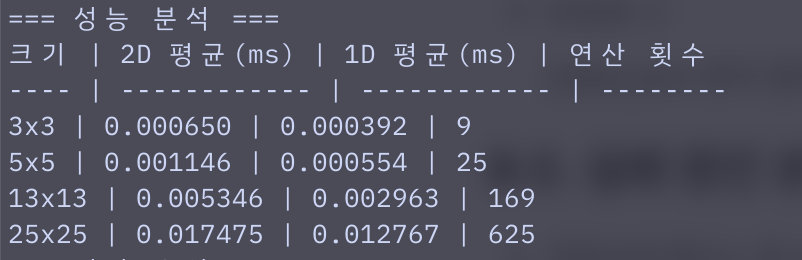
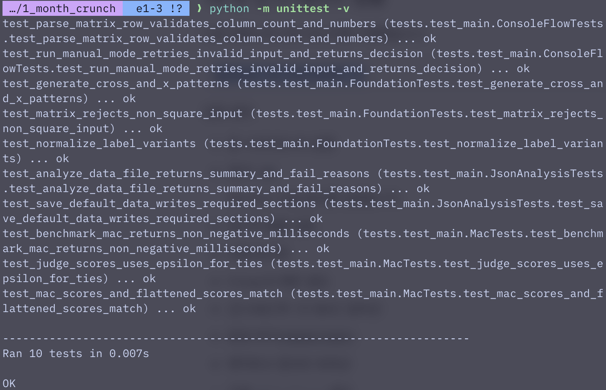

# 1_month_crunch

## 1. 프로젝트 개요
이 프로젝트는 정사각 행렬 기반의 MAC(Multiply-Accumulate) 연산으로 Cross(+) 패턴과 X 패턴을 판별하는 Mini NPU Simulator 과제입니다. 사용자는 3x3 필터와 입력 패턴을 직접 넣어 결과를 확인할 수 있고, `data.json`에 저장된 여러 크기의 패턴을 일괄 분석해 PASS/FAIL, 실패 원인, 성능 분석 결과를 함께 확인할 수 있습니다.

핵심 목표는 다음과 같습니다.
- Cross(+) 패턴과 X 패턴 필터 생성
- 2차원 MAC 연산과 1차원 평탄화 MAC 연산 구현
- 수동 입력 모드와 `data.json` 분석 모드 제공
- 동점(`UNDECIDED`) 처리와 입력 검증 처리 구현
- 결과 리포트와 성능 비교 제공

## 2. 실행 환경
- OS: Windows 11 IoT Enterprise LTSC 2024, macOS Tahoe 26.3.1
- Shell: bash
- Python: 3.12.10
- 사용 라이브러리: Python 표준 라이브러리만 사용 (`json`, `re`, `dataclasses`, `pathlib`, `time`, `unittest`)

별도 패키지 설치 없이 바로 실행 가능합니다.

## 3. 실행 방법
### 3-1. 프로그램 실행
```bash
python main.py
```

실행 후 메뉴에서 다음 중 하나를 선택합니다.
- `1`: 사용자 입력(3x3) 모드
- `2`: `data.json` 분석 모드

`2`번 분석 모드를 선택했을 때 현재 작업 디렉터리에 `data.json`이 없으면, 프로그램이 기본 샘플 데이터를 담은 `data.json`을 자동 생성한 뒤 바로 분석을 계속 진행합니다.

### 3-2. 테스트 실행
```bash
python -m unittest -v
```

## 4. 파일 구조
```text
.
├─ .gitignore
├─ README.md
├─ data.json
├─ docs/
│  └─ superpowers/
│     ├─ plans/
│     └─ specs/
├─ main.py
└─ tests/
   ├─ __init__.py
   └─ test_main.py
```

- `README.md`: 제출 보고서
- `data.json`: 필터 및 패턴 테스트 데이터
- `docs/superpowers/`: 설계/계획 문서
- `main.py`: 행렬 검증, 패턴 생성, MAC 연산, JSON 분석, 콘솔 UI 구현
- `tests/test_main.py`: 핵심 기능 단위 테스트

## 5. 구현 요약
구현된 내용은 다음과 같습니다.
- `Matrix` 데이터 클래스로 정사각 행렬 여부를 검증
- 홀수 크기 `N x N`에 대해 Cross 패턴과 X 패턴 필터 생성
- 2차원 MAC(`mac_2d`)과 1차원 평탄화 MAC(`mac_1d`) 구현
- 점수 비교 후 `Cross`, `X`, `UNDECIDED`를 반환하는 판정 로직 구현
- `data.json` 전체 케이스 분석 및 실패 사유 집계 구현
- 성능 측정을 위한 벤치마크 기능 구현
- 콘솔 입력 오류 재시도와 기본 `data.json` 자동 생성 기능 구현

라벨 정규화는 별도 파일까지 나누지는 않았지만, `normalize_label()`이라는 독립 함수로 책임을 분리했습니다. 이렇게 분리한 이유는 `+`, `cross`, `x` 같은 입력 표기를 프로그램 전체에서 한 번만 통일하고, 이후 비교 로직은 항상 `Cross`, `X`만 다루게 만들기 위해서입니다. 장점은 비교 코드가 단순해지고, JSON 입력 형식이 조금 달라도 판정 로직을 수정하지 않아도 된다는 점입니다.

### MAC 계산 흐름 설명
이 과제의 핵심 흐름은 아래 순서로 동작합니다.
1. 입력 모드에서는 필터 A, 필터 B, 패턴을 읽습니다.
2. 각 패턴/필터는 같은 위치의 값을 서로 곱합니다.
3. 곱한 결과를 `total`에 계속 누적합니다.
4. 모든 칸을 순회한 뒤 누적합을 최종 점수로 반환합니다.
5. 두 필터 점수를 비교해 더 큰 쪽을 최종 판정으로 사용합니다.
6. 점수 차가 `EPSILON`보다 작으면 `UNDECIDED` 또는 수동 입력 기준 `판정 불가`로 처리합니다.

즉, 전체 흐름은 **입력 → 위치별 곱셈 → 누적 합산 → 점수 반환 → 두 점수 비교 → 최종 판정 출력** 입니다.

## 6. 핵심 기능 설명
### 사용자 입력 모드
- 사용자가 3x3 필터 A, 3x3 필터 B, 3x3 입력 패턴을 직접 입력합니다.
- 각 입력 줄은 공백으로 구분된 3개의 숫자여야 하며, 형식이 틀리면 해당 3줄 입력을 처음부터 다시 받습니다.
- 입력된 패턴과 각 필터의 MAC 점수를 계산해 아래 3가지 중 하나를 **명시적으로 출력**합니다.
  - `판정: A`
  - `판정: B`
  - `판정: 판정 불가`
- 즉 수동 입력 모드는 항상 `A 점수`, `B 점수`, `판정 결과`를 함께 출력합니다.
- 같은 입력에 대해 2D MAC과 1D MAC 평균 시간도 함께 표시합니다.

### data.json 분석 모드
- `data.json`의 `filters`와 `patterns`를 읽어 전체 케이스를 순회합니다.
- 각 패턴 키는 `size_{N}_{idx}` 형식이며, 프로그램은 여기서 `N`을 추출한 뒤 같은 크기의 필터 묶음 `filters["size_N"]`를 선택합니다.
- 예를 들어 `size_13_2`라는 키를 만나면 `N=13`을 추출하고, `filters["size_13"]` 안의 `cross`, `x` 필터를 사용합니다.
- 기대 라벨은 `+`, `cross`, `x`를 내부적으로 `Cross`, `X`로 정규화한 뒤 비교합니다.
- 각 케이스마다 Cross 점수, X 점수, 최종 판정, 기대값, PASS/FAIL을 출력합니다.
- 비정상 데이터가 들어오면 예외를 그대로 실패 사유로 수집해 요약에 포함합니다.
- 분석 후에는 크기별 성능표와 전체 요약(total/passed/failed)을 함께 출력합니다.

### 보너스 기능
- `mac_2d`와 `mac_1d`를 둘 다 구현해 동일한 수학 결과와 성능 차이를 비교할 수 있게 했습니다.
- `benchmark_mac()`은 같은 MAC 호출을 여러 번 반복해 평균 시간을 계산합니다.
- `generate_cross_pattern()`, `generate_x_pattern()`으로 홀수 크기 패턴을 자동 생성합니다.
- `data.json`이 없을 때 기본 데이터셋을 자동 생성해 바로 실행 가능한 상태를 보장합니다.
- 실패 케이스도 숨기지 않고 `reason` 필드로 기록해 디버깅과 결과 해석이 쉽도록 했습니다.

## 7. data.json 구조 설명
`data.json`은 최상위에 `filters`, `patterns` 두 영역으로 구성됩니다.

### 7-1. filters
크기별 필터 세트를 저장합니다.
- `size_5`
- `size_13`
- `size_25`

각 크기 안에는 다음 두 필터가 있습니다.
- `cross`: Cross(+) 기준 필터
- `x`: X 기준 필터

예시는 아래와 같습니다.
```json
{
  "filters": {
    "size_5": {
      "cross": [[...]],
      "x": [[...]]
    }
  }
}
```

### 7-2. patterns
분석 대상 입력 패턴과 기대 라벨을 저장합니다.
- 예: `size_5_1`, `size_13_3`, `size_25_3`
- 각 항목은 `input`, `expected`를 가집니다.

```json
{
  "patterns": {
    "size_13_3": {
      "input": [[...]],
      "expected": "x"
    }
  }
}
```

구현상 `expected`는 `+`, `cross`, `x` 같은 입력을 받아 내부적으로 `Cross` 또는 `X`로 정규화합니다.

### 7-3. patterns 키에서 크기 N을 추출해 필터를 고르는 방식
이 과제에서 중요한 부분은 `patterns`의 키 이름만 보고 어떤 필터를 써야 하는지 결정하는 것입니다.

예를 들어:
- `size_5_1` → `N = 5` 추출 → `filters["size_5"]` 선택
- `size_13_2` → `N = 13` 추출 → `filters["size_13"]` 선택
- `size_25_1` → `N = 25` 추출 → `filters["size_25"]` 선택

즉, 프로그램은 먼저 패턴 키에서 숫자 크기를 읽고, 그 크기와 같은 필터 그룹을 매칭한 뒤 Cross 필터와 X 필터에 각각 MAC 연산을 수행합니다. 이 과정을 분리해 두면 패턴 데이터 개수가 늘어나도 키 규칙만 유지되면 자동으로 올바른 필터를 선택할 수 있습니다.

### 7-4. 의도적으로 포함한 실패 케이스
- `size_13_3`: 13x13 Cross 패턴과 X 패턴을 절반씩 섞은 입력입니다. 두 필터 점수가 같아지도록 설계되어 있으며, 판정 로직의 동점 처리(`UNDECIDED`)가 실제로 작동하는지 확인하기 위한 의도적 실패 케이스입니다.
- `size_25_3`: 마지막 행 길이를 줄여 정사각 행렬 조건을 일부러 깨뜨린 입력입니다. `Matrix` 검증이 비정상 입력을 즉시 차단하고 `matrix must be square`라는 실패 사유를 남기는지 확인하기 위한 의도적 실패 케이스입니다.

즉, 이 두 케이스는 우연한 오답 데이터가 아니라 동점 판정 정책과 입력 검증 정책을 문서화된 형태로 드러내기 위해 `data.json`에 의도적으로 포함한 검증용 사례입니다.

## 8. 결과 리포트
### 8-1. 수동 입력 모드 실행 결과
다음 명령으로 수동 입력 모드를 실행했습니다.

```bash
printf "1\n0 1 0\n1 1 1\n0 1 0\n1 0 1\n0 1 0\n1 0 1\n1 0 1\n0 1 0\n1 0 1\n" | python main.py
```

실측 결과는 다음과 같습니다.
- A 점수: 1.0
- B 점수: 5.0
- 연산 시간(평균/10회, 2D): 0.000610 ms
- 연산 시간(평균/10회, 1D): 0.000370 ms
- 최종 판정: B

즉, 수동 입력 모드도 **점수 2개와 명시적 판정 결과(`판정: B`)를 함께 출력**합니다.



### 8-2. data.json 분석 모드 실행 결과
다음 명령으로 전체 데이터셋을 분석했습니다.

```bash
printf "2\n" | python main.py
```

케이스별 실측 결과는 다음과 같습니다.
- `size_5_1`: Cross=9.0, X=1.0, 판정=Cross, expected=Cross, PASS
- `size_5_2`: Cross=1.0, X=9.0, 판정=X, expected=X, PASS
- `size_13_1`: Cross=25.0, X=1.0, 판정=Cross, expected=Cross, PASS
- `size_13_2`: Cross=1.0, X=25.0, 판정=X, expected=X, PASS
- `size_13_3`: Cross=13.0, X=13.0, 판정=UNDECIDED, expected=X, FAIL
- `size_25_1`: Cross=49.0, X=1.0, 판정=Cross, expected=Cross, PASS
- `size_25_2`: Cross=1.0, X=49.0, 판정=X, expected=X, PASS
- `size_25_3`: FAIL, reason=`matrix must be square`

최종 요약은 다음과 같습니다.
- total: 8
- passed: 6
- failed: 2



### 8-3. 실패 원인 분석 + 시간 복잡도 분석
- 전체 8개 케이스 중 6개가 PASS, 2개가 FAIL로 집계되었습니다. 즉, 기본 데이터셋은 정상 패턴 식별과 의도적 예외 검증을 함께 수행하도록 구성되어 있습니다.
- PASS 6건은 모두 Cross 또는 X 중 한쪽 점수가 다른 쪽보다 뚜렷하게 높게 나오는 사례입니다. 5x5에서는 `9 vs 1`, 13x13에서는 `25 vs 1`, 25x25에서는 `49 vs 1`처럼 점수 차가 명확합니다.
- `size_13_3`가 실패하는 이유는 구현 결함이 아니라 데이터 설계 의도에 가깝습니다. 이 케이스는 Cross와 X를 절반씩 섞어 만들어 두 필터에 대한 MAC 결과가 정확히 `13.0` 대 `13.0`으로 같아집니다.
- 판정 함수는 두 점수 차이가 `EPSILON`보다 작으면 부동소수 계산 오차를 포함한 사실상 동점으로 보고 `UNDECIDED`를 반환합니다. 따라서 기대값이 `X`여도 결과는 정책상 FAIL이 됩니다.
- `size_25_3`가 실패하는 이유는 점수 계산 이전 단계의 입력 검증입니다. 마지막 행 길이를 일부러 줄인 비정사각 입력이므로 `Matrix` 생성 시점에서 `matrix must be square` 예외가 발생합니다.
- 이 실패는 분류 실패가 아니라 형식 검증 실패이며, 잘못된 데이터를 조용히 통과시키지 않는다는 점에서 오히려 요구사항 준수 동작을 보여줍니다.
- 나머지 케이스들이 안정적으로 PASS하는 첫 번째 이유는 라벨 정규화입니다. `expected`에 `+` 또는 `x`가 들어와도 내부 비교에서는 `Cross`와 `X`로 통일되므로 표기 차이 때문에 오답 처리되지 않습니다.
- 안정적으로 PASS하는 두 번째 이유는 `EPSILON` 기반 비교입니다. 동점에 가까운 부동소수 상황에서 작은 오차 때문에 결과가 흔들리지 않도록 해 주며, 명확한 점수 차가 있는 케이스는 이 기준을 충분히 넘어 안정적으로 분류됩니다.
- 특히 PASS 케이스들은 점수 차가 최소 8 이상이므로, `1e-9` 수준의 epsilon이 분류 결과를 바꾸지 못합니다. 즉 실제로는 강한 margin이 존재해 반복 실행에도 분류 결과가 신뢰성 있게 유지됩니다.
- 시간 복잡도는 `O(N^2)`입니다. 이유는 `mac_2d()`와 `mac_1d()` 모두 결국 `N x N`개의 원소를 한 번씩 확인해야 하기 때문입니다.
- 따라서 입력 크기가 3x3에서 25x25로 커질수록 연산 횟수는 `9 → 25 → 169 → 625`로 증가하고, 실제 평균 시간도 함께 증가합니다.
- 정리하면, 현재 리포트의 6 PASS는 정상 패턴 인식이 잘 동작함을 보여 주고, 2 FAIL은 각각 동점 정책 검증과 입력 검증 검증을 위해 남겨 둔 의도적 사례입니다.
- 따라서 total/pass/fail 수치는 단순 정확도 숫자라기보다, 분류 로직과 예외 처리 로직이 모두 설계대로 작동하고 있음을 한 번에 보여 주는 종합 결과로 해석할 수 있습니다.

## 9. 성능 분석
다음 수치는 `data.json` 분석 모드 실행 중 출력된 최신 측정값입니다.

| 크기 | 2D 평균(ms) | 1D 평균(ms) | 연산 횟수 |
| --- | ---: | ---: | ---: |
| 3x3 | 0.000610 | 0.000390 | 9 |
| 5x5 | 0.001110 | 0.000550 | 25 |
| 13x13 | 0.005550 | 0.003120 | 169 |
| 25x25 | 0.019240 | 0.012690 | 625 |

성능 측정 기준은 다음과 같습니다.
- 이 벤치마크는 파일 읽기/쓰기, JSON 파싱, 콘솔 입력, 콘솔 출력 같은 I/O 시간을 제외합니다.
- 실제 경계는 `benchmark_mac()` 함수 안의 `start = perf_counter()` 직후부터 `end = perf_counter()` 직전까지입니다.
- 즉, `Matrix` 생성, `data.json` 로드, 메뉴 선택, 문자열 출력은 측정 구간 밖에 있고, 반복문 안에서 호출되는 `mac_2d()` 또는 `mac_1d()`만 측정 구간 안에 있습니다.
- `use_flatten=True`일 때도 평탄화된 리스트 준비는 측정 루프 바깥에서 한 번만 수행하고, 측정 대상은 반복 호출되는 `mac_1d()`입니다.
- 각 크기별로 동일한 패턴과 필터 조합에 대해 10회 반복 호출 후 평균 ms를 계산합니다.
- 따라서 표의 값은 프로그램 전체 실행 시간이 아니라 순수 MAC 호출 비용 비교에 가깝습니다.
- 정리하면 이 과제의 시간 측정 경계는 **입출력과 준비 단계는 제외하고, 실제 곱셈-누적 연산 함수 호출 구간만 포함**하도록 잡았습니다.

해석은 다음과 같습니다.
- 두 구현 모두 모든 원소를 한 번씩 순회하므로 시간 복잡도는 `O(N^2)`입니다.
- 실제 연산 횟수도 `N x N`으로 증가하며, 3x3에서 25x25로 갈수록 실행 시간이 함께 증가했습니다.
- 이번 실측에서는 1D 평탄화 방식이 모든 크기에서 2D 방식보다 더 낮은 평균 시간을 보였습니다.
- MAC 점수가 높을수록 "더 유사하다"고 보는 이유는, 같은 위치에서 1이 많이 겹칠수록 곱셈 결과가 더 많이 누적되기 때문입니다. 즉 필터와 입력 패턴이 같은 모양일수록 위치별 곱의 합이 커지고, 다른 모양일수록 0이 많이 섞여 총합이 작아집니다.
- 예를 들어 Cross 입력과 Cross 필터를 곱하면 중앙 행/열에서 1이 많이 겹쳐 높은 점수가 나오고, Cross 입력과 X 필터를 곱하면 대각선 쪽 겹침이 적어 낮은 점수가 나옵니다. 그래서 MAC 합계는 곧 "겹치는 정도"를 수치화한 값으로 볼 수 있습니다.
- 부동소수점 오차는 컴퓨터가 10진 소수를 정확히 저장하지 못하고 2진 근사값으로 저장하기 때문에 발생합니다. 그래서 수학적으로 같아 보여도 실제 메모리 안의 값은 `0.9000000000000000`과 `0.8999999999999999`처럼 아주 미세하게 달라질 수 있습니다.
- 이 때문에 점수를 `==`로 바로 비교하면 사실상 같은 값인데도 다른 값으로 판정될 수 있으므로, `EPSILON` 같은 허용오차를 두고 "충분히 가까우면 동점"으로 처리하는 정책이 필요합니다.
- 동점 처리 문구가 mode1과 mode2에서 다른 이유는 요구사항 관점에서 출력 대상이 다르기 때문입니다. mode1은 사용자가 직접 보는 콘솔 입력 모드이므로 사람 친화적인 표현인 `판정 불가`를 보여 주고, mode2는 배치 분석/리포트 모드이므로 결과 집계용 표준 상태값 `UNDECIDED`를 사용합니다.
- 즉 내부 판정 원리는 같고, 외부에 보여 주는 표현만 요구사항에 맞게 다르게 둔 것입니다.
- 따라서 현재 구현의 보너스 성격 최적화는 `flatten()` 기반 1D MAC 비교 기능과, 이를 수치로 확인할 수 있는 벤치마크 출력입니다.

### 9-1. 심층 인터뷰 대비 설명
#### 새로운 라벨(예: `o`)이 추가된다면 어떻게 확장할 것인가?
1. 먼저 요구사항을 확인해 `o`가 어떤 표준 라벨로 매핑되어야 하는지 정합니다.
2. 그 다음 `normalize_label()`에 `o` 처리를 추가해 입력 표준화를 먼저 해결합니다.
3. 이후 `data.json`의 `filters` 구조에 `o`에 대응하는 필터를 추가하고, 출력부가 새 라벨을 보여 줄 수 있게 확장합니다.
4. 판정 로직은 단순 2분류(Cross/X)에서 3분류 이상으로 바뀌므로, 점수 비교 방식을 일반화해야 합니다.
5. 마지막으로 테스트를 추가해 정규화, 판정, 출력, JSON 분석이 모두 새 라벨에서 정상 동작하는지 검증합니다.
6. 즉 확장 순서는 **정규화 → 필터 데이터 → 판정 로직 → 출력 → 테스트**가 가장 안전합니다.

#### 1000x1000 패턴을 처리하면 어떤 문제가 생기고 무엇을 먼저 최적화할 것인가?
- 1000x1000이면 원소 수가 100만 개이므로 한 번의 MAC에도 100만 번의 곱셈-누적이 필요합니다.
- 시간 측면에서는 Python 반복문 자체의 오버헤드가 커져 처리 시간이 급격히 늘어납니다.
- 메모리 측면에서는 필터와 입력 패턴을 여러 개 동시에 들고 있으면 리스트/중첩 리스트 오버헤드까지 더해져 사용량이 커집니다.
- 우선순위 1은 불필요한 복사 감소입니다. 예를 들어 반복 측정 시 매번 flatten하지 않고 한 번만 준비하는 식으로 준비 비용을 줄이는 것이 먼저입니다.
- 우선순위 2는 데이터 접근 단순화입니다. 현재 보너스처럼 1D 배열 기반 접근이 2D 인덱싱보다 유리할 수 있습니다.
- 우선순위 3은 Python 한계를 넘는 구조 개선입니다. 실제 대규모 처리라면 벡터화 라이브러리나 병렬 하드웨어를 검토해야 하지만, 이번 과제는 표준 라이브러리만 허용되므로 설명 차원에서만 언급할 수 있습니다.

#### CPU 직렬 처리와 NPU 병렬 처리 관점에서 병목은 어디에 생기는가?
- 이 문제의 병목은 같은 형태의 곱셈-누적 연산을 매우 많이 반복해야 한다는 점입니다.
- 일반적인 CPU는 이런 연산을 순서대로 빠르게 처리하는 데는 강하지만, 수많은 MAC을 한 번에 동시에 처리하는 구조는 제한적입니다.
- 반면 NPU는 많은 MAC 유닛을 병렬로 배치해 여러 위치의 곱셈과 누적을 동시에 처리하도록 설계됩니다.
- 따라서 패턴이 커질수록 CPU에서는 반복문 자체와 메모리 접근이 병목이 되고, NPU에서는 같은 계산을 더 넓게 병렬 처리해 처리량을 높일 수 있습니다.
- 즉 이 과제의 작은 시뮬레이터는 직렬 반복문으로 원리를 보여 주는 버전이고, 실제 AI 하드웨어는 이 반복 MAC 병목을 병렬화해 해결하는 방향이라고 설명할 수 있습니다.



## 10. 테스트 및 검증
### 10-1. 수동 입력 모드 검증
다음 명령으로 수동 입력 모드를 검증했습니다.

```bash
printf "1\n0 1 0\n1 1 1\n0 1 0\n1 0 1\n0 1 0\n1 0 1\n1 0 1\n0 1 0\n1 0 1\n" | python main.py
```

검증 결과:
- A 점수 1.0, B 점수 5.0 확인
- 2D 평균 0.000610 ms, 1D 평균 0.000370 ms 확인
- 최종 판정 `B` 확인
- 즉 수동 입력 모드에서 점수 + 판정 결과가 모두 출력됨을 확인


### 10-2. 배치(data.json) 모드 검증
다음 명령으로 배치 분석 모드를 검증했습니다.

```bash
printf "2\n" | python main.py
```

검증 결과:
- 총 8건 분석
- PASS 6건 / FAIL 2건 확인
- 실패 사유가 `expected X, got UNDECIDED`, `matrix must be square`로 명확히 출력됨을 확인
- 패턴 키에서 추출한 크기 `N`에 맞춰 필터 그룹이 선택되고 결과가 정상 출력됨을 확인
- 성능표가 3x3, 5x5, 13x13, 25x25 기준으로 정상 출력됨을 확인


### 10-3. 단위 테스트 검증
다음 명령으로 단위 테스트를 수행했습니다.

```bash
python -m unittest -v
```

검증 결과:
- 총 10개 테스트 실행
- 결과: `OK`

테스트는 다음 범주를 검증합니다.
- 정사각 행렬 검증
- 라벨 정규화
- Cross/X 패턴 생성
- 2D MAC와 1D MAC 일치성
- 동점 처리(`UNDECIDED`)
- 벤치마크 결과의 유효성
- 기본 `data.json` 생성
- 분석 결과 요약(total 8 / passed 6 / failed 2)
- 콘솔 입력 검증과 재시도 흐름



## 11. 트러블슈팅 / 배운 점
- 동점 케이스는 단순 오분류가 아니라, 실제로 두 필터 점수가 같은 경우임을 확인했습니다. 따라서 `size_13_3` 실패는 구현 버그라기보다 판정 정책의 결과입니다.
- 입력 데이터 검증을 일찍 수행하면, `size_25_3`처럼 잘못된 형식의 데이터도 빠르게 차단하고 명확한 실패 사유를 남길 수 있습니다.
- 같은 `O(N^2)` 연산이라도 데이터 접근 방식에 따라 실행 시간이 달라질 수 있음을 2D/1D 비교로 확인했습니다.
