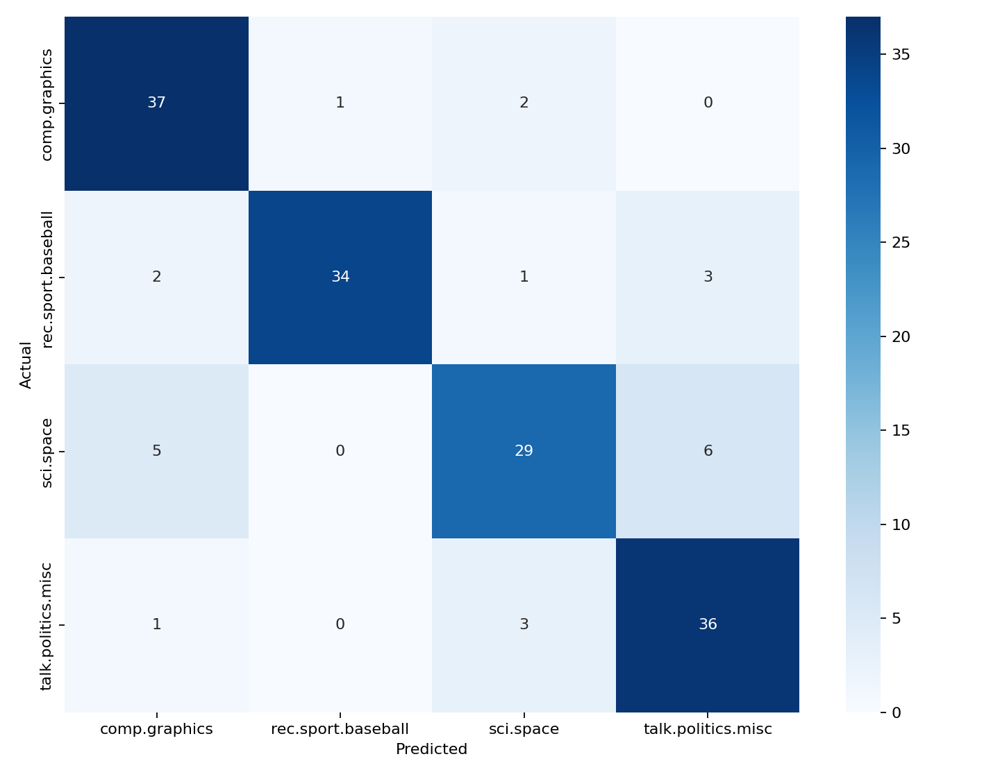

# 지능형 문서 검색 시스템

## 실행 방법

Python 3.10 이상에서 실행한다. 현재 검증 환경은 Python 3.12, NumPy 2.4.5, Scikit-learn 1.8.0이다.

```bash
pip install -r requirements.txt
python scripts/run.py --query "space shuttle nasa mission" --topk 5 --sample-per-class 200 --random-state 42
python main.py --query "space shuttle nasa mission" --topk 5
python -m pytest -q
```

검색 함수로 사용할 때의 시그니처는 다음과 같다.

```python
from main import search

results: list[tuple[float, int, str]] = search("space shuttle nasa mission", topk=5)
```

CLI 예시 출력:

```text
=== 검색 결과 ===
Query: space shuttle nasa mission

1. [0.374367] doc_id=498 Archive-name: space/controversy Last-modified: ...
2. [0.267369] doc_id=81 There is a guy in NASA Johnson Space Center ...
3. [0.257954] doc_id=653 Archive-name: space/data Last-modified: ...
4. [0.257939] doc_id=766 Archive-name: space/acronyms Edition: 8 ...
5. [0.256370] doc_id=694 For an essay, I am writing about the space shuttle ...
```

전체 재현 파이프라인의 단일 진입점은 `scripts/run.py`이다. 데이터 로드, 전처리, TF-IDF 검증, 검색, BM25 비교, 분류 학습, 평가, 혼동 행렬 저장을 한 번에 수행한다. `--sample-per-class 200`은 4개 카테고리에서 각 200개씩 총 800개 문서를 사용한다. `--random-state 42`는 데이터 샘플링과 Train/Test 분할을 재현하기 위해 고정했다. `--topk 5`는 요구사항의 상위 5개 검색 결과 반환 기준이다.

## 데이터

데이터셋은 Scikit-learn의 `fetch_20newsgroups`로 제공되는 20 Newsgroups를 사용했다. 선택 카테고리는 `comp.graphics`, `rec.sport.baseball`, `sci.space`, `talk.politics.misc` 네 개이며, 최소 2개 카테고리와 500개 문서 조건을 넘기기 위해 균형 샘플 800개를 구성했다. 실행 시 `data/`에 캐시되며 원본 데이터는 버전 관리 대상에서 제외한다.

```python
fetch_20newsgroups(
    subset="all",
    categories=[
        "comp.graphics",
        "rec.sport.baseball",
        "sci.space",
        "talk.politics.misc",
    ],
    remove=("headers", "footers", "quotes"),
    data_home="data",
)
```

20 Newsgroups는 공개 연구와 벤치마크에 널리 쓰이는 Usenet 말뭉치다. 단일 라이선스가 명확히 통일된 상업용 데이터셋으로 취급하지 않고 학습 실험 목적으로만 사용했다. 개인정보 노출 위험을 줄이기 위해 Scikit-learn 로더의 `remove=("headers", "footers", "quotes")` 옵션을 적용해 이메일 헤더, 서명, 인용문을 제거했다. 그래도 본문에 공개 게시글의 이름이나 메일 문자열이 일부 남을 수 있으므로 검색 결과는 짧은 스니펫만 출력하고, 원본 `data/` 디렉터리는 커밋하지 않는다.

## 구현 요약

구성 파일:

| 파일 | 역할 |
|---|---|
| `src/text_processing.py` | 정제, 소문자 변환, 정규식 기반 토큰화, 불용어 제거 |
| `src/tfidf.py` | NumPy 기반 TF-IDF 직접 구현, TF 변형 구현 |
| `src/search.py` | 코사인 유사도 검색, 역색인 후보 조회 |
| `src/bm25.py` | NumPy 기반 BM25 검색 비교 |
| `src/classification.py` | TF-IDF 벡터 기반 Logistic Regression 평가 |
| `scripts/run.py` | 전체 실험 재현과 evidence 저장 |
| `main.py` | `python main.py --query "..." --topk 5` 검색 CLI |

전처리 기준은 영어 뉴스그룹 데이터에 맞춰 설계했다. 모든 텍스트를 소문자로 변환하고, 정규식 `[^a-z0-9\s]+`에 해당하는 문자는 공백으로 치환한다. 하이픈, 따옴표, 괄호, URL 구분자처럼 의미보다 표기 형식에 가까운 문자는 제거하고, 알파벳과 숫자가 섞인 토큰(`b2`, `v2`)은 기술 문서에서 모델명이나 버전 정보일 수 있어 유지한다. 순수 숫자 토큰은 연도나 게시 번호처럼 분류 주제보다 문서 잡음이 되는 경우가 많아 제거했다. 길이 1 토큰도 대부분 약어 잡음이므로 제거했다.

불용어는 `the`, `and`, `is`, `of`, `to` 같은 영어 기능어 중심으로 직접 정의했다. 이 단어들은 문서 전반에 넓게 등장해 주제 구분력은 낮고 TF-IDF 차원을 늘린다. 동의어 통합은 적용하지 않았다. 예를 들어 `nasa`와 `space agency`, `baseball`과 `mlb`를 임의로 묶으면 수작업 사전의 편향이 들어가고 Scikit-learn 검증과도 분석 단위가 달라진다. 대신 BoW 한계와 후속 개선 방향에서 동의어 처리를 별도 과제로 다뤘다.

토큰화는 영어 데이터이므로 정규식 정제 뒤 공백 기반으로 수행했다. 한국어 데이터였다면 조사와 어미가 단어에 붙기 때문에 형태소 분석기가 검색 품질에 더 중요하다. 예를 들어 한국어에서 `분류했다`, `분류하는`, `분류를`을 공백 토큰화만 사용하면 서로 다른 토큰으로 남아 같은 개념의 빈도가 분산된다. 형태소 분석기는 어간과 품사를 분리해 같은 의미 단위를 더 잘 모으지만, 설치 환경과 사전 품질에 따라 결과가 달라지는 비용이 있다.

TF-IDF는 `src/tfidf.py`의 `NumpyTfidfVectorizer`에서 NumPy 행렬로 직접 계산한다. 문서 수를 \(N\), 단어 \(t_j\)가 등장한 문서 수를 \(df_j\), 문서 \(d_i\)에서의 단어 빈도를 \(tf_{i,j}\)라 두면 기본 설정은 다음과 같다.

\[
tf_{i,j} = count(t_j, d_i)
\]

\[
idf_j = \log\frac{1 + N}{1 + df_j} + 1
\]

\[
tfidf_{i,j} = tf_{i,j} \times idf_j
\]

\[
\hat{x_i} = \frac{x_i}{\lVert x_i \rVert_2}
\]

`smooth_idf=True`이므로 분자와 분모에 1을 더해 특정 단어가 모든 문서에 없거나 일부 문서에만 집중될 때의 불안정성을 낮춘다. `norm='l2'`로 문서 벡터 길이를 정규화해 긴 문서가 단어 수만으로 과도하게 유리해지지 않게 했다. Scikit-learn 검증과 같은 조건을 만들기 위해 `sublinear_tf=False`, raw count TF를 사용했다.

검색은 쿼리를 같은 전처리기와 학습된 어휘로 TF-IDF 벡터화한 뒤 코사인 유사도를 NumPy 연산으로 계산한다.

\[
cos(q, d) = \frac{q \cdot d}{\lVert q \rVert_2 \lVert d \rVert_2}
\]

`src/search.py`는 단어에서 문서 ID 집합으로 가는 역색인도 만든다. 쿼리 토큰이 등장한 문서를 후보로 먼저 찾고, 후보 수가 `topk`보다 적으면 전체 문서 스캔으로 보충해 항상 상위 결과를 반환한다. 코사인 계산 자체는 직접 구현한 `cosine_similarity()`가 담당한다.

분류 실험은 직접 구현한 TF-IDF 벡터를 특성으로 사용하고, 분류기는 허용 라이브러리인 Scikit-learn의 `LogisticRegression(max_iter=1000, class_weight='balanced', random_state=42)`를 사용했다. Train/Test는 8:2로 분할했고 `stratify`를 적용해 네 클래스가 테스트셋에 40개씩 들어가도록 했다.

보너스 구현으로 세 가지 TF 변형과 BM25를 추가했다.

| 방식 | 수식 또는 처리 |
|---|---|
| Raw Count | \(tf=count(t,d)\) |
| Log Normalization | \(tf=1+\log(count(t,d))\), 단 count > 0 |
| Double Normalization | \(tf=k+(1-k)\frac{count(t,d)}{\max count(d)}\), 기본 \(k=0.5\) |
| BM25 | \(idf(t)\frac{tf(t,d)(k_1+1)}{tf(t,d)+k_1(1-b+b\frac{|d|}{avgdl})}\), 기본 \(k_1=1.5, b=0.75\) |

## 검증 및 실험 결과

실험 산출물은 `evidence/`에 저장했다.

| 산출물 | 내용 |
|---|---|
| `evidence/tfidf_validation.txt` | 직접 구현 TF-IDF와 Scikit-learn 비교 로그 |
| `evidence/search_results_tfidf.txt` | TF-IDF 코사인 검색 결과 |
| `evidence/search_results_bm25.txt` | BM25 검색 결과 |
| `evidence/classification_metrics.txt` | 정확도, F1, classification report, 혼동 행렬 |
| `evidence/confusion_matrix.png` | 혼동 행렬 시각화 |
| `evidence/misclassified_cases.txt` | 오분류 사례 분석 |
| `evidence/tf_variant_comparison.csv` | TF 변형별 성능 비교 |
| `evidence/run_summary.json` | 주요 수치 요약 |

TF-IDF 검증 결과:

```text
=== TF-IDF 구현 검증 결과 ===
TF-IDF 행렬 shape: (800, 14401)
[검증] 직접 구현 vs Scikit-learn
  - sklearn 설정: tokenizer=str.split, lowercase=False, token_pattern=None
  - sklearn 설정: smooth_idf=True, sublinear_tf=False, norm='l2'
  - 직접 구현 설정: raw count TF, smooth_idf=True, sublinear_tf=False, norm='l2'
  - 최대 오차: 5.218048215738e-15
  - 평균 오차: 1.008411539472e-19
  - 결과: PASS (허용 오차 1e-6)
```

Scikit-learn의 기본 analyzer를 그대로 쓰지 않고 `tokenizer=str.split`, `lowercase=False`, `token_pattern=None`으로 맞춘 이유는 직접 구현 전처리 결과인 사전 토큰화 문서를 그대로 비교하기 위해서다. `vocabulary`도 직접 구현체의 단어 순서와 동일하게 전달해 행렬 열 순서 차이로 생기는 가짜 오차를 제거했다.

검색 결과 비교:

| 순위 | TF-IDF 코사인 검색 | 점수 | BM25 검색 | 점수 |
|---:|---|---:|---|---:|
| 1 | doc_id=498 `space/controversy` | 0.374367 | doc_id=498 `space/controversy` | 16.060209 |
| 2 | doc_id=81 NASA Johnson Space Center | 0.267369 | doc_id=281 shuttle/telescope mission | 15.311596 |
| 3 | doc_id=653 `space/data` | 0.257954 | doc_id=270 NASA followup mission | 15.209892 |
| 4 | doc_id=766 `space/acronyms` | 0.257939 | doc_id=195 NASA/Shuttle discussion | 14.643315 |
| 5 | doc_id=694 space shuttle propulsion essay | 0.256370 | doc_id=766 `space/acronyms` | 13.339866 |

두 방식 모두 `space`, `shuttle`, `nasa`, `mission`이 실제로 등장하는 우주 관련 문서를 상위에 배치했다. TF-IDF 코사인은 문서 전체 방향이 쿼리와 비슷한 문서를 선호하고, BM25는 쿼리 단어의 반복 빈도와 문서 길이 보정을 더 직접 반영해 shuttle/mission 언급이 많은 문서를 더 위로 올렸다.

분류 성능:

```text
모델: Logistic Regression(max_iter=1000, class_weight='balanced', random_state=42)
데이터: Train 640 / Test 160
전체 문서 수: 800
카테고리: comp.graphics, rec.sport.baseball, sci.space, talk.politics.misc
정확도: 0.850000
F1-Score(macro): 0.849412
```

클래스별 성능:

| 클래스 | precision | recall | f1-score | support |
|---|---:|---:|---:|---:|
| comp.graphics | 0.8222 | 0.9250 | 0.8706 | 40 |
| rec.sport.baseball | 0.9714 | 0.8500 | 0.9067 | 40 |
| sci.space | 0.8286 | 0.7250 | 0.7733 | 40 |
| talk.politics.misc | 0.8000 | 0.9000 | 0.8471 | 40 |

혼동 행렬:

```text
[[37  1  2  0]
 [ 2 34  1  3]
 [ 5  0 29  6]
 [ 1  0  3 36]]
```



가장 어려운 클래스는 `sci.space`였다. 테스트 40개 중 29개를 맞췄고, `comp.graphics`로 5개, `talk.politics.misc`로 6개가 이동했다. 우주 분야 문서에는 이미지 포맷, 데이터 아카이브, 정부 정책, 냉전 논쟁 같은 주변 단어가 자주 섞여 있어 그래픽 또는 정치 문서와 단어 분포가 겹쳤다.

TF 변형 비교:

| TF 방식 | 정확도 | Macro F1 | 검색 Top1 문서 | Top1 점수 |
|---|---:|---:|---:|---:|
| raw | 0.850000 | 0.849412 | 498 | 0.374367 |
| log | 0.887500 | 0.886599 | 81 | 0.242237 |
| double | 0.887500 | 0.887223 | 81 | 0.209941 |

Log와 Double Normalization은 반복 단어의 영향력을 눌러 분류 성능을 높였다. 20 Newsgroups 문서는 인용, 서명, 아카이브 문구처럼 특정 단어가 길게 반복되는 경우가 있어 raw count가 일부 문서 길이와 반복 표현에 더 민감했다.

테스트:

```text
python -m pytest -q
9 passed
```

## 오분류 분석

총 160개 테스트 문서 중 24개가 오분류되었다. 대표 사례는 다음과 같다.

| 사례 | 실제 | 예측 | 주요 원인 |
|---:|---|---|---|
| 1 | sci.space | talk.politics.misc | 우주 유영 조작설을 다룬 문서에 `war`, `claim`, `evidence`, `support`가 등장해 정치 논쟁 문서처럼 보였다. 냉전 문맥과 우주 문맥을 단어 빈도만으로 분리하지 못했다. |
| 2 | comp.graphics | sci.space | HSV/YUV `color space`를 설명한 그래픽 문서에서 `space`가 강하게 작용했다. BoW는 `color space`의 전문 용어 의미와 우주 공간 의미를 구분하지 못한다. |
| 3 | sci.space | comp.graphics | 매우 짧은 문서라 우주 관련 핵심 단어가 거의 없고 `language`, `talking` 같은 일반 단어만 남았다. 짧은 문서는 TF-IDF 벡터가 희소하고 불안정하다. |
| 4 | sci.space | comp.graphics | 우주 인물 사진 아카이브를 언급한 문서에서 `format`, `ftp`, `picture`, `use`가 그래픽 클래스 쪽 단어처럼 작용했다. 파일 포맷과 이미지라는 표면 단어가 실제 주제를 덮었다. |
| 5 | comp.graphics | rec.sport.baseball | 본문보다 서명성 문구 `GO HEAVY OR GO HOME`과 메일 문자열이 남아 주제 단서가 약했다. 헤더와 푸터 제거 후에도 짧은 잡음 문구는 완전히 사라지지 않는다. |
| 6 | sci.space | talk.politics.misc | `solid state`, `processes`, `costs`처럼 기술 문맥과 일반 정책 논의에 모두 쓰이는 단어가 많았다. 주제 지식 없이 단어 빈도만 보면 정치 토론 문서와 가까워진다. |
| 7 | rec.sport.baseball | talk.politics.misc | 풍자적 문장과 인물 비난 표현이 많아 야구 주제 단어보다 `people`, `school`, `tell` 같은 토론형 단어가 부각되었다. 문체와 감정 표현이 주제 단어보다 강하게 작용했다. |
| 8 | rec.sport.baseball | comp.graphics | Mets 선수 John Franco에 대한 문서지만 `information`, `using`, `line` 같은 일반 기술 문의 표현이 남아 그래픽 질문 문서와 비슷해졌다. 고유명사와 스포츠 엔티티를 별도로 인식하지 못했다. |

오분류는 대부분 BoW의 구조적 한계와 연결된다. 단어가 어느 순서로 등장했는지, 어떤 구를 이루는지, 단어가 어떤 의미로 쓰였는지, 글쓴이가 인용하거나 부정하는지 반영하지 못한다. 그 결과 `space`처럼 여러 도메인에서 쓰이는 단어, `picture`처럼 주변 주제에 걸쳐 나타나는 단어, `claim/evidence`처럼 담론 형식을 나타내는 단어가 실제 주제보다 크게 작용한다.

## 한계와 개선 방향

BoW는 구현이 단순하고 희소 벡터 검색에 효율적이며, 이번 실험에서도 800개 문서 기준 Macro F1 0.849412를 달성했다. 그러나 단어 집합만 보므로 문맥과 어순을 버린다. `NASA denied the claim`과 `the claim denied NASA`는 단어 구성이 거의 같아 비슷한 벡터가 된다. `color space`와 `outer space`도 모두 `space`를 공유하기 때문에 그래픽 문서와 우주 문서가 가까워질 수 있다.

어순 무시 문제는 n-gram으로 일부 완화할 수 있다. `color space`, `space shuttle`, `home run` 같은 bigram을 추가하면 단일 단어보다 구 단위 의미를 보존한다. 다만 차원이 빠르게 커지고 희소성이 증가하므로 `min_df`, `max_features`, 정규화 기준을 함께 조정해야 한다.

동음이의어와 다의어 문제는 표면 단어만으로 해결하기 어렵다. `space`가 색공간인지 우주인지 구분하려면 주변 단어의 조합이나 문장 수준 임베딩이 필요하다. Word2Vec, FastText, SBERT 같은 분산 표현을 쓰면 같은 단어라도 주변 문맥이 유사도에 더 반영된다. 분류 성능 개선에는 TF-IDF n-gram + Linear SVM, 또는 Transformer 기반 문서 분류 모델을 후속 실험으로 비교할 수 있다.

부정과 인용도 BoW가 약한 지점이다. `not reliable`과 `reliable`은 핵심 단어 `reliable`을 공유한다. 뉴스그룹 글에는 이전 글 인용, 풍자, 반박이 많아 실제 작성자의 주장과 인용된 주장이 섞일 수 있다. 인용문 제거를 더 강하게 하거나 문장 단위 분류, negation scope 처리, 담화 구조 분석을 추가하면 개선 가능성이 있다.

전처리도 더 정교화할 여지가 있다. 현재는 순수 숫자와 길이 1 토큰을 제거하지만, `3d`, `x11`, `c++`처럼 기술 도메인에서 의미 있는 표기는 일부 손실될 수 있다. 반대로 이메일 주소의 일부, FTP 경로, 아카이브 헤더는 아직 잡음으로 남는다. 도메인별 불용어와 URL/메일 정규식을 추가하고, stemming 또는 lemmatization으로 `launch`, `launched`, `launching`을 묶으면 어휘 분산을 줄일 수 있다.

## 운영 및 문제 해결

데이터 다운로드가 실패하면 네트워크 연결과 `data/` 쓰기 권한을 확인한다. Scikit-learn은 첫 실행 때 20 Newsgroups를 내려받고 이후에는 `data/20news-bydate_py3.pkz` 캐시를 사용한다. 폐쇄망에서는 캐시 파일을 먼저 준비한 뒤 같은 명령을 실행하면 된다.

`pytest` 명령이 인식되지 않으면 `python -m pytest -q`로 실행한다. Windows PowerShell 환경에서는 이 방식이 PATH 문제를 피하기 쉽다.

`Class ... has fewer usable records` 오류가 나면 `--sample-per-class` 값을 낮춘다. 현재 네 개 카테고리에서 200개씩은 정상 동작했으며, 전처리 후 토큰이 5개 미만인 빈 문서는 제외한다.

Matplotlib GUI 백엔드가 없는 환경에서도 실행되도록 `scripts/run.py`는 `Agg` 백엔드를 사용한다. 혼동 행렬 이미지는 화면 표시 없이 `evidence/confusion_matrix.png`로 저장된다.

Scikit-learn 또는 NumPy 버전 차이로 검증 수치가 달라지면 `pip install -r requirements.txt`로 동일 버전을 설치한다. TF-IDF 검증은 같은 토큰, 같은 vocabulary 순서, 같은 `smooth_idf/sublinear_tf/norm` 설정이 맞아야 1e-6 이내 오차가 나온다.
