# 1_month_crunch

## 1. 프로젝트 개요

Python 콘솔에서 동작하는 퀴즈 게임입니다. 단순히 문제를 맞히는 프로그램에 그치지 않고, 클래스 분리, 입력 검증, 파일 저장, 예외 처리, Git 작업 증빙까지 한 문서에서 설명할 수 있도록 정리한 과제 제출용 프로젝트입니다.

### 과제 관점 요약
- 퀴즈 주제: Python 기초 문법과 핵심 개념을 다루는 객관식 퀴즈 게임입니다.
- 주제 선정 이유: 변수, 자료형, 함수, 조건문, 예외 처리처럼 이번 과제에서 실제로 구현한 개념을 문제로 다시 확인할 수 있어 학습용 주제로 적합합니다.
- 과제 목표와의 연결: 콘솔 메뉴, 클래스 설계, JSON 저장, 예외 처리, 기능 확장을 한 흐름 안에서 보여 줄 수 있어 평가 항목 대응이 분명합니다.

현재 구현 상태를 기준으로 프로그램은 다음 기능을 지원합니다.

- 기본 퀴즈 6문항 제공
- 6개 메뉴 제공: 퀴즈 풀기, 퀴즈 추가, 퀴즈 목록, 퀴즈 삭제, 점수 확인, 종료
- 문제 수 선택
- 출제 순서 무작위 섞기
- 문제별 힌트 확인
- 힌트 사용 시 문제당 10점 감점
- 퀴즈 추가 및 퀴즈 삭제
- 최고 점수 저장
- 최근 플레이 기록 저장 및 최신순 표시
- `state.json` 손상 시 복구
- `KeyboardInterrupt`, `EOFError` 안전 종료
- 구버전 상태 파일에서 `hint` 또는 `history`가 없어도 로드 가능

## 2. 퀴즈 선정 이유

### 퀴즈 주제
- Python 기초 문법

### 선정 이유
- 이번 과제의 핵심이 Python 기본 문법, 클래스, 파일 입출력을 직접 구현하는 것이어서 문제를 푸는 과정 자체가 복습이 되도록 주제를 맞췄습니다.
- 변수, 자료형, 함수, 조건문, 예외 처리처럼 프로그램 코드에서 실제로 사용하는 개념을 다시 퀴즈로 확인할 수 있게 구성했습니다.
- 과제 발표나 제출 문서에서도 “왜 이 주제를 골랐는가”를 설명하기 쉬우며, 기능 추가 보너스도 자연스럽게 연결할 수 있습니다.

## 3. 실행 환경

- Python 3.10+
- Python 표준 라이브러리만 사용
- Windows 11 / Git Bash 기준 확인

## 4. 실행 방법

```bash
python main.py
```

실행 시 현재 메뉴는 아래와 같이 6개입니다.

1. 퀴즈 풀기
2. 퀴즈 추가
3. 퀴즈 목록
4. 퀴즈 삭제
5. 점수 확인
6. 종료

## 5. 주요 기능 설명

### 5-1. 퀴즈 풀기
- 먼저 이번 라운드에서 풀 문제 수를 고릅니다.
- 문제는 저장된 전체 퀴즈에서 복사한 목록을 기준으로 무작위로 섞은 뒤, 선택한 개수만큼만 출제합니다.
- 즉, 원본 퀴즈 저장 순서는 유지되고 실제 출제 순서만 랜덤으로 바뀝니다.
- 각 문제마다 힌트를 볼지 선택할 수 있습니다.
- 힌트를 사용하면 최종 점수에서 문제당 10점이 차감됩니다.
- 각 문제를 풀 때마다 정답/오답을 즉시 알려 줍니다.
- 라운드가 끝나면 정답 수, 점수, 최고 점수 갱신 여부를 출력합니다.
- 플레이 결과는 `history`에 누적 저장됩니다.

### 5-2. 퀴즈 추가
- 문제, 선택지 4개, 정답 번호, 힌트를 입력받아 새 퀴즈를 등록합니다.
- 추가 직후 `save_state()`가 호출되어 `state.json`에 바로 반영됩니다.

### 5-3. 퀴즈 목록
- 현재 저장된 전체 퀴즈 개수와 문제 목록을 출력합니다.
- 삭제 전 어떤 문제가 들어 있는지 확인하는 용도로도 사용됩니다.

### 5-4. 퀴즈 삭제 메뉴
- 메뉴 4번에서 삭제할 퀴즈 번호를 선택합니다.
- 이후 한 번 더 확인을 받아 실수 삭제를 줄였습니다.
- 삭제가 확정되면 해당 문제를 목록에서 제거하고 즉시 저장합니다.
- 삭제를 취소하면 데이터는 바뀌지 않습니다.

### 5-5. 점수 확인
- 최고 점수가 있으면 점수와 정답 수를 함께 보여 줍니다.
- 최근 플레이 기록은 최대 5개를 최신순으로 출력합니다.
- 각 기록에는 플레이 시각, 총 문제 수, 정답 수, 점수, 힌트 사용 횟수가 포함됩니다.

### 5-6. 입력 예외 처리와 안전 종료
- 빈 입력, 숫자 변환 실패, 허용 범위 밖 숫자는 모두 안내 메시지와 함께 재입력받습니다.
- `Ctrl+C` 또는 `EOFError`가 발생하면 `SafeExit`으로 변환한 뒤 현재 상태를 저장하고 종료합니다.
- 저장 실패 시에는 안내 메시지를 출력해 파일 I/O 예외를 사용자에게 알립니다.

## 6. 과제 평가 기준 대응표

| 평가 포인트 | 현재 구현 근거 | README/증빙 위치 |
|---|---|---|
| 메뉴 기반 콘솔 프로그램 | `show_menu()`, `handle_menu()` | README 4장, 7장 |
| 기본 퀴즈 5개 이상 | 기본 6문항 제공 | README 1장, 11장 |
| 퀴즈 풀기 기능 | 정답 판정, 점수 계산, 최고 점수 갱신 | README 5-1, 7장 |
| 퀴즈 추가 기능 | 문제/선택지/정답/힌트 입력 후 저장 | README 5-2, 7장 |
| 퀴즈 목록 기능 | 전체 목록 출력 | README 5-3 |
| 퀴즈 삭제 기능 | 삭제 번호 선택 + 재확인 + 저장 | README 5-4 |
| 입력 예외 처리 | `ask_text()`, `ask_number()` | README 5-6, 10장 |
| 파일 저장 및 유지 | `load_state()`, `save_state()` | README 8장, 10장 |
| 클래스 분리 | `Quiz`, `QuizGame` | README 9장 |
| 보너스: random order | `prepare_quiz_round()`에서 `random.shuffle()` | README 5-1 |
| 보너스: selectable count | 라운드 전 문제 수 입력 | README 5-1 |
| 보너스: hints | 문제별 힌트 표시 및 점수 감점 | README 5-1 |
| 보너스: history | 최근 플레이 기록 저장/표시 | README 5-5, 8장 |
| Git 작업 증빙 | `git log`, 브랜치/병합 설명 | README 13장 |
| `git clone` / `git pull` 실습 | 명령 의미와 화면 증빙 | README 14장 |

## 7. 실행 화면 및 증빙

### 7-1. 메인 메뉴 실행 화면
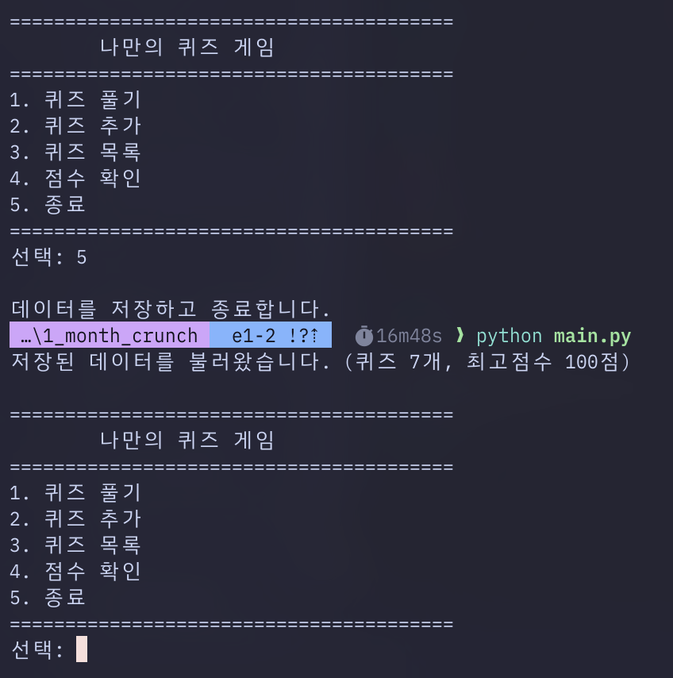

현재 README 설명과 동일하게 6개 메뉴가 출력되어야 합니다.

### 7-2. 퀴즈 진행 화면
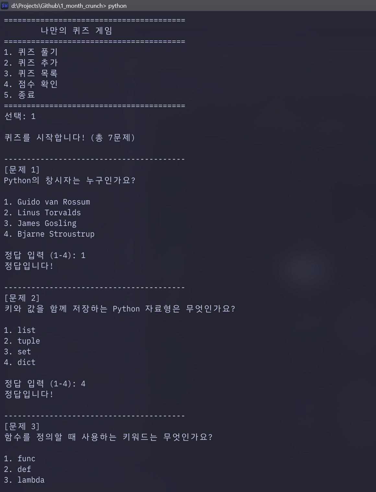

- 문제 풀이 흐름을 확인할 수 있습니다.
- 실제 코드에서는 이 흐름에 앞서 문제 수 선택이 들어가며, 출제는 랜덤 순서로 진행됩니다.

### 7-3. 정답/오답 처리 화면
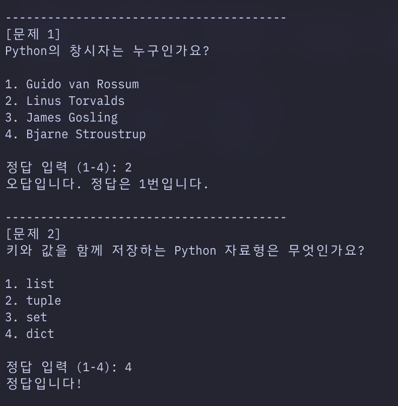

- 각 문제를 푼 직후 정답 여부를 바로 안내합니다.
- 힌트 사용 여부와 점수 감점은 같은 플레이 흐름 안에서 함께 적용됩니다.

### 7-4. 새 퀴즈 추가 화면
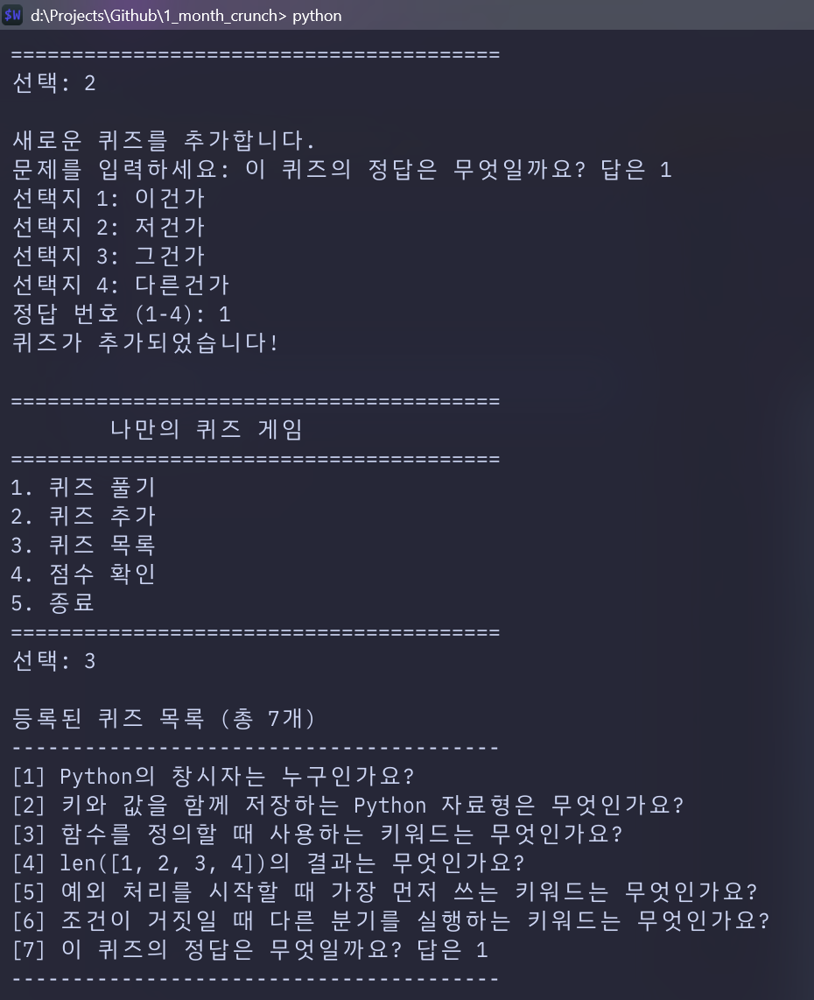

- 문제, 선택지, 정답 번호, 힌트를 입력해 새 퀴즈를 저장합니다.
- 저장 직후 `state.json`에 반영됩니다.

### 7-5. 최고 점수 및 최근 기록 화면
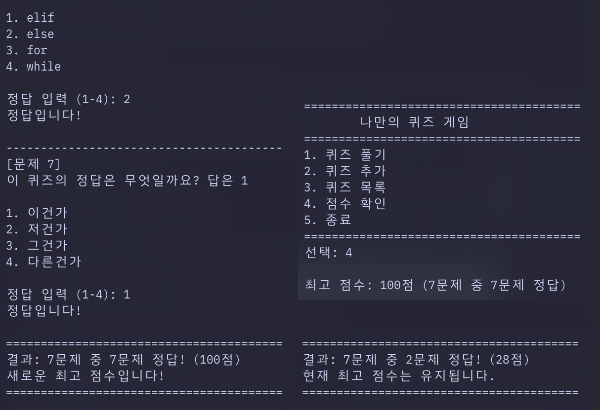

- 최고 점수와 함께 최근 플레이 기록(history)을 확인하는 화면입니다.
- 최신 5개만 최신순으로 보여 주는 현재 구현 설명과 연결됩니다.

### 7-6. 입력 오류 및 안전 종료 화면
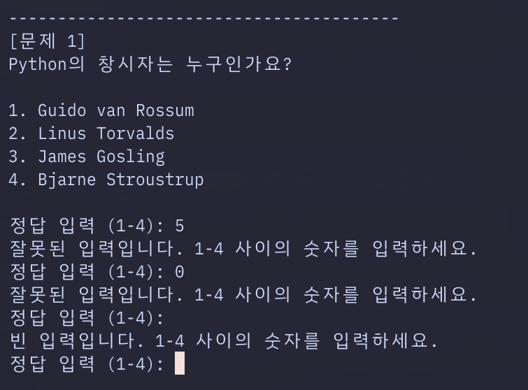

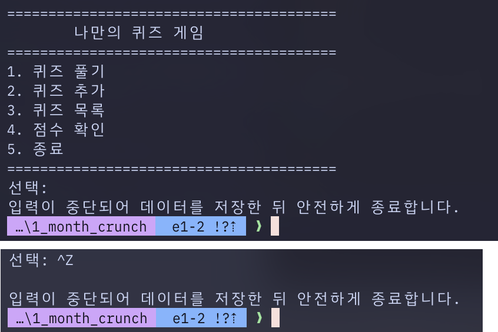

- 숫자 범위 오류, 문자 입력, 입력 중단 상황을 확인할 수 있습니다.

### 7-7. 손상 복구 화면
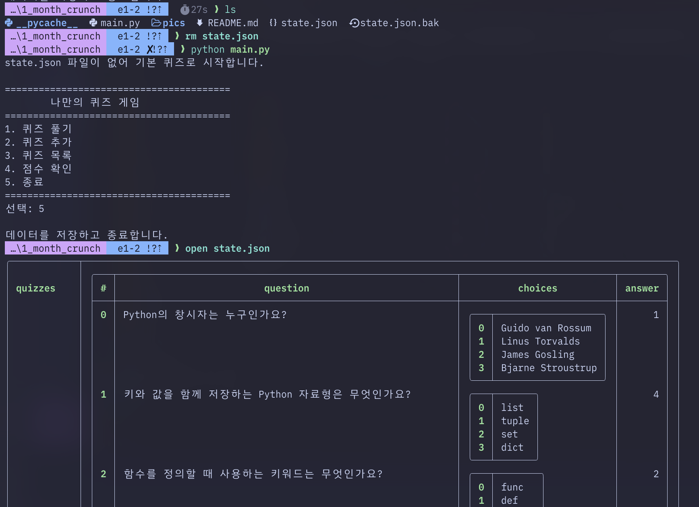

- `state.json` 전체가 깨졌거나 핵심 구조가 잘못되었을 때 기본 데이터로 복구하는 흐름을 보여 주는 증빙입니다.

### 7-8. 추가로 있으면 좋은 보완 증빙
- 퀴즈 삭제 기능은 현재 저장소에 별도 삭제 캡처 파일이 없으므로, 제출 전에 실제 삭제 번호 선택과 최종 확인 문구가 함께 보이는 화면 1장을 추가해 주세요. 현재 문구는 사용자가 나중에 채워 넣을 자리표시자입니다: `퀴즈 삭제 확인 화면 추가 예정`

## 8. 데이터 파일(`state.json`) 설명

- 경로: `./state.json`
- 역할: 퀴즈 목록, 최고 점수, 최근 플레이 기록 저장
- 인코딩: UTF-8

### 8-1. 왜 JSON을 사용했는가
- Python 표준 라이브러리의 `json`만으로 읽고 쓸 수 있어 별도 패키지가 필요 없습니다.
- 사람이 직접 파일을 열어 구조를 확인하기 쉬워 과제 설명용으로 적합합니다.
- 퀴즈 목록은 배열, 최고 점수는 객체, 최근 기록은 객체 배열로 표현할 수 있어 현재 데이터 형태와 잘 맞습니다.
- 즉, JSON은 “무엇이 저장되고 있는가”를 눈으로 보여 주기 좋은 저장 형식입니다.

### 8-2. 현재 스키마 예시

아래 예시는 현재 코드가 다루는 구조를 설명하기 위한 예시입니다.

```json
{
  "quizzes": [
    {
      "question": "문제",
      "choices": ["선택지1", "선택지2", "선택지3", "선택지4"],
      "answer": 1,
      "hint": "문제를 푸는 데 도움이 되는 설명"
    }
  ],
  "best_score": {
    "correct": 4,
    "total": 6,
    "score": 56
  },
  "history": [
    {
      "played_at": "2026-04-03T21:22:23",
      "total": 6,
      "correct": 4,
      "score": 56,
      "hint_used": 1
    }
  ]
}
```

### 8-3. 필드 설명
- `quizzes`: 전체 퀴즈 목록입니다.
- `question`: 문제 문자열입니다.
- `choices`: 길이 4의 선택지 배열입니다.
- `answer`: 정답 번호이며 1~4 범위의 정수입니다.
- `hint`: 해당 문제의 힌트 문자열입니다.
- `best_score`: 최고 기록입니다. 아직 플레이 전이면 `null`일 수 있습니다.
- `history`: 최근 플레이 기록 배열입니다.
- `played_at`: ISO 형식 시각 문자열입니다.
- `hint_used`: 해당 라운드에서 힌트를 사용한 문제 수입니다.

### 8-4. 왜 현재 필드 구조를 선택했는가
- `quizzes`는 실제 출제 원본 데이터이므로 문제 단위로 묶어 두는 편이 가장 직관적입니다.
- 각 퀴즈에 `question`, `choices`, `answer`, `hint`를 함께 두면 문제 1개를 다시 복원하기 위한 최소 정보가 한곳에 모입니다.
- `best_score`를 별도 객체로 둔 이유는 최고 기록 화면에서 바로 사용하기 위해서입니다. 매번 `history` 전체를 다시 계산할 필요가 없습니다.
- `history`는 플레이 1회의 결과만 요약 저장해 최근 기록 표시와 검증을 단순하게 유지합니다.
- 전체적으로 보면 “현재 퀴즈 데이터”, “최고 기록”, “최근 플레이 기록”을 구분해 저장하는 구조입니다.

## 9. 클래스 구조와 역할 분리

### 9-1. `Quiz` 클래스
- 퀴즈 1개를 표현하는 데이터 단위입니다.
- 문제, 선택지, 정답, 힌트를 보관합니다.
- 화면 출력(`display`), 정답 판정(`is_correct`), JSON 저장용 변환(`to_dict`, `from_dict`)을 담당합니다.

### 9-2. `QuizGame` 클래스
- 게임 전체 흐름을 관리하는 상위 클래스입니다.
- 퀴즈 목록, 최고 점수, 최근 기록, 실행 상태, 파일 경로를 관리합니다.
- 메뉴 출력, 입력 처리, 라운드 준비, 퀴즈 플레이, 퀴즈 추가/삭제, 점수 확인, 저장/불러오기, 안전 종료를 담당합니다.

### 9-3. 왜 둘을 분리했는가
- `Quiz`는 문제 1개의 책임만 맡고, `QuizGame`은 프로그램 전체 진행을 맡도록 분리했습니다.
- 이렇게 나누면 “문제 데이터 구조”와 “게임 흐름 제어”가 섞이지 않아 수정 범위가 줄어듭니다.
- 과제 설명에서도 객체지향 설계 이유를 분명하게 제시할 수 있습니다.

## 10. 입력 처리 / 게임 흐름 / 저장-불러오기 설명

### 10-1. 입력 처리 기준
- `ask_text()`는 빈 문자열을 허용하지 않고 재입력을 요구합니다.
- `ask_number()`는 정수 변환 실패, 범위 오류, 빈 입력을 모두 다시 입력받습니다.
- `read_input()`는 `KeyboardInterrupt`, `EOFError`를 `SafeExit`으로 바꿔 상위 흐름에서 공통 처리하게 만듭니다.

### 10-2. 게임 진행 흐름
1. `QuizGame()` 생성 시 `load_state()`가 먼저 호출됩니다.
2. `run()`이 메뉴를 반복 출력합니다.
3. 사용자가 메뉴를 고르면 `handle_menu()`가 기능별로 분기합니다.
4. 퀴즈 풀기에서는 먼저 문제 수를 입력받고, 퀴즈 목록을 복사한 뒤 랜덤으로 섞습니다.
5. 각 문제에서 힌트 사용 여부를 선택하고, 정답을 입력받아 채점합니다.
6. 라운드 종료 후 점수를 계산하고 `history`를 기록합니다.
7. 최고 점수를 갱신한 뒤 `save_state()`로 저장합니다.

### 10-3. `load_state()`가 호출되는 시점과 동작
- `load_state()`는 프로그램 시작 시 `__init__()`에서 가장 먼저 호출됩니다.
- `state.json`이 없으면 기본 퀴즈 6개로 시작하고, 최고 점수는 `None`, 최근 기록은 빈 배열로 둡니다.
- 저장 파일이 정상이라면 `quizzes`, `best_score`, `history`를 메모리로 복원합니다.
- 구버전 데이터처럼 개별 퀴즈에 `hint`가 없으면 기본 힌트 문자열로 보완해 로드합니다.
- `history` 필드가 없거나 구조가 잘못되면, 평가 관점에서도 중요한 퀴즈 데이터와 최고 점수는 그대로 유지한 채 최근 기록만 비우고 계속 실행합니다.
- 기술적으로는 `history`만 빈 배열로 초기화해 다시 로드하는 방식이라, “전체 파일 복구”가 아니라 “최근 기록만 무시하고 나머지는 살려서 로드”하는 동작입니다.

### 10-4. `save_state()`가 호출되는 시점과 동작
- 퀴즈를 추가한 직후 저장합니다.
- 퀴즈를 삭제한 직후 저장합니다.
- 한 라운드가 끝나 최고 점수와 `history`가 갱신된 뒤 저장합니다.
- 정상 종료(`exit_game()`) 시 저장합니다.
- 입력 중단으로 안전 종료(`handle_safe_exit()`)할 때도 저장합니다.
- 즉, 상태가 실제로 바뀌는 시점마다 저장해 다음 실행에서도 이어지게 했습니다.

### 10-5. 전체 손상 복구와 history-only fallback의 차이
- `state.json` 전체가 깨졌거나 JSON 파싱이 실패하거나 핵심 구조가 잘못되면, 프로그램은 기본 퀴즈 데이터로 복구하고 그 즉시 `save_state()`를 호출해 파일도 다시 씁니다.
- 반면 `history`만 잘못된 경우에는 퀴즈와 최고 점수는 그대로 두고 `history = []`로만 처리합니다.
- 즉, 전체 손상은 즉시 파일 재작성, history-only 문제는 최근 기록만 버리고 실행 계속이라는 차이가 있습니다.

### 10-6. 왜 파일 I/O에 `try/except`가 필요한가
- 파일은 없을 수도 있고, JSON이 깨져 있을 수도 있으며, 읽기/쓰기 중 OS 오류가 날 수도 있습니다.
- 예외 처리가 없으면 프로그램이 바로 종료되어 과제 프로그램으로서 완성도가 떨어집니다.
- 따라서 `load_state()`와 `save_state()`에 예외 처리를 두어 복구 또는 안내 메시지 출력을 가능하게 했습니다.

## 11. 기본 데이터 상태

저장소에 포함된 현재 `state.json` 샘플은 다음 상태를 기준으로 맞춰져 있습니다.

- 기본 퀴즈 6개가 모두 실제 힌트를 포함합니다.
- `best_score`는 6문항 모두 정답인 예시 값(`100점`)이 들어 있습니다.
- `history`는 빈 배열로 시작합니다.
- 테스트에서는 저장소의 `state.json` 샘플과 코드의 기본 퀴즈 데이터가 일치하는지도 검증합니다.

## 12. 테스트 및 검증 포인트

```bash
python -m pytest
```

현재 테스트는 다음 내용을 포함합니다.

- 기본 퀴즈 로드 및 파일 누락 시 기본값 사용
- 구버전 형식(`hint`/`history` 누락) 로드 허용
- 힌트/히스토리 스키마 저장과 복원
- 랜덤 순서(random order)와 문제 수 선택(selectable count)
- 힌트 사용과 점수 감점
- 퀴즈 추가 시 힌트 저장
- 퀴즈 삭제 흐름
- 플레이 기록 저장과 최근 기록 최대 5개 출력
- 저장소의 `state.json` 샘플과 기본 퀴즈 일치 여부

## 13. Git 작업 흐름 설명

### 13-1. 커밋 단위 전략
- 커밋은 “기능 하나” 또는 “이유 하나”씩 나누는 것이 가장 설명하기 쉽습니다.
- 예를 들어 힌트 기능 추가, 플레이 기록 저장 추가, 퀴즈 삭제 추가, README 보강은 서로 목적이 다르므로 분리하는 편이 좋습니다.
- 이렇게 나누면 `git log`에서 프로그램이 어떤 단계로 발전했는지 읽기 쉬워집니다.

### 13-2. 커밋 메시지 규칙
- 첫 줄만 읽어도 변경 이유가 보이도록 짧고 분명하게 적는 것을 기준으로 삼았습니다.
- 예: `feat: add quiz hints`, `feat: implement quiz deletion`, `docs: strengthen README evidence`
- 즉, “무엇을 왜 바꿨는지”가 보이는 메시지를 유지하는 것이 원칙입니다.

### 13-3. 브랜치를 나누는 이유
- 메인 브랜치에서 모든 작업을 바로 진행하면 기능 추가, 문서 수정, 실험적 변경이 한 줄 기록에 섞이기 쉽습니다.
- 그래서 기능 작업이나 문서 보강 작업을 브랜치별로 분리하면 변경 범위가 명확해집니다.
- 과제 관점에서는 특정 기능이 어떤 단위로 진행되었는지 설명하기 쉬워집니다.

### 13-4. merge의 의미
- `merge`는 분리해서 진행한 브랜치의 변경을 기준 브랜치에 합치는 과정입니다.
- 즉, 독립 작업을 최종 결과물에 반영했다는 증거가 됩니다.
- 제출 시 브랜치 작업이 실제 프로젝트 결과에 어떻게 합쳐졌는지 보여 주는 근거로 활용할 수 있습니다.

### 13-5. `git log` 증빙
- 평가자가 작업 기록을 확인할 때는 `git log --oneline` 또는 `git log --oneline --graph`가 가장 직관적입니다.
- 기능 추가, 문서 보강, merge 흐름이 한눈에 보여 작업 과정을 설명하기 좋습니다.

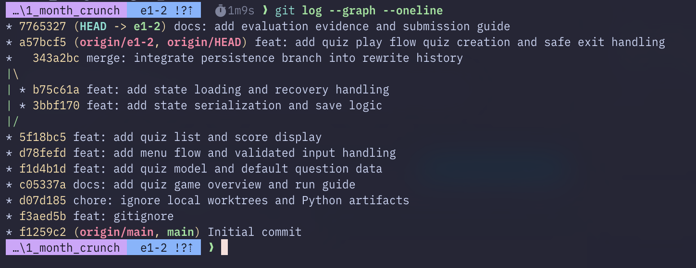

## 14. `git clone` / `git pull` 실습 증빙

### 14-1. 왜 clone과 pull을 따로 설명하는가
- `git clone`은 저장소를 처음 내 컴퓨터로 받아 오는 과정입니다.
- `git pull`은 이미 받은 저장소를 최신 상태로 갱신하는 과정입니다.
- 둘을 구분해서 설명하면 “처음 받기”와 “이후 업데이트 반영”의 차이를 문서에서 분명하게 보여 줄 수 있습니다.

### 14-2. clone 실습 설명
- 새 폴더에 저장소를 복제한 뒤 README, 파일 구조, 브랜치 상태가 정상적으로 내려왔는지 확인하면 됩니다.
- 이 과정은 제출용 저장소가 다른 환경에서도 재현 가능하다는 점을 보여 주는 기본 증빙이 됩니다.

### 14-3. pull 실습 설명
- 원격에 반영된 변경이 로컬에도 갱신되는지 확인하고, 어떤 차이가 들어왔는지 짧게 정리하면 됩니다.
- 가능하면 pull 전후에 `git log`나 변경 파일 목록을 함께 확인하면 업데이트 반영 증빙이 더 분명해집니다.

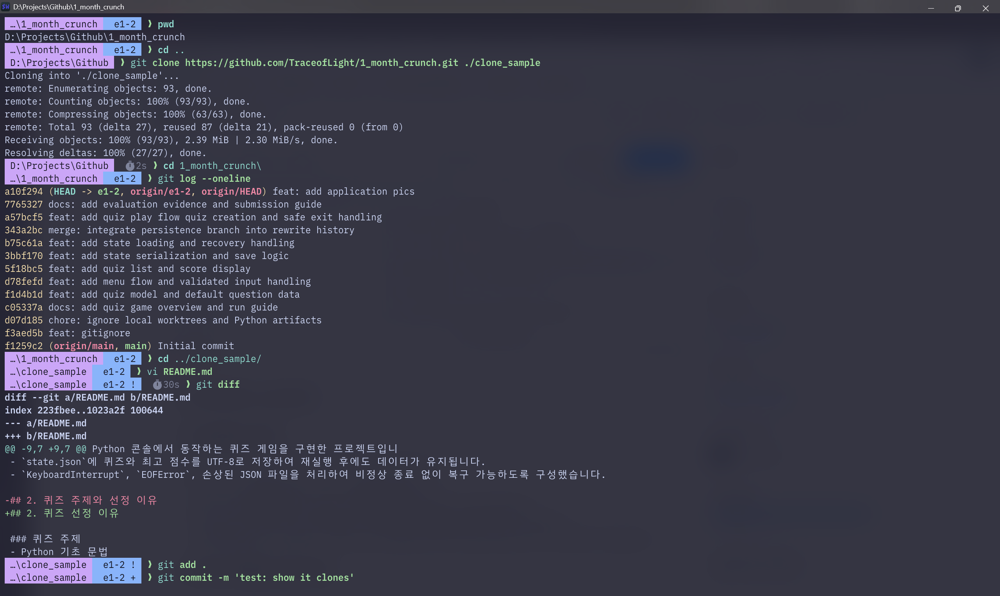

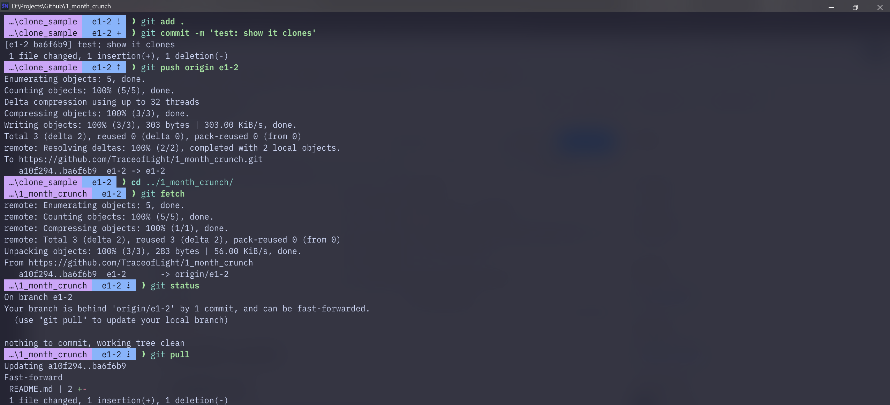

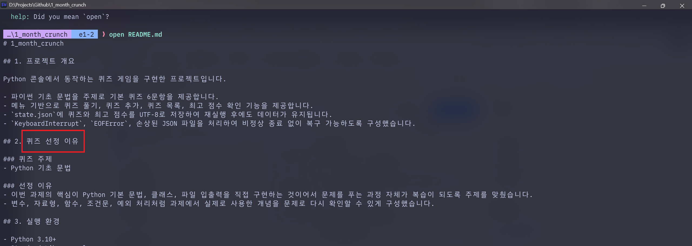

## 15. 파일 구조

```text
.
├─ README.md
├─ main.py
├─ state.json
├─ pics/
│  ├─ menu.png
│  ├─ play.png
│  ├─ answers.png
│  ├─ add_quiz.png
│  ├─ score.png
│  ├─ wrong_answer.png
│  ├─ EOF_control.png
│  ├─ recovery.png
│  ├─ git_log.png
│  ├─ git_1.png
│  ├─ git_2.png
│  └─ git_3.png
├─ docs/
└─ tests/
   └─ test_main.py
```

## 16. 면접식 예상 질문과 답변

### Q. JSON 저장 방식은 퀴즈가 1000개 이상으로 늘어나도 괜찮나요?
- 과제 규모의 콘솔 프로그램에서는 이해하기 쉽고 관리하기도 쉽지만, 한계는 분명합니다.
- 현재 구조는 `state.json` 전체를 한 번에 읽고 다시 저장하므로 데이터가 크게 늘어나면 로딩/저장 효율이 떨어질 수 있습니다.
- 따라서 과제 설명용으로는 적합하지만 규모가 더 커지면 SQLite 같은 저장소로 넘어가는 것이 다음 단계라고 답할 수 있습니다.

### Q. `state.json`이 손상되면 어떻게 대응하나요?
- JSON 파싱 실패나 핵심 구조 손상 시 기본 퀴즈 데이터로 복구하고 즉시 저장합니다.
- 단, `history`만 잘못되었을 때는 퀴즈와 최고 점수는 유지하고 최근 기록만 빈 배열로 처리합니다.
- 한 문장으로 정리하면 “손상 범위를 구분해서 최소한의 데이터만 버리고 계속 실행”하는 방식입니다.

### Q. 점수 규칙이나 퀴즈 구조가 바뀌면 어디를 먼저 수정해야 하나요?
- 점수 규칙이 바뀌면 `QuizGame`의 점수 계산, 최고 점수 갱신, 기록 저장 흐름을 먼저 봐야 합니다.
- 퀴즈 구조가 바뀌면 `Quiz` 데이터 구조와 `state.json` 스키마 설명을 먼저 봐야 합니다.
- 즉, 규칙 변경은 게임 로직부터, 구조 변경은 데이터 모델과 저장 형식부터 확인하는 것이 우선입니다.

### Q. 함수만으로 구현하지 않고 클래스를 쓴 이유는 무엇인가요?
- 퀴즈 1개와 게임 전체 흐름의 책임을 분리하기 위해서입니다.
- 함수만으로 모두 구현하면 데이터와 상태가 여러 곳에 흩어지기 쉬워 수정 범위가 커집니다.
- 클래스로 나누면 저장, 출력, 판정, 메뉴 흐름의 경계가 더 분명해집니다.

## 17. 최종 제출 전 체크리스트

### README 내용 점검
- [x] 현재 메뉴가 6개(풀기/추가/목록/삭제/점수/종료)로 반영되어 있다.
- [x] random order, selectable question count, hints, history가 현재 구현대로 설명되어 있다.
- [x] `state.json` 스키마에 `hint`와 `history`가 포함되어 있다.
- [x] `load_state()` / `save_state()`의 호출 시점과 복구 동작이 현재 코드와 맞다.
- [x] `history`만 잘못되었을 때의 fallback 동작을 별도로 설명했다.
- [x] `git log` 증빙과 `git clone` / `git pull` 설명이 포함되어 있다.

### 추가로 보완하면 좋은 항목
- [ ] 퀴즈 삭제 실화면 캡처 1장 추가
- [ ] 문제 수 선택 또는 힌트 사용 장면이 더 잘 보이는 캡처가 필요하면 1장 추가
