# 행렬 변환과 경사하강법으로 이해하는 딥러닝의 핵심 원리

선형대수, 미적분, 최적화, 확률을 NumPy 구현과 Matplotlib/Seaborn 시각화로 연결한 실습 프로젝트이다. 신경망의 선형층을 행렬 변환으로 해석하고, 손실을 줄이는 과정은 경사하강법 경로로 확인하며, MSE와 Cross-Entropy가 각각 어떤 확률 모델의 최대우도추정과 같은지 수식으로 정리했다.

## 실행 방법

```powershell
python -m venv .venv
.\.venv\Scripts\Activate.ps1
pip install -r requirements.txt
python scripts/run.py
python -m pytest
```

선택적으로 Docker에서도 같은 파이프라인을 실행할 수 있다.

```powershell
docker build -t ai-assignment .
docker run --rm ai-assignment
```

`scripts/run.py`는 난수 시드를 `np.random.seed(42)`로 고정하고, 모든 그림을 `outputs/`에 PNG로 저장하며, 수치 검증 로그를 `evidence/summary.txt`와 `evidence/backprop_numpy_check.txt`에 저장한다.

## 파일 구조

| 경로 | 역할 |
|---|---|
| `src/linear_algebra.py` | 회전, 스케일링, 전단 행렬, 면적비 검증, Power Iteration, SVD 이미지 복원 |
| `src/calculus.py` | 중심차분 수치 미분, 2변수 함수 gradient 등고선 시각화 |
| `src/optimizer.py` | `VanillaGD`, `Momentum`, 보너스 `Adam`, 수렴 경로 시각화 |
| `src/probability.py` | 정규분포 PDF, 베르누이 PMF, 소프트맥스, 정보 이론 보너스 함수 |
| `notebooks/backprop_derivation.ipynb` | 2층 신경망 순전파/역전파 손계산과 NumPy 검증 |
| `notebooks/probability_loss.ipynb` | 확률 분포 시각화 코드와 MSE/Cross-Entropy의 MLE 유도 |
| `scripts/run.py` | 전체 재현 단일 진입점 |
| `outputs/` | 변환, SVD, gradient, 최적화, 분포 PNG |
| `evidence/` | 재현 결과 텍스트 로그 |

## 데이터와 재현성

SVD 압축 실험은 Matplotlib에 번들로 포함된 `grace_hopper.jpg` 예제 이미지를 사용하고, 중앙 `64x64` 영역을 grayscale로 변환한다. 원본 이미지는 Grace Hopper 공식 초상 사진으로, Wikimedia Commons 설명에 따르면 미국 해군 공무 수행 저작물이라 미국 내 퍼블릭 도메인이다: [Grace Hopper.jpg](https://en.wikisource.org/wiki/File:Grace_Hopper.jpg). 별도 데이터 다운로드 명령은 필요 없다.

`k=10, 50, 100` 복원을 모두 실행하되, `64x64` 행렬의 최대 rank는 64이므로 `k=100` 요청은 내부적으로 `rank_used=64`인 완전 rank 복원으로 처리한다. 이 선택은 “64x64 이하 grayscale 이미지” 조건과 “k=10, 50, 100 비교” 조건을 동시에 만족시키기 위한 것이다.

## 주요 결과

| 항목 | 검증 결과 |
|---|---|
| 회전 `R(pi/4)` | `det=1.000000`, 면적비 `1.000000`, 상대오차 `0.00000000` |
| 스케일링 `S(2, 0.5)` | `det=1.000000`, 면적비 `1.000000`, 상대오차 `0.00000000` |
| 전단 `Sh(1.0)` | `det=1.000000`, 면적비 `1.000000`, 상대오차 `0.00000000` |
| Power Iteration | `lambda=4.61803399`, `np.linalg.eig=4.61803399`, 상대오차 `0.00000000`, 37회 수렴 |
| 중심차분 | `f(x)=x^2`, `x=3`에서 `6.0000000000`, 해석값 6과 오차 `0.0000000000` |
| Vanilla GD | `lr=0.1`, 100회 후 반경 `0.0000000014` |
| 발산 예시 | `lr=1.1`, 시작 반경 `1.4142135624`, 20회 후 반경 `54.2175537620` |
| 타원 함수 Momentum | `x^2+10y^2`, 100회 후 Vanilla 값 `0.4396986651`, Momentum 값 `0.0024795600` |
| Softmax | `[0.0900305732, 0.2447284711, 0.6652409558]`, 합 `1.0000000000`, 오차 `0.000000000000` |

시각화 산출물:

- 행렬 변환: 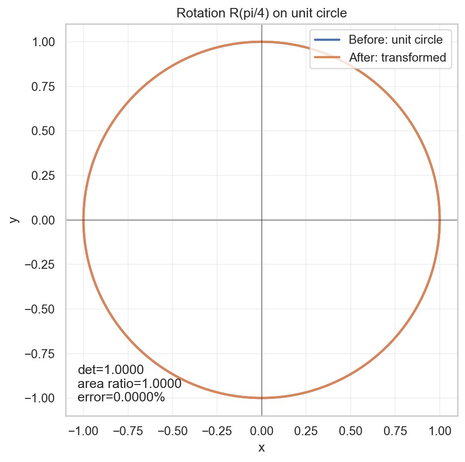 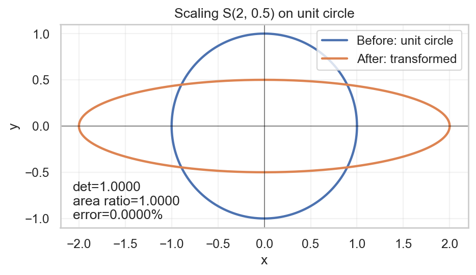 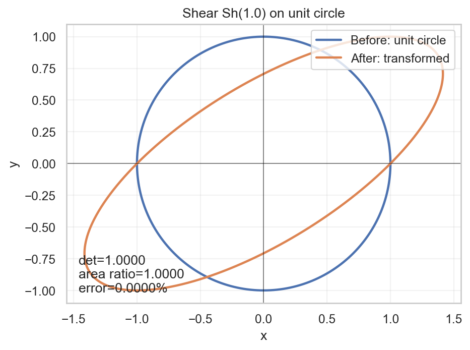
- SVD 복원: 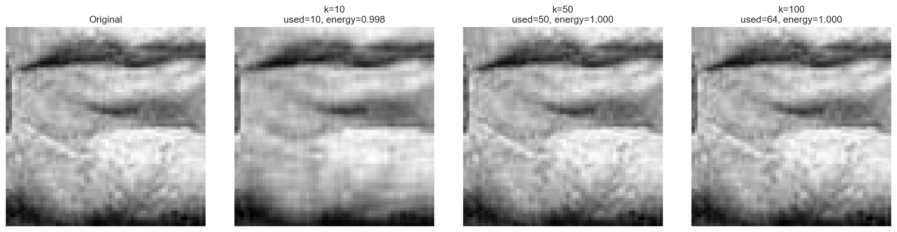
- Gradient 등고선: 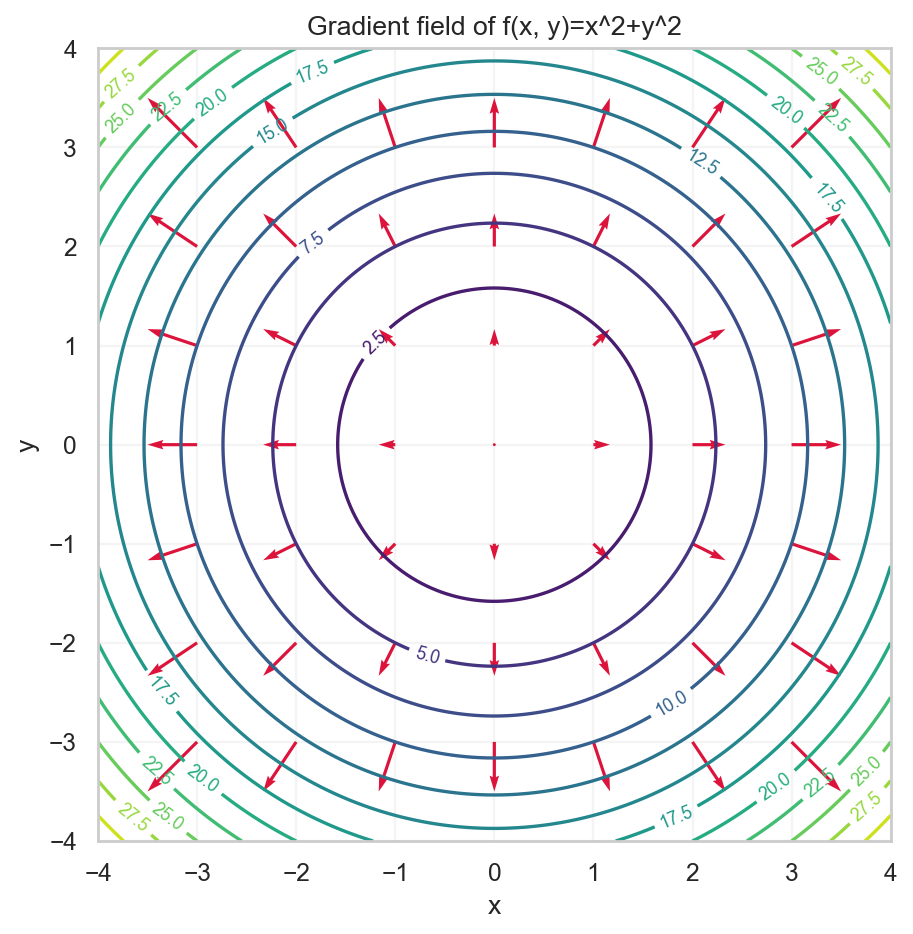
- 최적화 경로: 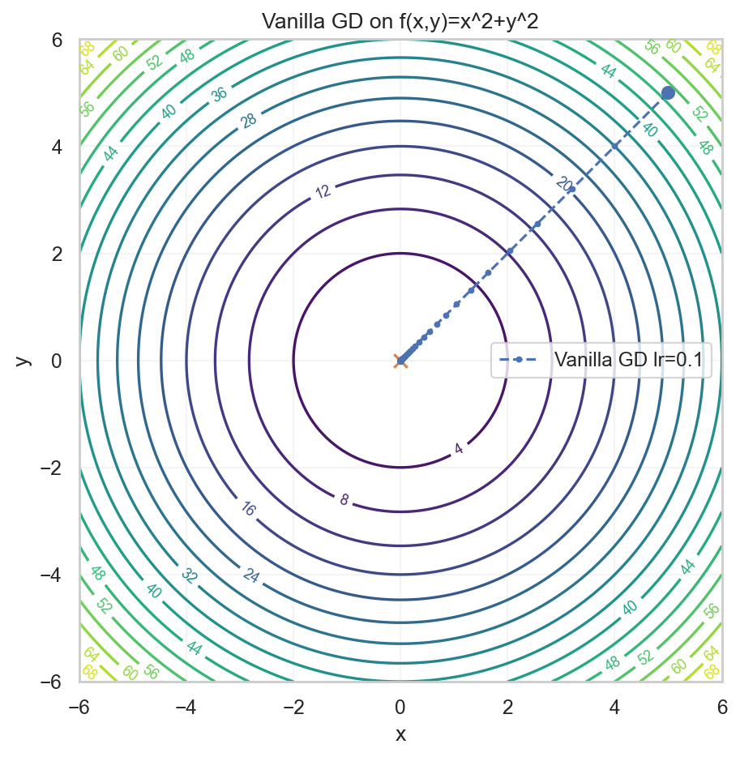 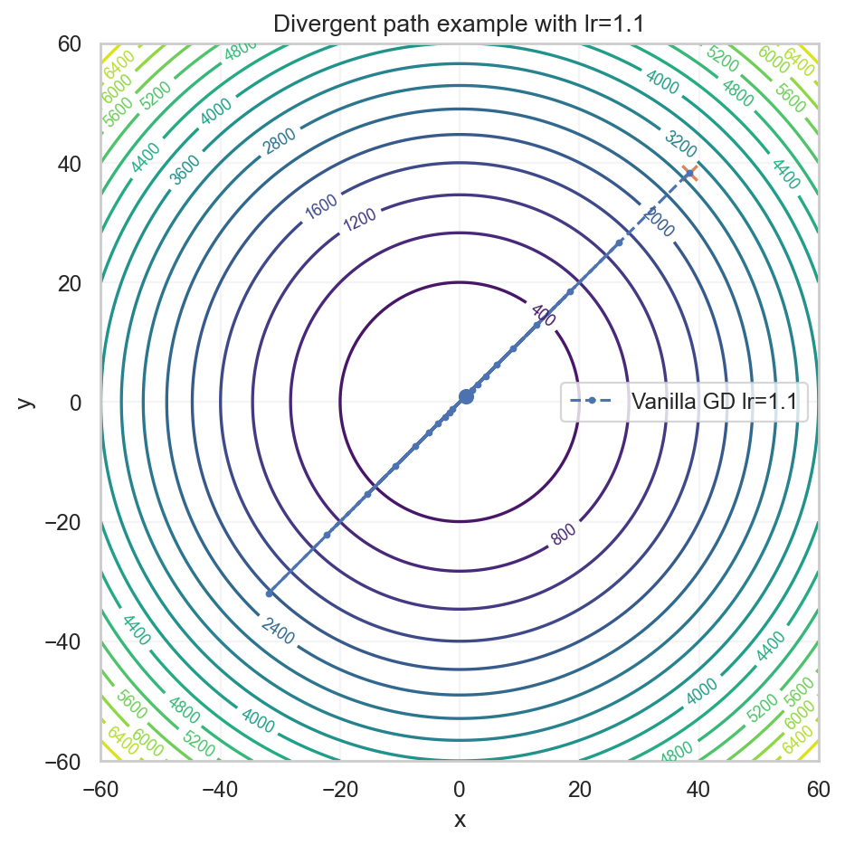 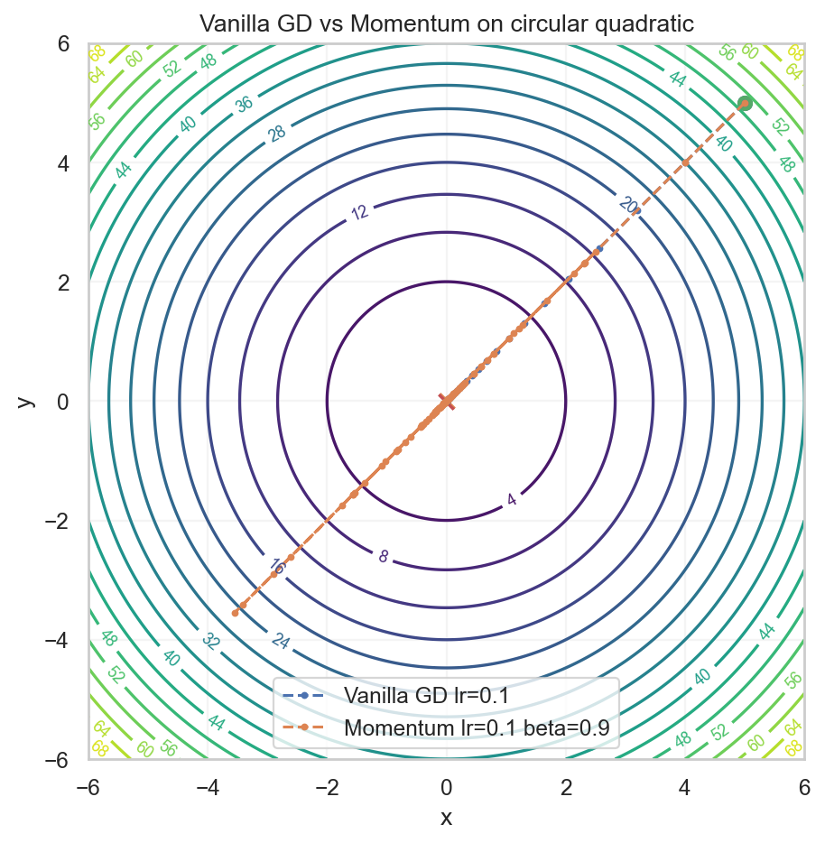 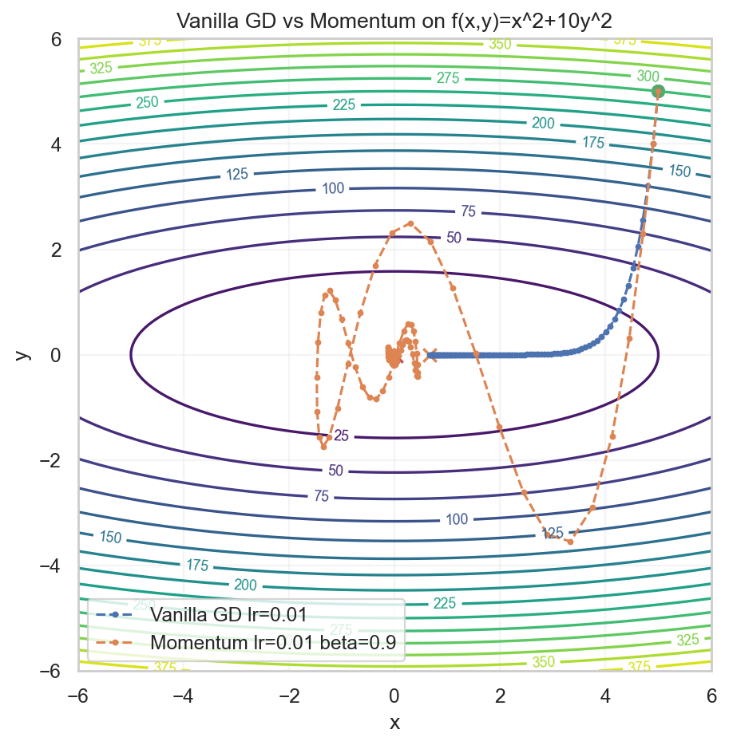
- 확률 분포: 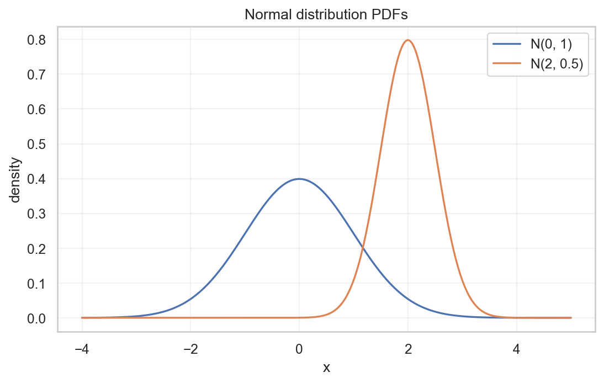 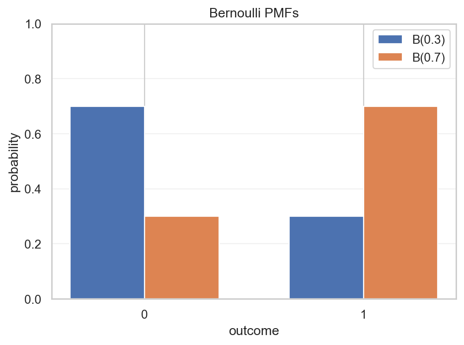

## 선형대수 구현과 해석

행렬 변환은 점을 행벡터로 저장하고 `points @ A.T`로 적용했다. 수학적으로는 각 점 `p`에 대해 `p' = A p`를 계산하는 것과 같다.

회전 행렬은

```text
R(theta) = [[cos(theta), -sin(theta)],
            [sin(theta),  cos(theta)]]
```

이고 `det(R)=1`이므로 면적이 보존된다. 스케일링 행렬 `S(2, 0.5)`는 x축을 2배, y축을 0.5배로 바꾸어 단위 원을 타원으로 만들지만 `det(S)=2*0.5=1`이라 면적은 유지된다. 전단 행렬 `Sh(k)=[[1,k],[0,1]]`은 원을 기울어진 형태로 바꾸지만 `det(Sh)=1`이므로 역시 면적은 유지된다.

면적 검증은 단위 원을 720개 점의 다각형으로 근사하고 shoelace 공식 `area = 1/2 * |sum(x_i y_{i+1} - y_i x_{i+1})|`를 사용했다. 선형 변환 후 면적비가 `|det(A)|`와 같아야 하며, 세 변환 모두 상대오차가 1% 이내가 아니라 수치상 0에 가깝게 확인되었다.

Power Iteration은 `v_{t+1} = A v_t / ||A v_t||`를 반복하고 Rayleigh quotient `lambda = v^T A v / v^T v`로 고유값을 추정한다. 고유값 계산 자체에는 `np.linalg.eig`를 쓰지 않았고, 검증 단계에서만 `A=[[4,1],[1,3]]`의 최대 고유값과 비교했다.

SVD 복원은 `A = U Sigma V^T`에서 상위 `k`개의 특이값만 남기는 방식이다. 보존 에너지는 `sum(s[:k]^2) / sum(s^2)`로 계산했다. 결과는 `k=10`에서 `0.99766132`, `k=50`에서 `0.99999963`, `k=100` 요청에서 `rank_used=64`, `1.00000000`이었다.

## 미적분 구현과 해석

중심차분은 다음 공식을 사용했다.

```text
f'(x) ~= (f(x+h) - f(x-h)) / (2h)
```

`h=1e-5`로 `f(x)=x^2`, `x=3`을 계산하면 `6.0000000000`이 나온다. 해석적 미분 `2x=6`과의 절대오차는 `1e-4` 기준을 만족한다.

2변수 함수 `f(x,y)=x^2+y^2`의 gradient는 `[2x, 2y]`이다. 등고선은 `x^2+y^2 = c`인 원이고, gradient는 원점에서 해당 점으로 향하는 반지름 방향이다. 원의 접선 방향과 반지름 방향은 수직이므로, 등고선 위의 gradient 화살표가 등고선에 수직으로 나타난다.

## 역전파 손계산

고정 예제는 `x=[1,0]`, `W1=[[0.1,0.2],[0.3,0.4]]`, `b1=[0,0]`, `W2=[0.5,0.6]`, `b2=0`, `y_true=1`이다.

순전파:

```text
x:      (2,)   = [1, 0]
W1:     (2,2)  = [[0.1, 0.2], [0.3, 0.4]]
z1:     (2,)   = W1 @ x + b1 = [0.1000, 0.3000]
a1:     (2,)   = sigmoid(z1) = [0.5250, 0.5744]
W2:     (2,)   = [0.5, 0.6]
z2:     scalar = W2 @ a1 + b2 = 0.6072
y_pred: scalar = sigmoid(z2) = 0.6473
L:      scalar = -log(y_pred) = 0.4350
```

역전파:

```text
dL/dy_pred = -y/y_pred + (1-y)/(1-y_pred)
            = -1/0.6473 = -1.5449

dL/dz2 = dL/dy_pred * y_pred(1-y_pred)
       = y_pred - y_true = -0.3527

dL/dW2 = dL/dz2 * a1
       = [-0.1852, -0.2026]          shape (2,)

dL/da1 = dL/dz2 * W2
       = [-0.1764, -0.2116]          shape (2,)

dL/dz1 = dL/da1 * a1 * (1-a1)
       = [-0.0440, -0.0517]          shape (2,)

dL/dW1 = outer(dL/dz1, x)
       = [[-0.0440, 0.0000],
          [-0.0517, 0.0000]]         shape (2,2)
```

`notebooks/backprop_derivation.ipynb`와 `evidence/backprop_numpy_check.txt`의 NumPy 계산은 위 손계산과 소수점 4자리까지 일치한다.

## 최적화 구현과 해석

Vanilla GD는 `theta <- theta - lr * grad(theta)`를 사용한다. `f(x,y)=x^2+y^2`에서 gradient는 `[2x,2y]`이므로 각 좌표 업데이트는 `theta_{t+1} = (1 - 2lr) theta_t`이다. `lr=0.1`이면 수축 계수는 `0.8`이라 100회 후 원점 반경 `0.1` 이내에 도달한다.

발산 그래프는 `lr=1.1`로 만들었다. 이 값은 `0.5` 이상이며, 이 함수에서는 `|1-2lr| > 1`이 되어 좌표 크기가 반복마다 커진다. 로그에서도 반경이 `1.4142`에서 `54.2176`으로 증가했다.

Momentum은 heavy-ball 형태로 구현했다.

```text
v_t = beta * v_{t-1} + grad(theta_t)
theta_{t+1} = theta_t - lr * v_t
```

`beta=0.9`는 이전 gradient 방향을 강하게 보존하므로 완만한 방향으로는 가속하고, 급격한 방향의 반복 진동은 완화한다. 원형 함수에서는 Vanilla GD와 Momentum의 경로 차이를 한 Figure에 겹쳤고, 타원형 함수 `x^2+10y^2`에서는 `lr=0.01`로 비교했다. 100회 후 목적 함수 값은 Vanilla `0.4396986651`, Momentum `0.0024795600`으로 Momentum이 더 빠르게 낮은 손실에 도달했다.

보너스로 Adam도 구현했다. Adam은 1차 모멘트와 2차 모멘트를 모두 사용하며, 타원형 함수에서 100회 후 목적 함수 값 `0.0160775851`을 기록했다.

## 확률과 손실 함수

정규분포 시각화는 `N(0,1)`과 `N(2,0.5)`의 PDF를 같은 Figure에 그렸다. 베르누이 시각화는 `B(0.3)`과 `B(0.7)`의 `P(X=0), P(X=1)` 막대를 같은 Figure에 비교했다.

소프트맥스는 overflow를 피하기 위해 `logits - max(logits)`를 먼저 적용한다.

```text
softmax(z_i) = exp(z_i - max(z)) / sum_j exp(z_j - max(z))
```

`[1,2,3]`에 대한 출력은 `[0.0900305732, 0.2447284711, 0.6652409558]`이고 합은 `1.0000000000`이라 `1e-6` 기준을 만족한다.

MSE와 정규분포 MLE:

```text
y_i = f(x_i; theta) + epsilon_i,  epsilon_i ~ N(0, sigma^2)

p(y_i | x_i, theta)
= 1 / sqrt(2 pi sigma^2) * exp(-(y_i - f(x_i; theta))^2 / (2 sigma^2))

log L(theta)
= sum_i [-log sqrt(2 pi sigma^2)
         - (y_i - f(x_i; theta))^2 / (2 sigma^2)]

argmax_theta log L(theta)
= argmin_theta sum_i (y_i - f(x_i; theta))^2
= argmin_theta MSE
```

Cross-Entropy와 베르누이 MLE:

```text
p(y_i | x_i, theta) = p_i^y_i * (1-p_i)^(1-y_i)

-log L(theta)
= -sum_i [y_i log p_i + (1-y_i) log(1-p_i)]
= Binary Cross-Entropy의 합
```

Cross-Entropy와 카테고리 MLE:

```text
p(y_i | x_i, theta) = product_k p_ik^y_ik

-log L(theta)
= -sum_i sum_k y_ik log p_ik
= Categorical Cross-Entropy의 합
```

따라서 MSE는 정규분포 오차 모델의 음의 로그우도이고, Cross-Entropy는 베르누이/카테고리 분류 모델의 음의 로그우도이다.

## 명령과 옵션 선택 근거

- `python scripts/run.py`: 데이터 준비, 계산, 시각화, evidence 저장을 한 번에 재현하기 위한 단일 진입점이다.
- `python -m pytest`: 핵심 수학 API의 정확도를 자동 검증한다.
- `Power Iteration tol=1e-10`: 요구 기준은 5% 이내지만, 작은 대칭 행렬 검증에서는 더 엄격한 수렴 기준을 사용했다.
- `unit_circle num_points=720`: 면적비 검증에서 다각형 근사 오차를 충분히 낮추기 위한 점 개수이다.
- `central_difference h=1e-5`: truncation error와 floating-point cancellation 사이의 균형을 잡는 값이다.
- `Vanilla GD lr=0.1`: `x^2+y^2`에서 안정적으로 수렴하는 기본 실험값이다.
- `divergence lr=1.1`: `0.5` 이상 학습률 중 실제 발산이 관찰되는 값을 선택했다.
- `elliptic lr=0.01`: `x^2+10y^2`의 y축 곡률이 크므로 안정성을 확보하면서 Momentum의 누적 효과를 관찰하기 위한 값이다.

## 위협 모델과 품질 통제

- 자동 미분 라이브러리 위협: PyTorch, TensorFlow, JAX, scikit-learn 최적화/PCA를 사용하지 않았다. 모든 핵심 계산은 NumPy로 직접 구현했다.
- 검증용 고유값 계산 오용 위협: `np.linalg.eig`는 `scripts/run.py`의 Power Iteration 검증 코드에서만 사용한다. `power_iteration()` 내부에는 포함하지 않았다.
- 수치 불안정성 위협: softmax는 최댓값을 빼고 지수 함수를 적용하며, 중심차분은 `h=1e-5`로 고정했다. Cross-Entropy/정보 이론 함수는 로그 계산에 작은 `eps`를 둔다.
- 재현성 위협: 난수 시드, 고정 버전 의존성, 단일 실행 스크립트, Dockerfile을 제공한다.
- 산출물 누락 위협: `outputs/`와 `evidence/`를 `.gitignore`에서 제외하지 않았다. 재실행 후 생성 파일을 바로 확인할 수 있다.
- 해석 오류 위협: eigenvector는 부호가 바뀌어도 같은 방향을 의미하므로 비교 시 내적 부호를 맞춘다. SVD의 `k=100`은 64x64 행렬의 최대 rank 제한 때문에 `rank_used=64`로 기록한다.

## 문제 해결 절차

- `ModuleNotFoundError: No module named 'src...'`: 저장소 루트에서 `python scripts/run.py` 또는 `python -m pytest`를 실행한다.
- Matplotlib 창 관련 오류: 스크립트는 `Agg` 백엔드를 사용하므로 GUI가 없어도 PNG를 생성한다. 노트북에서만 대화형 표시가 필요하다.
- `grace_hopper.jpg` 샘플을 찾지 못함: `pip install -r requirements.txt`로 Matplotlib를 다시 설치한다. 스크립트에는 실행 실패를 막는 대체 경로가 있지만, 정상 재현은 Matplotlib 샘플 이미지를 기준으로 한다.
- Power Iteration 벡터 부호가 예시와 반대임: 고유벡터 `v`와 `-v`는 같은 고유공간을 나타낸다. 고유값과 방향 일치 여부를 기준으로 판단한다.
- 발산 그림에서 경로가 크게 튀어 보임: `lr=1.1`은 발산을 확인하기 위한 의도적 설정이다. 수렴 실험은 `lr=0.1` 결과를 기준으로 본다.

## 검증 명령 결과

마지막 확인 명령:

```powershell
python scripts/run.py
python -m pytest tests/test_linear_algebra.py tests/test_calculus.py tests/test_optimizer.py tests/test_probability.py -q
```

`scripts/run.py`는 `evidence/summary.txt`를 다시 생성했고, 테스트는 12개 모두 통과했다.
