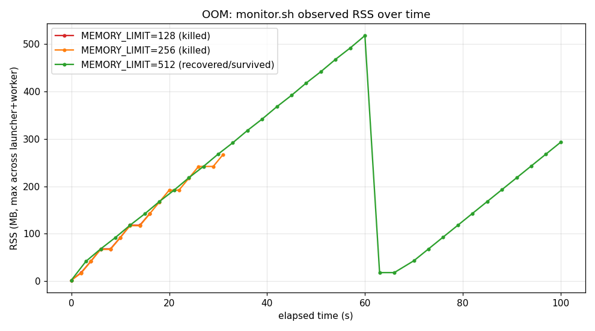
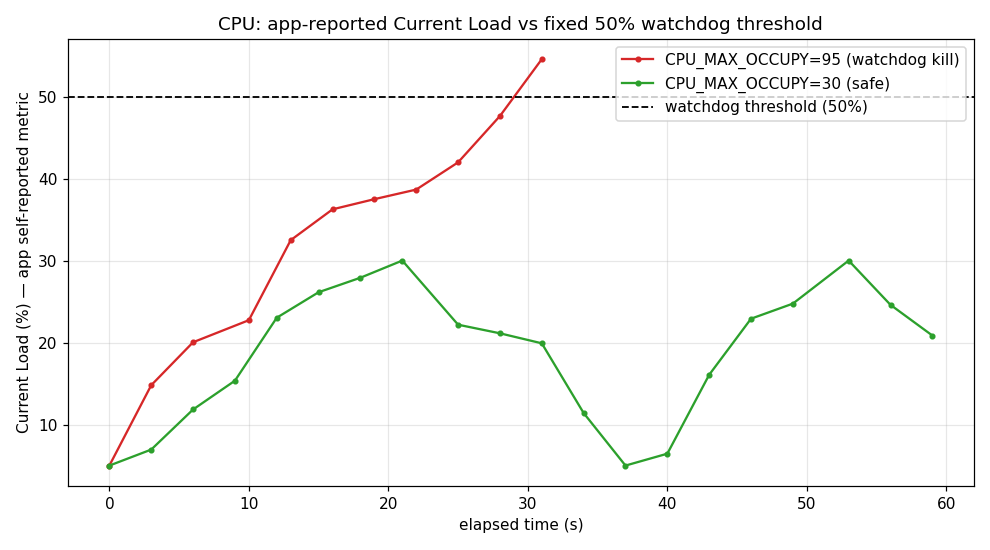
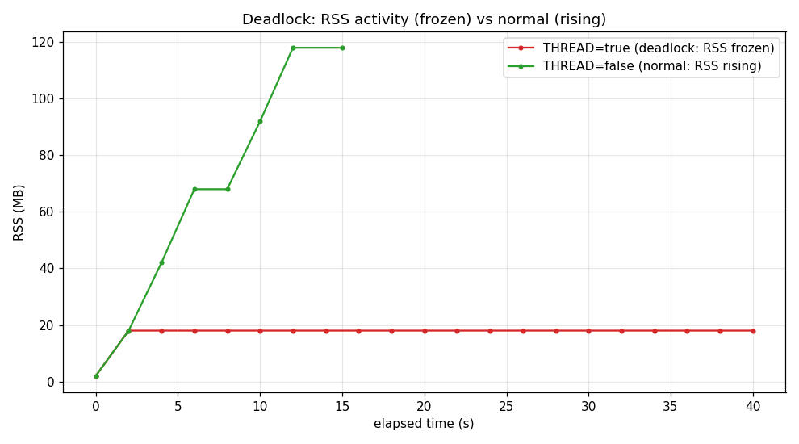

# 리눅스 프로세스 및 시스템 리소스 트러블슈팅

빌드된 데몬 `agent-leak-app-x86` 을 운영 환경에서 실행하며 발생하는 세 가지 시스템 장애 — 메모리 누수에 의한 OOM, CPU 과점유에 의한 Watchdog 종료, 멀티스레드 교착상태(Deadlock) — 를 관제 데이터와 실행 로그를 근거로 진단하고, GitHub Issue 형태의 기술 리포트로 정리한 결과물이다. 모든 수치와 로그 발췌는 `evidence/` 아래에 한 번의 파이프라인 실행(`scripts/run.sh all`)에서 같은 타임라인으로 수집된 실제 캡처를 그대로 인용한다.

## 한눈에 보는 3대 장애

| 장애 | 트리거 환경변수 | 관측된 핵심 증상 | 종료 형태 | 핵심 마커 (실제 로그) | Before → After |
| --- | --- | --- | --- | --- | --- |
| OOM Crash | `MEMORY_LIMIT` <= 256 | RSS 가 시간에 따라 선형 증가 후 예고 없이 종료 | SIGKILL, 셸 exit 137 | `[CRITICAL] [MemoryGuard] Memory limit exceeded` + `Self-terminating process` | 128MB→17s 종료, 256MB→32s 종료, 512MB→무한 생존(자가 회복) |
| CPU Latency | `CPU_MAX_OCCUPY` >= 50 | 앱 자체 보고 Load 가 50% 임계를 넘는 순간 종료 | SIGTERM, 셸 exit 143 | `[CRITICAL] [CpuWorker] CPU Threshold Violated!` | 95%→33s 종료, 30%→60s 생존(임계 위반 0건) |
| Deadlock | `MULTI_THREAD_ENABLE` = true | PID 생존, CPU/MEM/로그 모두 정지(무응답) | 종료 없음(영구 BLOCKED) | `[Worker-Thread-N] WAITING for [...]... (Status: BLOCKED)` | true→영구 정지, false→정상 진행 |

세 장애는 모두 동일한 바이너리에서 부트 사전 조건 환경변수 값에 따라 시나리오가 자동 선택된다. 시나리오 선택 규칙은 다음과 같다.

- `MULTI_THREAD_ENABLE=true` 이면 Deadlock 경로(별도 코드 경로, 누수/CPU 워커 없음).
- 그렇지 않으면서 `CPU_MAX_OCCUPY >= 50` 이면 CPU 경로.
- 그렇지 않으면서 `MEMORY_LIMIT <= 256` 이면 메모리 누수 경로.
- 위 어느 것도 아니면(메모리 권장치 이상, CPU 50 미만, 단일 스레드) Healthy 모니터링.

미션 예시 문서의 종료 배너(`SELF-TERMINATED (Memory Limit Exceeded)`, `WATCHDOG: INITIATING EMERGENCY ABORT (SIGTERM)`)는 이 빌드가 글자 그대로 출력하지는 않는다. 대신 같은 의미를 갖는 실제 마커가 출력되며, 본 리포트는 그 둘을 다음과 같이 대응시켜 인용한다.

| 미션 예시 배너 | 이 빌드의 실제 마커 | 부가 증거 |
| --- | --- | --- |
| `SELF-TERMINATED (Memory Limit Exceeded)` | `[CRITICAL] [MemoryGuard] Self-terminating process <pid>` | 셸 종료코드 137 (128+SIGKILL 9) |
| `WATCHDOG: INITIATING EMERGENCY ABORT (SIGTERM)` | `[CRITICAL] [CpuWorker] CPU Threshold Violated! (<load>%)` | 셸 종료코드 143 (128+SIGTERM 15) |
| `WAITING... BLOCKED` | `[Worker-Thread-N] WAITING for [...]... (Status: BLOCKED)` | PID 생존 + 스레드 `futex_wait_queue` |

## 실행 환경과 재현 방법

### 환경

- 실행 호스트: WSL2 Ubuntu 24.04 (커널 `6.6.87.2-microsoft-standard-WSL2`), x86_64.
- 실행 계정: 일반 사용자(uid=1000). 부트 1단계가 root 실행을 거부하므로 비루트 계정이 필수다.
- 분석 도구: `procps`(ps/top/pgrep), Python 3.12 + matplotlib 3.6.3(차트 생성).
- 대상 바이너리: `agent-leak-app-x86` (PyInstaller 패키징 ELF). x86 외 환경을 위해 `agent-leak-app-arm64` 도 동봉한다.

### 단일 진입점

모든 단계는 `scripts/run.sh` 하나로 재현한다. 증거가 같은 실행에서 일관된 타임라인으로 나오도록 인자 없이(또는 `all`) 전체 파이프라인을 한 번에 도는 방식을 권장한다.

```bash
bash scripts/run.sh all        # 부트 → OOM → CPU → Deadlock → Scheduler → Charts (기본값)
bash scripts/run.sh boot       # 부트 사전 조건 검증만
bash scripts/run.sh oom        # 메모리 누수 / OOM 만
bash scripts/run.sh cpu        # CPU 과점유 만
bash scripts/run.sh deadlock   # 교착상태 만
bash scripts/run.sh scheduler  # 보너스: 스케줄러 블록 캡처
bash scripts/run.sh charts     # 수집된 로그로 PNG 차트만 재생성
```

전체 실행은 약 6분이 걸린다. OOM 생존 케이스(512MB)는 힙이 한계에 도달해 캐시 플러시가 일어나기까지 시간이 필요하므로 100초 관측 창을 사용한다.

### 컨테이너 재현

평가자가 로컬 OS/패키지 상태에 의존하지 않도록 `Dockerfile` 을 함께 제공한다. 부트 사전 조건상 비루트 실행이 필요하므로 컨테이너 안에 일반 계정 `agent`(uid 1001)를 만들어 그 계정으로 실행한다.

```bash
docker build -t agent-leak-lab .
docker run --rm agent-leak-lab all      # 또는 boot|oom|cpu|deadlock|scheduler
```

### 스크립트와 증거 디렉터리 구조

| 경로 | 역할 |
| --- | --- |
| `scripts/run.sh` | 단일 진입점. 단계 디스패치. |
| `scripts/lib.sh` | 공용 헬퍼(부트 환경 구성, 프로세스 정리, ps/top/스레드 스냅샷). |
| `scripts/monitor.sh` | 관제 스크립트. 대상 프로세스의 합산 CPU/MEM/최대 RSS 를 주기적으로 1줄씩 기록. |
| `scripts/run_boot.sh` | 부트 사전 조건 정상/실패 케이스 캡처. |
| `scripts/run_oom.sh` | `MEMORY_LIMIT` 128/256/512 3회 실행. |
| `scripts/run_cpu.sh` | `CPU_MAX_OCCUPY` 95/30 2회 실행 + ps/top 스냅샷. |
| `scripts/run_deadlock.sh` | `MULTI_THREAD_ENABLE` true/false 2회 실행 + 스레드 스냅샷 2시점. |
| `scripts/run_scheduler.sh` | Healthy 실행에서 스케줄러 블록 추출. |
| `scripts/make_charts.py` | 수집 로그로부터 PNG 차트 3종 생성. |
| `evidence/boot/` | 정상 부트 + 3개 실패 케이스 로그. |
| `evidence/oom/` | OOM before/mid/after 의 앱 로그·관제 로그·요약. |
| `evidence/cpu/` | CPU before/after 의 앱 로그·관제 로그·ps/top 스냅샷·요약. |
| `evidence/deadlock/` | Deadlock before/after 의 앱 로그·관제 로그·스레드 스냅샷(T1/T2)·요약. |
| `evidence/scheduler/` | Healthy 실행 전체 로그와 스케줄러 블록 발췌. |
| `evidence/charts/` | `oom_rss.png`, `cpu_load.png`, `deadlock_activity.png`. |

## 사전 준비: 부트 사전 조건 검증

`agent-leak-app-x86` 은 부팅 시 6단계 사전 점검을 수행하고, 하나라도 위반하면 그 단계에서 즉시 실패 처리하며 이후 단계는 건너뛴 채 `System Boot Failed. Process Terminated.` 를 출력하고 종료한다. 요구되는 조건은 다음과 같다.

| 항목 | 조건 | 점검 단계 |
| --- | --- | --- |
| 실행 계정 | root 가 아닌 일반 사용자 | [1/6] User Account |
| `AGENT_HOME` | 필수 환경변수 설정 | [2/6] Environment Variables |
| `AGENT_PORT` | `15034` (고정) | [2/6] Environment Variables |
| `AGENT_UPLOAD_DIR` | `$AGENT_HOME/upload_files` 디렉터리 존재 | [2/6] Environment Variables |
| `AGENT_KEY_PATH` | `$AGENT_HOME/api_keys` 경로 존재 | [2/6] / [3/6] |
| `AGENT_LOG_DIR` | 로그 디렉터리 존재 + 쓰기 권한 | [5/6] Log Permission |
| `MEMORY_LIMIT` | 정수 50~512 (MB) | [6/6] Mission Environment |
| `CPU_MAX_OCCUPY` | 정수 10~100 (%) | [6/6] Mission Environment |
| `MULTI_THREAD_ENABLE` | `true`/`false` | [6/6] Mission Environment |
| `secret.key` | `$AGENT_KEY_PATH/secret.key`, 내용 정확히 `agent_api_key_test` | [3/6] Required Files |
| 네트워크 | `0.0.0.0:15034` 바인딩 가능 | [4/6] Port Availability |

`scripts/lib.sh` 의 `setup_env` 가 위 조건을 모두 구성한다. 전용 작업 디렉터리(`/tmp/agent-leak-lab`)를 `AGENT_HOME` 으로 강제 지정해, 로그인 프로파일이 미리 export 해 둔 쓰기 불가 경로의 영향을 받지 않게 한다. `secret.key` 는 개행 없이 정확한 문자열로 기록한다.

정상 부트(모든 조건 충족, `evidence/boot/boot_success.log`):

```
[1/6] Checking User Account               [OK]
[2/6] Verifying Environment Variables     [OK]
[3/6] Checking Required Files             [OK]
[4/6] Checking Port Availability          [OK]
[5/6] Verifying Log Permission            [OK]
[6/6] Verifying Mission Environment       [OK]
------------------------------------------------------------
All Boot Checks Passed!
Agent READY
2026-06-07 21:02:01,487 [INFO] [SafetyGuard] Process priority lowered (nice=10).
2026-06-07 21:02:01,488 [INFO] Agent listening at port 15034
```

부트 직후 `SafetyGuard` 가 프로세스 우선순위를 `nice=10` 으로 낮추는 점에 주목한다. 이 앱은 자신을 의도적으로 저우선순위로 두어, 과부하 시에도 호스트의 다른 프로세스에 CPU 를 양보하도록 설계되어 있다. 이 사실은 뒤의 CPU 케이스에서 "호스트는 한가한데 앱만 종료된다"는 현상을 해석하는 근거가 된다.

실패 케이스 세 건도 함께 캡처해, 사전 조건이 어떻게 강제되는지 보인다.

`MEMORY_LIMIT` 범위 위반(40, 허용 50~512) — `evidence/boot/boot_fail_memory_range.log`:

```
[6/6] Verifying Mission Environment       [FAIL]
   >>> MEMORY_LIMIT too low (40MB). Minimum: 50MB
--------------------------------------------------
System Boot Failed. Process Terminated.
```

`secret.key` 내용 불일치 — `evidence/boot/boot_fail_secretkey.log`. 3단계에서 실패하면 이후 단계는 모두 건너뛴다.

```
[3/6] Checking Required Files             [FAIL]
   >>> Invalid Content in secret.key
   >>>    (Expected: 'agent_api_key_test', Found: 'wrong_key_value')
[4/6] Checking Port Availability          [FAIL]
   >>> Skipped due to previous critical failure.
```

`AGENT_PORT` 고정값 위반(9999) — `evidence/boot/boot_fail_port.log`:

```
[2/6] Verifying Environment Variables     [FAIL]
   >>> Port mismatch (Expected 15034, Got 9999)
```

## 관제 방법론과 진단 도구

장애 종류와 무관하게 모든 케이스에서 공통으로 쓰인 데이터 수집·판단 절차를 먼저 정리한다.

### monitor.sh 가 수치를 추출하는 방법

이 바이너리는 PyInstaller 런처와 워커, 두 프로세스로 갈라진다. 두 프로세스의 `comm` 이름이 같고 15자를 넘어 `pgrep -x` 로는 잡히지 않으며, 단순히 "첫 PID" 만 보면 RSS 약 2MB 의 런처만 잡혀 사용량이 0 으로 보인다. 그래서 `monitor.sh` 는 다음 3단계로 집계한다.

1. PID 수집: `pgrep -f agent-leak-app-x86` 로 런처와 워커의 모든 PID 를 가져와 쉼표로 묶는다.
2. 원시 표본: `ps -o %cpu=,%mem=,rss= -p <pids>` 로 헤더 없이 프로세스별 CPU/MEM/RSS 를 읽는다.
3. 집계: `awk` 로 CPU 와 MEM 은 전체 PID 합산, RSS 는 최댓값(`if($3>r)r=$3`)을 취하고 KB 를 MB 로 환산(`/1024`)한다. 워커가 실제 메모리를 쥐므로 RSS 는 합이 아니라 최댓값이 의미 있는 지표다.

이렇게 만든 한 줄을 미션 예시와 동일한 포맷으로 기록한다.

```
[2026-06-07 21:02:01] PROCESS:agent-leak-app CPU:0.9% MEM:0.3% RSS:118MB DISK:950G FIREWALL:inactive
```

메모리 추세는 백분율(`%MEM`)이 아니라 절대 RSS(MB)로 본다. `%MEM` 은 호스트 총 메모리에 대한 비율이라 머신마다 기준이 달라지지만, RSS 절대값은 "이 프로세스가 실제로 쥔 물리 메모리"를 그대로 보여 주어 누수 추세 판독에 적합하기 때문이다. 시계열만 따로 뽑을 때는 다음처럼 추출한다.

```bash
grep -oE 'RSS:[0-9]+MB' evidence/oom/monitor_before.log
```

### CPU 진단 도구와 옵션의 의미 구분

CPU 케이스에서는 "무엇을 측정하는가"가 도구마다 다르므로, 네 가지 지표를 의도적으로 함께 떠서 대비시킨다(`scripts/lib.sh` 의 `snap_cpu`).

| 명령 / 지표 | 측정하는 값 | 해석 |
| --- | --- | --- |
| `ps -o %cpu -p <pid>` | 프로세스 수명 전체에 대한 누적 평균 %CPU | 장기 평균. 짧은 스파이크는 희석된다. |
| `top -b -n2 -d0.3 -p <pid>` 의 2번째 표본 | 직전 0.3초 구간의 순간 %CPU | 실시간 점유. 1번째 표본은 버리고 2번째를 본다. |
| `top -b -n1` 헤더(`%Cpu(s)`, `load average`) | 호스트 전체 CPU 포화 여부 | 시스템 전역 관점. 특정 프로세스가 아니라 OS 전체. |
| 앱 로그 `Current Load: N%` | 앱이 스스로 보고하는 내부 부하 지표 | 이 빌드의 Watchdog 가 임계 판단에 사용하는 값. |

이 구분이 중요한 이유는, 이 빌드의 CPU 부하가 OS 스케줄러를 실제로 포화시키는 부하가 아니라 앱 내부에서 산출한 지표이기 때문이다. Watchdog 는 OS 의 실측 점유율이 아니라 앱 자신의 `Current Load` 를 보고 종료를 결정한다. 도구별 지표를 함께 떠 두면 이 사실(앱 정책 종료 vs OS 포화 종료의 구분)을 증거로 보일 수 있다.

### 진단 도구 사용 순서와 판단 흐름

"프로세스가 죽었다/멈췄다"는 현상에서 원인 유형까지 좁혀 가는 일반 흐름은 다음과 같다.

1. 살아 있나 죽었나부터 가른다: `pgrep -f` / `ps -ef | grep [a]gent` 로 PID 존재를 확인한다. PID 가 사라졌으면 종료형(OOM 또는 CPU), 남아 있으면 무응답형(Deadlock 의심)으로 분기한다.
2. 종료형이면 종료 신호를 본다: 셸 종료코드 137(SIGKILL)이면 메모리 보호(`MemoryGuard`), 143(SIGTERM)이면 과점유 보호(`Watchdog`)를 1차 가설로 세우고, 앱 로그의 `[CRITICAL]` 라인으로 확정한다.
3. 무응답형이면 "느린 진행"과 "완전 정지"를 가른다: `monitor.sh` 의 RSS 추세, 그리고 같은 지점을 두 시점에 떠서 로그·RSS·`TIME+` 가 그대로인지 본다. 변화가 전혀 없으면 정지다.
4. 정지의 원인을 락 대기로 좁힌다: `ps -L` / `top -H` 로 스레드별 대기 채널(`WCHAN`)을 본다. `futex_wait_queue` 는 락 대기, `do_select` 는 정상 이벤트 루프 대기다.
5. 마지막 로그로 인과를 닫는다: 멈추기 직전 로그에서 어떤 스레드가 어떤 자원을 점유하고 무엇을 기다리는지 읽어 순환 대기를 그린다.

이하 세 건의 리포트는 위 절차를 각 장애에 적용한 결과를 GitHub Issue 형식으로 정리한 것이다.

## 리포트 1 — [Bug] OOM Crash: 메모리 누수로 임계 도달 후 MemoryGuard 강제 종료

### 1. Description (현상 설명)

- 무엇: `agent-leak-app-x86` 프로세스가 예고 없이 종료되며 셸 종료코드 137 을 남긴다.
- 언제: `MEMORY_LIMIT` 가 권장치(256) 이하일 때. 128MB 설정에서 약 17초, 256MB 설정에서 약 32초 만에 종료된다.
- 어디서: 부트 직후 `MemoryWorker` 가 활성화되는 정상 워크로드 구간.
- 어떻게: 관제 로그상 RSS 가 시간에 따라 계단식으로 꾸준히 상승하다가, 한계 부근에서 프로세스가 사라진다.
- 누가: 외부 신호가 아니라 애플리케이션 내부의 메모리 보호 정책 `MemoryGuard` 가 스스로 종료시킨다.
- 왜: `MemoryWorker` 가 힙에 데이터를 약 3초마다 25MB씩 쌓고 해제하지 않아(누수), 추적 힙이 `MEMORY_LIMIT` 에 도달하기 때문이다.

### 2. Evidence & Logs (증거 자료)

관제 로그의 RSS 추이(`evidence/oom/monitor_before.log`, `MEMORY_LIMIT=128`). 2MB(런처만)로 시작해 워커가 붙으면서 약 25MB 간격으로 상승하다 종료된다.

```
RSS:2MB RSS:18MB RSS:42MB RSS:68MB RSS:68MB RSS:92MB RSS:118MB RSS:118MB RSS:142MB
[2026-06-07 21:02:33] PROCESS:agent-leak-app STATUS:NOT_RUNNING (프로세스 종료 감지)
```

종료 직전/직후 실행 로그(`evidence/oom/app_before.log`). 힙이 한계를 넘는 순간 `MemoryGuard` 가 자가 종료한다.

```
2026-06-07 21:02:33,404 [CRITICAL] [MemoryGuard] Memory limit exceeded (150MB >= 128MB) / (Recommend Over 256MB)
2026-06-07 21:02:33,404 [CRITICAL] [MemoryGuard] Self-terminating process 1073 to prevent system instability.
```

부트 시 자원 점검 배너가 이미 위험을 경고한다(`MEMORY_LIMIT` 가 권장치 미만일 때).

```
 [ MEMORY ] Limit: 128MB 		[ WARNING: Recommend Over 256MB ]
```

세 설정의 RSS 추이를 한 그래프로 겹쳐 비교한다.



### 3. Root Cause Analysis (원인 분석)

현상은 전형적인 메모리 누수다. 프로그램의 메모리는 크게 코드/정적 영역, 스택, 힙으로 나뉘는데, 동적으로 할당한 데이터는 힙에 올라간다. 정상 프로그램은 더 쓰지 않는 힙 객체의 참조를 끊어 회수되게 하지만, 이 앱의 `MemoryWorker` 는 생성한 데이터를 계속 누적만 하고 해제하지 않는다. 그래서 힙 사용량이 약 3초당 25MB 의 일정한 기울기로 단조 증가한다(`Current Heap: 25MB → 50MB → 75MB ...`).

이때 두 단계의 보호 메커니즘을 구분해 이해해야 한다.

- 애플리케이션 수준(`MemoryGuard`): 앱이 자체적으로 추적하는 힙 카운터가 `MEMORY_LIMIT` 에 도달하면, 시스템 전체가 불안정해지기 전에 선제적으로 자기 프로세스를 SIGKILL 로 종료한다. 본 케이스에서 관측된 종료가 이것이다. 셸 종료코드 137 = 128 + 9(SIGKILL) 가 이를 뒷받침한다.
- 운영체제 수준(참고): 만약 이런 앱 보호가 없었다면, 물리 메모리가 고갈되면서 커널은 페이지 회수(`kswapd`)를 시작하고, 스왑이 켜져 있으면 스왑 thrashing 으로 시스템 전체가 느려진다. 그래도 메모리가 부족하면 커널 OOM Killer 가 `oom_score` 가 높은 프로세스를 강제 종료한다. 즉 한 프로세스의 누수는 그 프로세스만의 문제가 아니라, 페이지 회수 비용과 스왑 경합을 통해 호스트 전체의 지연으로 번진다. `MemoryGuard` 는 이 연쇄가 시작되기 전에 가해자 프로세스를 먼저 끄는 자가 격리 장치다.

`Memory limit exceeded (150MB >= 128MB)` 에서 한계(128)보다 큰 150 이 찍히는 것은, 워커가 한 사이클에 25MB 단위로 늘리다 보니 한계를 넘긴 첫 표본에서 비교가 일어나기 때문이다. 관제 RSS(약 142MB)가 앱이 보고한 힙(150MB)보다 약간 작은 것은, `MemoryGuard` 가 OS RSS 가 아니라 앱이 추적하는 힙 카운터를 기준으로 판단하고, RSS 표본과 종료 시점 사이에 미세한 시차가 있기 때문이다.

### 4. Workaround & Verification (조치 및 검증)

조치: 부트 환경변수 `MEMORY_LIMIT` 를 상향한다. 가용 한계를 높이면 누수가 한계에 도달하기까지 더 오래 걸리고, 권장치(256 초과)로 올리면 앱의 자가 회복 경로가 작동해 종료 자체가 사라진다.

세 차례 실행한 Before & After 비교(`evidence/oom/before_after.txt`):

| MEMORY_LIMIT | 결과 | 생존 시간 | 종료코드 | 마지막 힙 |
| --- | --- | --- | --- | --- |
| 128MB (before) | MemoryGuard 종료 | 17s | 137 | 150MB |
| 256MB (mid) | MemoryGuard 종료 | 32s | 137 | 275MB |
| 512MB (after) | 종료 안 함, 100초 관측 내내 생존 | ALIVE | — | 회복 후 재누적 |

512MB 설정에서는 힙이 525MB 에 도달하자 종료 대신 캐시 플러시로 자가 회복하고, 힙을 다시 25MB 로 떨어뜨린 뒤 재누적하는 톱니 패턴을 무한히 반복한다(`evidence/oom/app_after.log`).

```
2026-06-07 21:04:14,638 [INFO] [MemoryWorker] Current Heap: 525MB
2026-06-07 21:04:14,639 [WARNING] [MemoryWorker] Memory Usage Reached Limit (525MB). Starting cleanup...
2026-06-07 21:04:14,654 [INFO] [System] Memory Cache Flushed. Process Stabilized.
>>> [SYSTEM] MEMORY RECOVERED (Cache Cleared) <<<
2026-06-07 21:04:19,682 [INFO] [MemoryWorker] Current Heap: 25MB
```

검증 결과 환경변수 상향은 생존 시간을 늘리고(128→256 에서 17s→32s, 한계에 비례) 권장치 이상에서는 종료를 없앤다. 다만 이것은 임시 완화다. 한계를 키워도 누수 자체는 남아 메모리를 계속 쓰므로, 근본 해결은 소스에서 불필요한 데이터를 주기적으로 회수하도록 고치는 것이다(코드 레벨 개선 방안은 마지막 절 참조).

추출 방법 메모: 위 RSS 시계열은 `grep -oE 'RSS:[0-9]+MB' evidence/oom/monitor_*.log` 로, 종료 마커는 `grep -E 'MemoryGuard|Self-terminating' evidence/oom/app_before.log` 로, 종료코드/생존시간은 `run_oom.sh` 가 `wait` 의 반환값과 시작·종료 시각 차로 계산해 `before_after.txt` 에 적재한 값이다.

## 리포트 2 — [Bug] CPU Latency: 과점유 방지 Watchdog 의 SIGTERM 보호 종료

### 1. Description (현상 설명)

- 무엇: 프로세스가 셸 종료코드 143 을 남기며 종료된다(오류 크래시가 아님).
- 언제: `CPU_MAX_OCCUPY` 가 50 이상일 때. 95% 설정에서 약 33초 만에 종료된다.
- 어디서: 부트 직후 `CpuWorker` 가 활성화되는 구간.
- 어떻게: 앱이 보고하는 `Current Load` 가 5% 에서 시작해 점진적으로 상승하다 50% 를 넘는 순간 종료된다.
- 누가: 외부 도구가 아니라 앱 내부의 과점유 방지 정책(Watchdog)이 SIGTERM 으로 종료시킨다.
- 왜: 부하 지표가 하드코딩된 안전 임계치(50%)를 위반했기 때문이다.

### 2. Evidence & Logs (증거 자료)

CPU 사용률 급상승 구간(`evidence/cpu/app_before.log`, `CPU_MAX_OCCUPY=95`). 앱 자체 보고 `Current Load` 가 단조 상승해 50% 를 넘는 순간 임계 위반으로 종료된다.

| 시각 | Current Load |
| --- | --- |
| 21:04:58 | 5.00% |
| 21:05:01 | 14.80% |
| 21:05:11 | 32.49% |
| 21:05:23 | 41.98% |
| 21:05:26 | 47.63% |
| 21:05:29 | 54.56% → 임계 위반 종료 |

종료 로그(앱 자체 보고 지표 기준의 Watchdog 동작):

```
2026-06-07 21:05:29,887 [INFO] [CpuWorker] Current Load: 54.56%
2026-06-07 21:05:29,988 [CRITICAL] [CpuWorker] CPU Threshold Violated! (54.56%).
```

같은 구간에서 ps/top 으로 뜬 OS 실측 스냅샷(`evidence/cpu/cpu_metrics_before.txt`). 앱은 40%대 부하를 보고하지만, 워커의 실측 순간 %CPU 는 0.0% 이고 호스트는 100% 유휴다.

```
### (1) ps %cpu = 프로세스 수명 누적 평균
  PID  PPID %CPU     TIME  NI COMMAND
 2157  2144  0.3 00:00:00   0 agent-leak-app-     <- 런처
 2176  2157  0.8 00:00:00  10 agent-leak-app-     <- 워커(nice=10)

### (2) top -b -n2 -d0.3 (직전 0.3초 순간 %CPU)
 2157 ...  S   0.0   0.0   0:00.05 agent-lea+
 2176 ...  S   0.0   0.1   0:00.12 agent-lea+

### (3) top -b -n1 헤더 = 호스트 전체 CPU 포화 여부
top - 21:05:12 up  5:23, load average: 0.21, 0.11, 0.03
%Cpu(s):  0.0 us,  0.0 sy,  0.0 ni,100.0 id,  0.0 wa, ...
```

앱 보고 Load 추이와 고정 임계선(50%)을 함께 그린 그래프.



### 3. Root Cause Analysis (원인 분석)

이 종료는 버그성 크래시가 아니라 시스템 보호 조치다. 근거는 종료코드와 로그 두 가지다. 셸 종료코드 143 = 128 + 15(SIGTERM) 으로, SIGKILL(9, 코드 137)로 강제 사살된 OOM 과 달리 정상 종료 신호로 내려갔음을 뜻한다. 그리고 종료 직전 라인이 오류 스택이 아니라 `CPU Threshold Violated!` 라는 정책 위반 통지다.

CPU 과점유가 왜 위험한지의 원리는 다음과 같다. 한 프로세스가 CPU 를 과점유하면 OS 스케줄러의 실행 큐(run queue)에 대기 작업이 쌓이고, 다른 프로세스들이 CPU 를 받지 못해 starvation 과 응답 지연이 발생한다. 컨텍스트 스위치 비용까지 더해져 시스템 전체 처리량이 떨어진다. Watchdog 정책은 이런 전역 지연이 퍼지기 전에 과점유 프로세스를 먼저 종료해 시스템을 보호하는 장치다.

다만 이 빌드에서 관측된 증거는 한 가지 중요한 구분을 드러낸다. 종료의 근거가 된 `Current Load` 는 앱이 자체 산출한 내부 지표이고, 같은 시각 OS 의 실측값은 전혀 포화되지 않았다. `top` 헤더는 `100.0 id`(완전 유휴), `load average` 는 0.21 로 매우 낮고, 워커의 순간 %CPU 는 0.0% 다. 즉 이 케이스의 부하는 OS 스케줄러를 실제로 포화시키는 부하가 아니라 시뮬레이션된 지표이며, Watchdog 는 OS 의 실측 점유율이 아니라 앱 자신의 보고값을 기준으로 판단한다. 부트 시 `SafetyGuard` 가 워커를 `nice=10` 으로 낮춰 둔 것과도 일관된다(저우선순위라 실제로는 호스트에 부담을 주지 않는다). 따라서 정확한 결론은 "OS 자원 포화로 인한 종료"가 아니라 "앱 내부 정책 지표가 임계를 넘어 앱이 스스로 내린 보호 종료"다.

### 4. Workaround & Verification (조치 및 검증)

조치: 부하 천장을 결정하는 `CPU_MAX_OCCUPY` 를 임계치(50) 아래로 낮춘다. 그러면 Load 가 50% 에 도달하지 못해 Watchdog 가 발동하지 않는다.

Before & After 비교(`evidence/cpu/before_after.txt`):

| CPU_MAX_OCCUPY | 결과 | 생존 | 종료코드 | 임계 위반 로그 |
| --- | --- | --- | --- | --- |
| 95 (before) | Watchdog 종료 | 33s | 143 | 1건(54.56%) |
| 30 (after) | 종료 안 함, 60초 생존 | ALIVE | — | 0건 |

After 실행(`CPU_MAX_OCCUPY=30`, `evidence/cpu/app_after.log`)에서 Load 표본은 최저 5.00%, 최고 30.00% 사이에서만 진동하며 50% 를 한 번도 넘지 않았고, 임계 위반 로그는 0건이었다. 환경변수 조정만으로 종료가 사라짐을 확인했다.

추출 방법 메모: Load 추이는 `grep -oE 'Current Load: [0-9.]+%' evidence/cpu/app_*.log`, 종료 마커는 `grep -E 'Threshold Violated' evidence/cpu/app_before.log`, OS 실측 대비는 `snap_cpu`(위 도구 표 참조)로 캡처했다.

## 리포트 3 — [Bug] Deadlock: 멀티스레드 순환 자원 대기로 프로세스 무응답

### 1. Description (현상 설명)

- 무엇: 프로세스가 종료되지 않고 PID 가 유지되지만, CPU/메모리 변화가 없고 로그 출력도 완전히 멈춘 무응답 상태가 지속된다.
- 언제: `MULTI_THREAD_ENABLE=true` 로 동시성을 켰을 때. 부트 후 약 8초 시점에 두 워커 스레드가 서로의 락을 요청하면서 멈춘다.
- 어디서: 별도의 동시성 코드 경로(`Worker-Thread-1`, `Worker-Thread-2`). 이 경로에서는 누수/CPU 워커가 돌지 않는다.
- 어떻게: 마지막 로그가 `WAITING ... (Status: BLOCKED)` 에서 멈춘 뒤 더 이상 갱신되지 않으며, 16초·28초 두 시점의 스냅샷이 완전히 동일하다.
- 누가: 외부 종료 신호 없음. 두 스레드가 서로를 영구히 기다린다.
- 왜: 두 스레드가 각각 한 자원을 점유한 채 상대가 쥔 자원을 요청하는 순환 대기(circular wait)에 빠졌기 때문이다.

### 2. Evidence & Logs (증거 자료)

PID 생존 증거(`evidence/deadlock/snapshot_t1.txt`). 런처(2961)와 워커(2980)가 살아 있다.

```
heejun_+  2961  2949  0 21:06 pts/2  00:00:00 .../agent-leak-app-x86
heejun_+  2980  2961  0 21:06 pts/2  00:00:00 .../agent-leak-app-x86
```

스레드별 상태/대기채널/CPU/RSS — 16초(T1)와 28초(T2) 두 시점이 완전히 동일하다. 세 스레드 모두 `futex_wait_queue`(락 대기) 상태, %CPU 0, RSS 17920KB 로 고정, `TIME+` 도 변하지 않는다.

```
# T1 (t≈16s)             # T2 (t≈28s)
  PID   TID STAT WCHAN              %CPU   RSS
 2980  2980 SNl+ futex_wait_queue    0.0 17920
 2980  3043 SNl+ futex_wait_queue    0.0 17920
 2980  3044 SNl+ futex_wait_queue    0.0 17920
```

관제 로그의 RSS 가 동결되어 있다는 증거(`evidence/deadlock/monitor_before.log`). 정상 워크로드라면 RSS 가 올라가야 하는데, 40초 내내 18MB 에 그대로 멈춰 있다.

```
RSS:2MB RSS:18MB RSS:18MB RSS:18MB ... (40초간 18MB 고정)
```

마지막 로그 지점(`evidence/deadlock/app_before.log`). 락 점유와 순환 요청, 그리고 BLOCKED 가 또렷하다.

```
[Worker-Thread-1] LOCK ACQUIRED: [Shared_Memory_A]. (Holding...)
[Worker-Thread-2] LOCK ACQUIRED: [Socket_Pool_B]. (Holding...)
[Worker-Thread-1] Need resource [Socket_Pool_B] to finish job.
[Worker-Thread-2] Need resource [Shared_Memory_A] to write logs.
[Worker-Thread-1] WAITING for [Socket_Pool_B]... (Status: BLOCKED)
[Worker-Thread-2] WAITING for [Shared_Memory_A]... (Status: BLOCKED)
```

부트 자원 점검 배너도 동시성 모드에서 교착 위험을 미리 경고한다.

```
 [ THREAD ] Concurrency: True 		[ WARNING ]
 >>> SYSTEM WARNING: POTENTIAL DEADLOCK IN CONCURRENT MODE.
```

활동량 대비 그래프(교착 시 RSS 동결 vs 정상 시 RSS 상승).



### 3. Root Cause Analysis (원인 분석)

교착상태는 둘 이상의 스레드가 서로 상대가 쥔 자원을 무한히 기다려 아무도 진행하지 못하는 상태다. 흔히 식사하는 철학자들 문제(Dining Philosophers Problem)로 비유한다. 각 철학자가 왼쪽 포크를 든 채 오른쪽 포크를 기다리면 모두가 영원히 식사하지 못한다. 본 케이스의 두 스레드가 정확히 이 구조다.

교착이 성립하려면 코프만의 4대 조건이 동시에 충족되어야 하며, 수집한 증거가 네 조건을 모두 보인다.

| 조건 | 의미 | 본 케이스의 증거 |
| --- | --- | --- |
| 상호 배제(Mutual Exclusion) | 자원을 한 번에 한 스레드만 점유 | `Strict resource locking is enabled`, `LOCK ACQUIRED ... (Holding...)` |
| 점유 대기(Hold and Wait) | 자원을 쥔 채 다른 자원을 요청 | T1 은 A 를 쥔 채 B 를, T2 는 B 를 쥔 채 A 를 요청 |
| 비선점(No Preemption) | 점유 자원을 강제로 빼앗지 못함 | 종료 신호 없이 두 스레드가 영구 BLOCKED |
| 순환 대기(Circular Wait) | 대기 관계가 고리를 이룸 | T1→B→T2→A→T1 의 닫힌 고리 |

스레드 간 의존 관계는 마지막 로그에서 점유/요청을 뽑아 대기 그래프(wait-for graph)로 추적한다.

| 스레드 | 점유(Holds) | 요청(Wants) | 그 자원의 보유자 |
| --- | --- | --- | --- |
| Worker-Thread-1 | Shared_Memory_A | Socket_Pool_B | Worker-Thread-2 |
| Worker-Thread-2 | Socket_Pool_B | Shared_Memory_A | Worker-Thread-1 |

대기 그래프로 옮기면 `T1 → (Socket_Pool_B 보유자) T2 → (Shared_Memory_A 보유자) T1` 로 시작점과 끝점이 같은 닫힌 고리가 만들어진다. 사이클이 존재한다는 것이 곧 교착의 논리적 증명이다.

OS 수준에서 이 정지가 "느린 진행"이 아니라 "완전한 멈춤"임을 가르는 결정적 증거는 대기 채널이다. 정상 동작 스레드는 이벤트 루프에서 입출력을 기다리며 `do_select` 에 머무는데(아래 After 대비), 교착 스레드는 모두 `futex_wait_queue` 에 있다. `futex` 는 리눅스 사용자 공간 락의 커널측 대기 큐로, 스레드가 락을 얻으려 잠들어 있음을 뜻한다. 여기에 `%CPU` 0, RSS 동결, 두 시점 간 `TIME+` 불변이 겹치면 "CPU 를 한 사이클도 쓰지 않고 락만 기다리는 정지"가 확정된다.

### 4. Workaround & Verification (조치 및 검증)

조치: 교착의 전제인 동시 다중 락 획득을 없애기 위해 `MULTI_THREAD_ENABLE` 을 `false` 로 바꿔 단일 스레드 경로로 재실행한다.

Before & After 비교(`evidence/deadlock/before_after.txt`):

| MULTI_THREAD_ENABLE | 결과 | 28초 후 상태 | 로그/활동 |
| --- | --- | --- | --- |
| true (before) | 교착 발생 | PID 생존하나 무응답 | 마지막 로그가 BLOCKED 에서 동결, T1 로그 == T2 로그 |
| false (after) | 정상 동작 | 워크로드 계속 진행 | 로그 33줄로 계속 갱신, RSS 상승 |

After 실행(`MULTI_THREAD_ENABLE=false`, `evidence/deadlock/snapshot_after.txt`)에서는 스레드가 더 이상 `futex_wait_queue` 에 갇히지 않고 `do_select`(정상 이벤트 대기) 상태로 동작하며, RSS 가 145920KB 로 상승하고 로그가 계속 흐른다. 동일 시점의 대기 채널을 대비하면 차이가 분명하다.

```
# before(THREAD=true): 모두 락 대기      # after(THREAD=false): 정상 이벤트 대기
 futex_wait_queue   (RSS 17920 동결)      do_select        (RSS 145920 상승)
 futex_wait_queue                          do_select
 futex_wait_queue                          futex_wait_queue (메인 1개만)
```

검증 결과 동시성을 끄면 교착이 재현되지 않고 정상 진행한다. 다만 이는 동시성 자체를 포기하는 임시 회피이고, 동시성을 유지하면서 교착을 없애려면 락 획득 순서를 통일하거나 타임아웃을 도입해야 한다(코드 레벨 개선 방안 절 참조).

추출 방법 메모: 스레드 스냅샷은 `lib.sh` 의 `snap_threads`(`ps -ef | grep [a]gent` → `worker_pid` 산출 → `ps -L -o pid,tid,stat,wchan:22,pcpu,rss` → `top -H -b -n1`)를 16초·28초 두 시점에 호출해 떴고, "로그 동결"은 두 시점 tail 을 `diff -q` 로 비교해 동일함을 확인했다.

## 보너스 — [Analysis] 로그 패턴 분석을 통한 스케줄링 알고리즘 추론

### 1. 관찰 개요

모든 설정이 최적(메모리 권장치 이상, CPU 50 미만, 단일 스레드)이면 Healthy 시나리오가 선택되고, 부하 워커가 돌기 전에 작업 스케줄러 안정성 테스트가 한 번 돈다. 이 `[Scheduler]`/`[Thread-X]` 블록(`evidence/scheduler/scheduler_block.txt`)의 타임스탬프와 진행률로 실행 순서와 교체 주기를 분석했다. 이는 애플리케이션 런타임의 작업 스케줄러 추론이며, OS 커널 스케줄러 추론이 아님을 명시한다.

### 2. 증거 자료

```
[Scheduler] Registered Tasks: ['Thread-A', 'Thread-B', 'Thread-C']
[Scheduler] Starting task execution...
[Thread-B] Task Started. Calculating... (20%)
[Thread-B] Calculating... (40%)
[Thread-B] Calculating... (60%)
[Thread-B] Calculating... (80%)
[Thread-B] Task Completed. (100%)
[Thread-C] Task Started. Calculating... (20%)
 ... (C 가 100% 까지 완주) ...
[Thread-A] Task Started. Calculating... (20%)
 ... (A 가 100% 까지 완주) ...
[Scheduler] All tasks completed.
```

### 3. 패턴 분석 및 결론

- 끼어듦 없음: B 가 20→40→60→80→100% 로 끝까지 완주한 뒤에야 C 가 시작되고, C 가 완주한 뒤에야 A 가 시작된다. 하나의 작업이 진행 중에 다른 작업이 중간에 끼어드는 인터리빙이 전혀 없다. 따라서 시간 할당량으로 번갈아 실행하는 라운드 로빈이 아니다.
- 시간 분할 없음: 각 작업이 약 50ms 간격으로 한 번에 완주하며, 정해진 타임 슬라이스마다 자원을 반납하는 흔적이 없다. 이는 선점형이 아니라 비선점형(non-preemptive) 실행이다.
- 우선순위 독점 없음: 특정 스레드가 우선권으로 자원을 독점하지 않고, 등록된 작업이 하나씩 차례로 완주한다.
- 결론: 먼저 잡힌 작업을 끝까지(run-to-completion) 처리한 뒤 다음 작업으로 넘어가는 비선점형 FCFS(First-Come First-Served) 계열로 추론된다. 미션 예시에 등장하는 라운드 로빈(인터리빙) 패턴은 설명용 예시이며, 이 빌드의 실제 동작과는 다르다.

참고로 부하 시나리오에서 보이는 `MemoryWorker` 와 `CpuWorker` 의 약 3초 교차는 스케줄링 증거가 아니라 두 개의 독립 타이머가 각자 주기로 도는 것일 뿐이므로, 스케줄러 추론 근거로 사용하지 않았다.

### 4. 장단점과 적합한 아키텍처

| 관점 | FCFS(비선점 run-to-completion) |
| --- | --- |
| 장점 | 구현이 단순하고 오버헤드(컨텍스트 스위치)가 적다. 시작 순서대로 끝나 결과가 예측 가능하고, 컨텍스트 보존 비용이 없어 처리량이 높다. |
| 단점 | 긴 작업이 앞에 오면 뒤 작업의 대기 시간이 길어지는 convoy effect 가 생긴다. 짧은 작업이 긴 작업 뒤에서 오래 기다리며, 실시간 응답 보장이 어렵다. |
| 적합 | 작업 길이가 비슷하고 지연보다 처리량이 중요한 배치 처리 서버, 순차 일관성이 필요한 ETL/리포트 생성 워크로드. |
| 부적합 | 짧은 요청의 응답 지연이 중요한 대화형 웹 서버. 이런 서비스는 라운드 로빈처럼 선점형으로 짧은 작업을 빨리 끼워 넣는 방식이 더 낫다. |

## 운영 관점 심화 분석 및 회고

### monitor.sh 개선 방안

현재 `monitor.sh` 는 사후에 수치를 기록하는 수동 관제다. 장애를 사전에 감지하려면 다음을 더한다.

- 추세 기반 조기 경보: 매 표본의 RSS 증가 기울기를 계산해, 단조 증가가 일정 횟수 이상 이어지면 누수 의심 경보를 낸다.
- 단계형 임계 경보: 현재값을 `MEMORY_LIMIT` 대비 백분율로 환산해 70%/90% 두 단계로 WARN/CRIT 을 구분한다.
- 도달 시간(ETA) 추정: 기울기로 한계 도달까지 남은 시간을 외삽해 대응 시간을 확보한다.
- 무응답 감지: PID 는 살아 있으나 로그·RSS 가 N회 연속 불변이면 교착 의심으로 표시한다(현재는 종료만 감지).

개념 코드 스케치:

```bash
# 직전 RSS 대비 증가 + 한계 대비 비율 + ETA 경보
delta=$(( rss - prev_rss ))
pct=$(( rss * 100 / MEMORY_LIMIT ))
if [ "$delta" -gt 0 ]; then rising=$((rising+1)); else rising=0; fi
if [ "$pct" -ge 90 ]; then
  eta=$(( (MEMORY_LIMIT - rss) / (delta>0?delta:1) * INTERVAL ))
  emit "[CRIT] RSS ${rss}MB (${pct}% of limit), ~${eta}s to limit"
elif [ "$pct" -ge 70 ] || [ "$rising" -ge 5 ]; then
  emit "[WARN] leak suspected: ${rising} consecutive rises, ${pct}% of limit"
fi
prev_rss=$rss
```

### 가장 치명적인 장애와 근본 예방

세 장애 중 운영상 가장 치명적인 것은 Deadlock 이다. OOM 과 CPU 는 프로세스가 스스로 종료(137/143)하므로 모니터링이 죽음을 즉시 포착하고, supervisor/오케스트레이터의 자동 재시작이 작동한다. 반면 Deadlock 은 프로세스가 살아 있어(PID 존재) 단순 헬스체크(포트 응답/프로세스 존재)를 통과하지만 실제로는 아무 일도 처리하지 못하는 "조용한 멈춤"이다. 죽지 않으니 재시작도 트리거되지 않아 장애가 가장 오래 방치된다.

근본 예방: 살아 있음(liveness)이 아니라 진행하고 있음(progress)을 검사하는 헬스체크로 바꾼다. 마지막 작업 완료 타임스탬프나 처리 카운터가 일정 시간 갱신되지 않으면 비정상으로 판정해 강제 재시작한다. 코드 차원에서는 다음 절의 락 순서 통일/타임아웃으로 교착 자체를 구조적으로 차단한다.

### 복합 장애 시나리오의 트러블슈팅 우선순위

OOM 과 Deadlock 이 동시에 의심되는 상황을 가정한다. 분류 작업의 우선순위는 다음과 같이 정한다.

1. 휘발성 증거를 먼저 확보한다: Deadlock 의 스레드 스택과 대기 채널(`ps -L`, `top -H`, 마지막 로그)은 프로세스가 살아 있는 동안에만 뜰 수 있다. OOM 으로 프로세스가 죽으면 이 증거가 사라지므로, 죽기 전에 교착 스냅샷부터 캡처한다.
2. 영향 범위(blast radius)가 큰 쪽을 먼저 처리한다: OOM 누수는 페이지 회수·스왑 경합을 통해 호스트 전체로 번지므로, 단일 프로세스에 갇힌 Deadlock 보다 시스템 차원의 위험이 크다. 따라서 증거 확보 후의 조치 순서는 OOM 완화(메모리 한계 상향/원인 프로세스 격리)를 먼저, 이어서 Deadlock 해소(동시성 비활성 또는 락 구조 수정)를 진행한다.

요약하면 증거 수집은 사라지기 쉬운 Deadlock 부터, 실제 조치는 파급이 큰 OOM 부터다. "증거의 휘발성"과 "영향의 파급력"이라는 두 축을 분리해 판단하는 것이 핵심이다.

### 코드 레벨 개선 방안

환경변수 조정은 모두 임시 완화이며, 근본 해결은 소스 수정이다.

- 메모리 누수: 무한히 누적되는 컬렉션을 상한이 있는 자료구조로 바꾼다. 최근 N개만 유지하면 `collections.deque(maxlen=N)`, 만료가 필요하면 TTL 캐시, 캐시가 객체 수명을 잡지 않게 하려면 약한 참조(`weakref`)를 사용한다. 주기적으로 사용하지 않는 항목을 `del`/`pop` 으로 비우는 것도 병행한다.
- CPU 과점유: 바쁜 대기(busy loop)를 제거하고 작업 사이에 적절한 `sleep`/백오프를 넣거나, I/O 바운드 작업은 비동기로 전환해 CPU 를 양보한다. 토큰 버킷 등으로 처리율을 제한한다.
- 교착상태: 모든 스레드가 락을 같은 전역 순서로 획득하도록 강제해 순환 대기를 원천 차단한다(lock ordering). 또는 `acquire(timeout=...)` 로 일정 시간 못 얻으면 보유 락을 풀고 재시도하게 해(점유 대기 조건 깨기) 영구 대기를 막는다.

### 미션 재수행 시의 회고

- 한 번의 실행으로 모든 증거를 일관되게: 케이스별로 따로 돌려 시각이 어긋난 로그를 짜깁기하면 리포트의 인용 수치가 증거 파일과 불일치하기 쉽다. `scripts/run.sh all` 로 전 단계를 한 타임라인에서 수집하고, 리포트는 그 파일을 그대로 인용하도록 처음부터 묶는 편이 정확하다.
- 지표의 출처를 구분: 다음에도 가장 먼저 확인할 것은 "이 수치가 OS 실측인가, 앱 자체 보고인가"이다. CPU 케이스의 핵심은 앱 보고 Load 와 OS 실측의 괴리였고, 이 구분을 빠뜨리면 "스파이크가 없다"는 잘못된 결론에 이른다.
- 종료형과 무응답형의 분기를 먼저: PID 생존 여부로 종료형(OOM/CPU)과 무응답형(Deadlock)을 가르고, 종료형은 종료코드(137 vs 143)로, 무응답형은 대기 채널(`futex` vs `do_select`)로 좁히는 순서가 가장 빠른 진단 경로였다.
- 관제의 사전 감지화: 이번 `monitor.sh` 는 사후 기록 중심이었다. 다시 한다면 추세·임계·ETA·무응답 감지를 처음부터 넣어, 종료를 관측하는 도구가 아니라 종료를 예방하는 도구로 설계하겠다.
