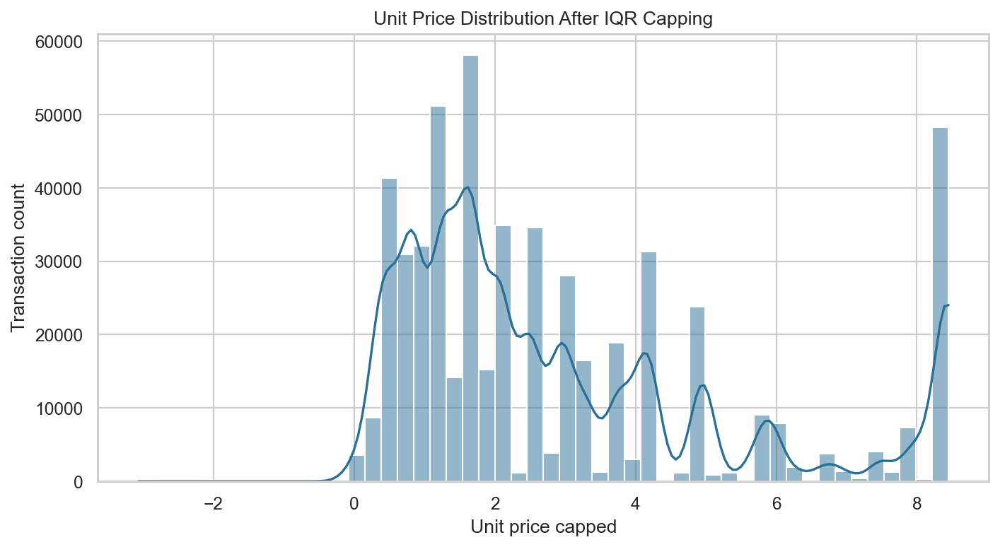
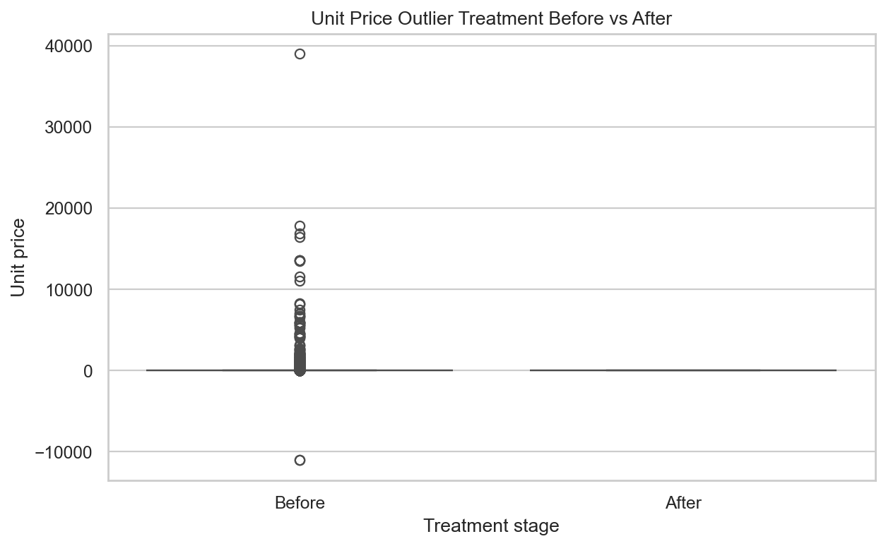
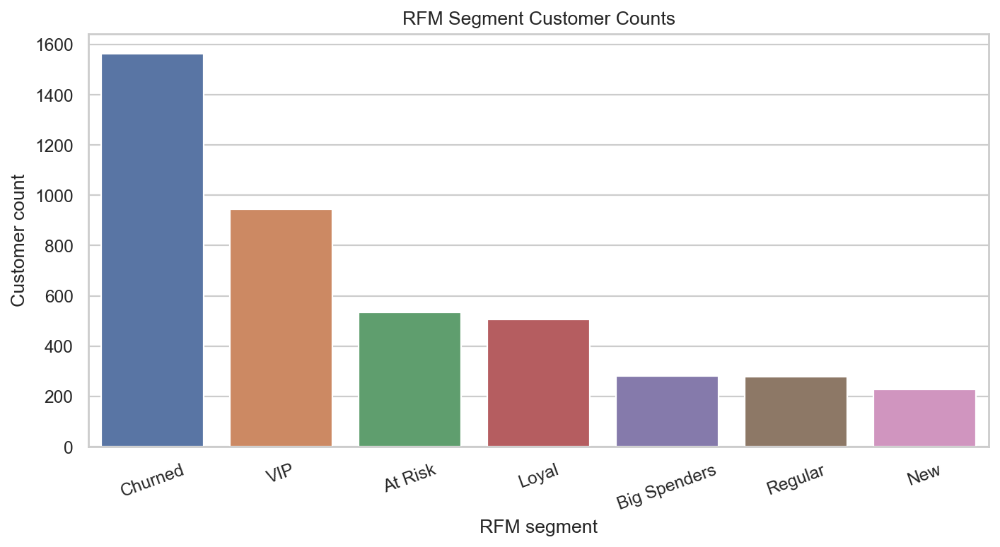
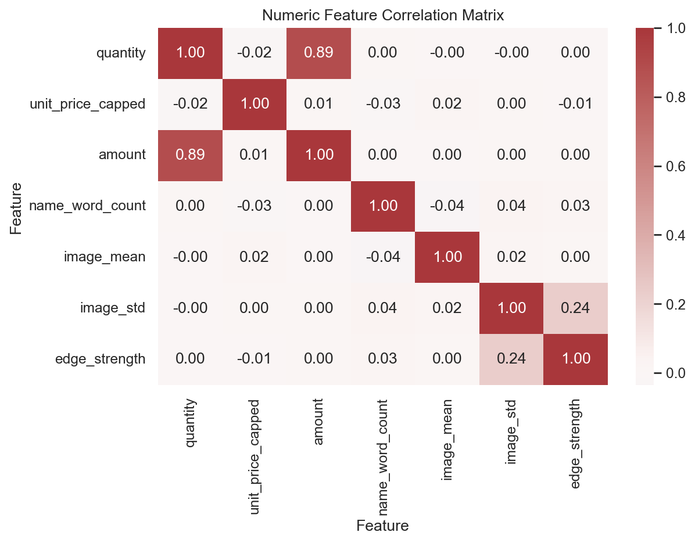
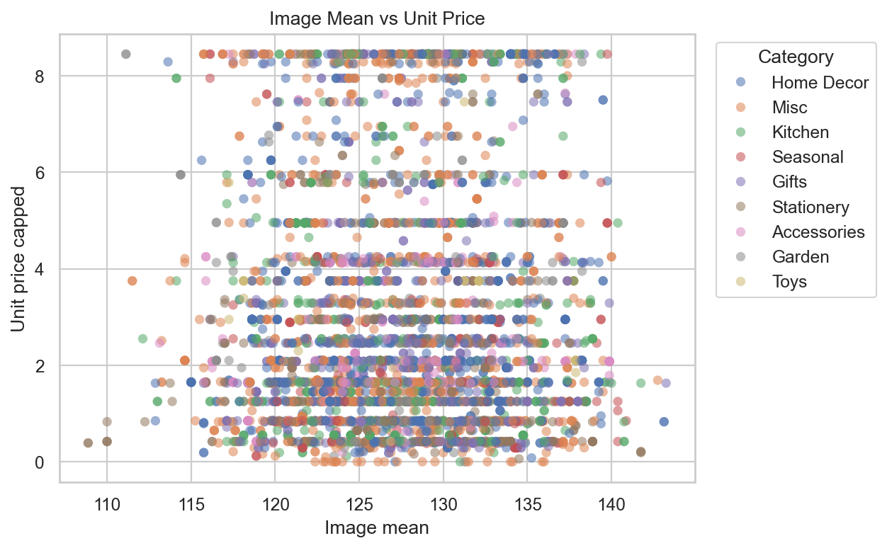
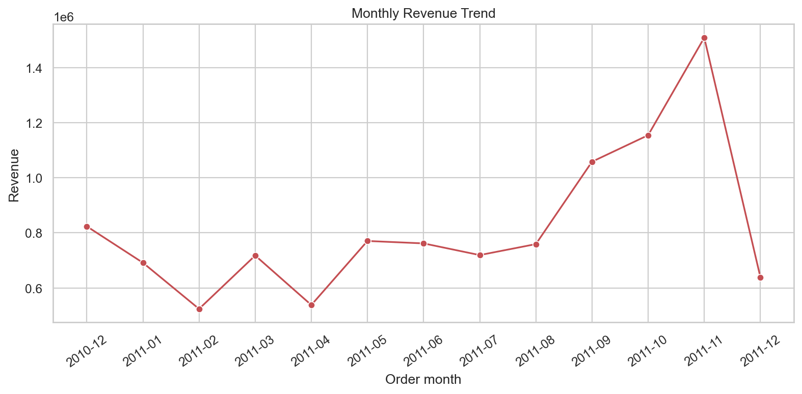
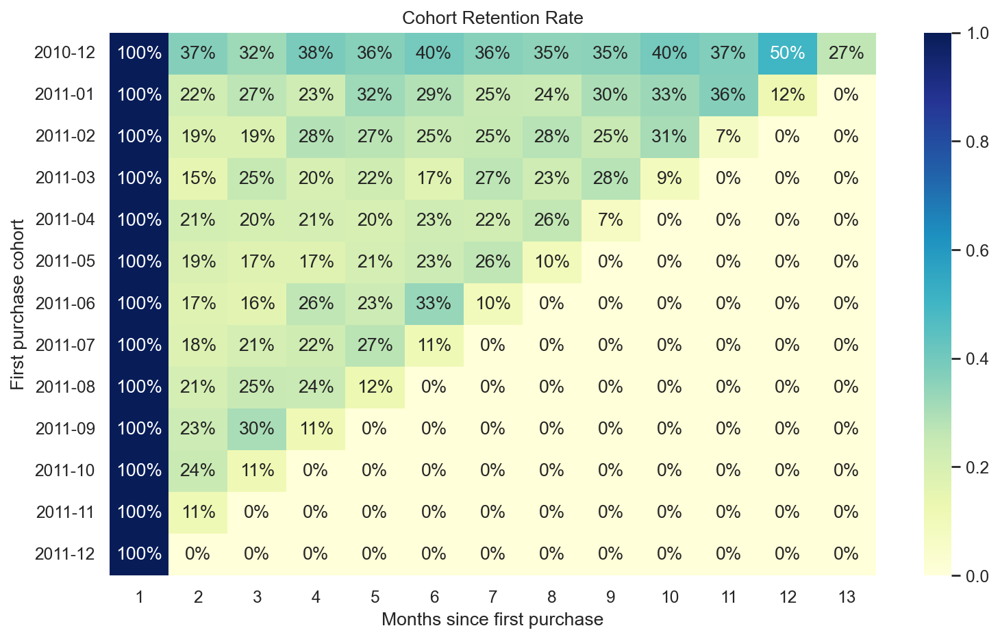

# 이커머스 멀티 모달 데이터 분석 및 RFM 비즈니스 인사이트 파이프라인

## 프로젝트 개요

이 프로젝트는 이커머스 거래 데이터를 수치형 거래 정보, 상품명 텍스트, 범주형 상품군, 날짜형 주문 이력, NumPy 이미지 배열 피처로 통합 처리하는 분석 파이프라인이다. `src/pipeline.py`의 `DataAnalyzer` 클래스가 데이터 로드, 결측치 대치, IQR 이상치 탐지, 멀티 모달 피처 엔지니어링, RFM 고객 세분화를 담당하고, `scripts/run.py`가 전체 분석과 evidence 생성을 한 번에 실행한다.

분석 결과는 `evidence/`에 저장했다. 전체 실행 기준 데이터는 541,909건, 정규화 후 기본 컬럼은 10개, 피처 엔지니어링 후 분석 컬럼은 17개이며, RFM에 사용된 고객 수는 4,338명이다. 주문 기간은 2010-12-01부터 2011-12-09까지이고 Recency 기준일은 데이터의 최종 거래일인 2011-12-09로 정의했다.

## 데이터

| 항목 | 내용 |
|---|---|
| 원천 | Kaggle `carrie1/ecommerce-data`, UCI Machine Learning Repository Online Retail 미러 |
| 원본 링크 | <https://www.kaggle.com/datasets/carrie1/ecommerce-data>, <https://archive.ics.uci.edu/dataset/352/online+retail> |
| 라이선스 | UCI Online Retail 데이터셋은 CC BY 4.0으로 제공된다. |
| 원본 크기 | 541,909행, 원본 8개 컬럼 |
| 주요 컬럼 | `InvoiceNo`, `StockCode`, `Description`, `Quantity`, `InvoiceDate`, `UnitPrice`, `CustomerID`, `Country` |
| RFM 필수 컬럼 | `customer_id`, `order_date`, `amount = quantity * unit_price` |
| 데이터 유형 | 수치형: 수량/단가/금액, 텍스트: 상품명, 범주형: 국가/파생 상품군, 날짜형: 주문일, 배열형: 상품 식별자 기반 8x8 NumPy 배열 |

원천 거래 로그에는 상품 이미지 파일이 포함되어 있지 않다. 이미지 전용 라이브러리 없이 배열 피처 처리 능력을 검증하기 위해 `StockCode`와 `Description`을 해시해 각 상품 행의 재현 가능한 8x8 그레이스케일 배열을 만들었다. 실제 서비스 적용에서는 이 부분을 카탈로그 이미지 CDN에서 읽은 NumPy 배열로 교체하면 되고, 이후 평균/표준편차/엣지 강도 계산 로직은 동일하게 사용할 수 있다.

다운로드 명령:

```bash
kaggle datasets download -d carrie1/ecommerce-data -p data/ecommerce/ --unzip
```

## 실행 방법

Python 3.12에서 검증했다. Python 3.8 이상이면 동작하도록 표준 Pandas/NumPy API만 사용했다.

```bash
python -m venv .venv
.venv\Scripts\activate
pip install -r requirements.txt
python scripts/run.py
python -m pytest tests/test_pipeline.py -q
```

Kaggle 인증 파일은 `%USERPROFILE%\.kaggle\kaggle.json` 또는 `~/.kaggle/kaggle.json`에 있어야 한다. 이미 CSV를 내려받았다면 다음처럼 다운로드를 생략할 수 있다.

```bash
python scripts/run.py --input-csv data/ecommerce/data.csv --skip-download
```

Docker 실행 예시:

```bash
docker build -t ecommerce-rfm .
docker run --rm -v %USERPROFILE%\.kaggle:/root/.kaggle ecommerce-rfm
```

주요 옵션:

| 옵션 | 기본값 | 선택 이유 |
|---|---:|---|
| `--dataset` | `carrie1/ecommerce-data` | 과제 선호 데이터셋인 UCI Online Retail Kaggle 미러를 그대로 사용한다. |
| `--max-rows` | `0` | `0`은 전체 데이터를 의미한다. 빠른 확인이 필요할 때만 50,000 같은 값으로 줄인다. |
| `--iqr-threshold` | `1.5` | Tukey fence 표준값이며, 단가 기준 Q1=1.25, Q3=4.13, 상한=8.45를 만든다. |
| `--skip-download` | 꺼짐 | CI나 오프라인 환경에서 이미 존재하는 CSV만 사용하도록 강제할 때 쓴다. |

## 파일 구조

```text
src/pipeline.py                  # DataAnalyzer OOP 파이프라인
scripts/run.py                   # 데이터 로드 -> 전처리 -> EDA/RFM -> evidence 저장 단일 진입점
notebooks/analysis_report.ipynb  # 분석 리포트 노트북
tests/test_pipeline.py           # 핵심 메서드 단위 테스트
evidence/                        # 실행 결과, 표, 그래프, 요약 로그
requirements.txt                 # 재현용 고정 의존성
Dockerfile                       # 컨테이너 실행 환경
```

## 파이프라인 설계

`DataAnalyzer`는 절차형 스크립트가 아니라 상태를 가진 재사용 가능한 클래스로 설계했다. 원본 데이터 경로와 정규화된 `df`, 이미지 텐서, RFM 결과를 객체가 보관하므로 노트북과 스크립트에서 같은 메서드를 재사용할 수 있다.

| 메서드 | 역할 | 주요 파라미터 |
|---|---|---|
| `load_data()` | Kaggle/UCI 컬럼명을 `invoice_no`, `stock_code`, `product_name`, `quantity`, `order_date`, `unit_price`, `customer_id`, `country`로 표준화하고 `amount`, `category`를 추가한다. | `nrows`, `encoding` |
| `handle_missing_values()` | 상품군별 중앙값/평균으로 수치 결측치를 대치하고 텍스트 결측치를 지정 문자열로 채운다. | `numeric_strategy`, `group_col`, `numeric_cols`, `text_fill` |
| `engineer_multimodal_features()` | 상품명 단어 수/길이와 8x8 이미지 배열의 평균, 표준편차, 엣지 강도를 생성한다. `image_col`이 있으면 `ast.literal_eval` 또는 `np.fromstring`으로 CSV 문자열 배열을 복구한다. | `image_size`, `image_col`, `store_arrays` |
| `detect_outliers()` | Q1, Q3, IQR, 하한, 상한을 직접 계산해 이상치 행과 경계를 반환한다. | `column`, `threshold` |
| `cap_outliers()` | IQR 경계로 winsorizing한 컬럼을 추가한다. | `column`, `threshold`, `output_col` |
| `calculate_rfm()` | 고객별 Recency, Frequency, Monetary와 1~5점 R/F/M 점수, 세그먼트를 계산한다. | `customer_col`, `date_col`, `amount_col`, `reference_date` |

이미지 피처는 반복문으로 행마다 처리하지 않고 `image_tensor.mean(axis=(1, 2))`, `image_tensor.std(axis=(1, 2))`, `np.diff()`를 사용해 전체 배열을 한 번에 계산한다. 텍스트 피처는 Pandas 문자열 벡터 연산으로 `name_word_count`, `name_length`를 만든다. 실제 이미지 배열 컬럼이 제공되는 경우 리스트 문자열(`"[[0, 1], [2, 3]]"`)과 공백 구분 문자열(`"0 1 2 3"`)을 모두 NumPy 배열로 복구한 뒤 동일한 벡터 연산 경로를 사용한다.

## EDA 결과와 해석

기본 구조 캡처:

- `info()` 결과: [evidence/info.txt](evidence/info.txt)
- `head()` 결과: [evidence/head.csv](evidence/head.csv)
- `describe()` 결과: [evidence/describe.csv](evidence/describe.csv)

정규화 직후 데이터는 541,909행과 10개 기본 컬럼으로 구성된다. `product_name`은 540,455건만 존재하고 `customer_id`는 406,829건만 존재한다. 고객 ID 결측은 실제 구매자 식별자가 없다는 뜻이므로 임의 대치하지 않고 RFM 계산에서 제외했다. 단가 평균은 4.61, 중앙값은 2.08로 평균이 중앙값의 2.2배이며, 고가 상품 또는 비정상 단가가 분포를 오른쪽으로 늘리는 구조다.

결측치 처리 전 전체 결측치는 136,534개, 처리 후 135,080개다. 상품명 텍스트와 그룹별 수치 결측은 대치했지만, RFM의 고객 식별 무결성을 해치지 않기 위해 `customer_id` 결측 135,080개는 유지했다. 이 결정은 고객 세분화 표본을 줄이지만, 없는 고객 ID를 추정해 구매 빈도와 금액을 왜곡하는 위험을 피한다.

IQR 단가 이상치 탐지 결과 Q1=1.25, Q3=4.13, IQR=2.88, 하한=-3.07, 상한=8.45이며, 이상치는 39,627건으로 전체의 7.31%다. 음수 단가와 38,970 같은 극단값이 함께 존재하므로 단가 분포 시각화와 상관분석에는 `unit_price_capped`를 추가해 처리 전후를 비교했다.

수치 요약:

| 변수 | 평균 | 중앙값 | 표준편차 | Q1 | Q3 | 해석 |
|---|---:|---:|---:|---:|---:|---|
| `quantity` | 9.55 | 3.00 | 218.08 | 1.00 | 10.00 | 대량 주문과 반품이 표준편차를 크게 만든다. |
| `unit_price` | 4.61 | 2.08 | 96.76 | 1.25 | 4.13 | 평균보다 중앙값이 대표값으로 더 안정적이다. |
| `amount` | 17.99 | 9.75 | 378.81 | 3.40 | 17.40 | 매출 합계 분석은 양수 거래 필터링이 필요하다. |
| `name_word_count` | 4.37 | 4.00 | 1.11 | 4.00 | 5.00 | 상품명은 대체로 4~5단어라 검색 키워드 확장 여지가 제한적이다. |
| `image_mean` | 127.44 | 127.38 | 5.41 | 123.63 | 131.13 | 상품 배열 밝기는 중앙값 주변에 밀집한다. |
| `edge_strength` | 76.59 | 76.84 | 7.57 | 71.50 | 81.82 | 이미지 배열의 경계 변화량은 상품 식별자 차이를 수치화한다. |

상관계수 해석:

- `quantity`와 `amount`의 상관계수는 0.887로 강하다. 거래 금액은 단가보다 수량 변화에 더 민감하므로 묶음 구매와 대량 주문 관리가 매출 예측에 중요하다.
- `image_std`와 `edge_strength`의 상관계수는 0.235로 약한 양의 관계다. 배열 내 픽셀 변동성이 클수록 경계 강도도 커지지만, 가격이나 금액을 직접 설명할 정도는 아니다.
- `name_word_count`와 `unit_price_capped`의 상관계수는 -0.031로 거의 0에 가깝다. 상품명 길이만으로 가격대를 추정하기 어렵고, 카테고리/브랜드/원가 같은 추가 피처가 필요하다.

## 시각화 evidence

### 차트별 제목과 축 레이블

| 차트 | 파일 | 제목 | X축 | Y축 |
|---|---|---|---|---|
| 히스토그램 | [evidence/histogram_unit_price.png](evidence/histogram_unit_price.png) | Unit Price Distribution After IQR Capping | Unit price capped | Transaction count |
| 박스플롯 | [evidence/boxplot_outlier_before_after.png](evidence/boxplot_outlier_before_after.png) | Unit Price Outlier Treatment Before vs After | Treatment stage | Unit price |
| 막대그래프 | [evidence/bar_rfm_segments.png](evidence/bar_rfm_segments.png) | RFM Segment Customer Counts | RFM segment | Customer count |
| 히트맵 | [evidence/heatmap_correlation.png](evidence/heatmap_correlation.png) | Numeric Feature Correlation Matrix | Feature | Feature |
| 산점도 | [evidence/scatter_image_mean_price.png](evidence/scatter_image_mean_price.png) | Image Mean vs Unit Price | Image mean | Unit price capped |
| 라인차트 | [evidence/line_monthly_revenue.png](evidence/line_monthly_revenue.png) | Monthly Revenue Trend | Order month | Revenue |
| 보너스 코호트 히트맵 | [evidence/bonus_cohort_retention_heatmap.png](evidence/bonus_cohort_retention_heatmap.png) | Cohort Retention Rate | Months since first purchase | First purchase cohort |

히스토그램: 수치형 단가 분포  


박스플롯: 이상치 처리 전후 비교  


막대그래프: RFM 세그먼트별 고객 수  


히트맵: 수치 피처 상관행렬  


산점도: 이미지 평균과 단가의 관계  


라인차트: 월별 매출 추세  


보너스 코호트 유지율 히트맵  


## RFM 고객 세분화

RFM은 양수 거래와 고객 ID가 있는 행만 사용했다. `Recency`는 2011-12-09에서 고객의 마지막 구매일까지의 일수, `Frequency`는 고객별 고유 송장 수, `Monetary`는 고객별 구매 금액 합계다. 점수는 1~5점이며 최근 구매일이 가까울수록, 구매 빈도와 금액이 높을수록 높은 점수를 받는다.

세그먼트 규칙:

| 세그먼트 | 규칙 | 비즈니스 의미 |
|---|---|---|
| `VIP` | R/F/M이 모두 높은 고객 | 최근성, 빈도, 금액이 모두 우수한 핵심 매출층 |
| `Loyal` | 최근성과 빈도가 높은 고객 | 반복 구매 습관이 형성된 고객 |
| `New` | 최근 구매했지만 빈도 1회인 고객 | 2회차 구매 유도 대상 |
| `Churned` | Recency 점수가 낮은 고객 | 이탈 또는 휴면 위험 고객 |
| `At Risk` | 중간 최근성이지만 빈도가 낮은 고객 | 관심 약화 조짐이 있는 고객 |
| `Big Spenders` | 금액은 높지만 빈도/최근성이 약한 고객 | 고액 구매 후 재방문이 약한 고객 |
| `Regular` | 위 조건에 속하지 않는 고객 | 일반 유지 관리 대상 |

세그먼트 결과:

| 세그먼트 | 고객 수 | 고객 비중 | 평균 Recency | 평균 Frequency | 평균 Monetary | 매출 비중 |
|---|---:|---:|---:|---:|---:|---:|
| Churned | 1,564 | 36.1% | 193.9일 | 1.98회 | 567.50 | 10.0% |
| VIP | 945 | 21.8% | 11.5일 | 11.16회 | 6,077.30 | 64.4% |
| At Risk | 535 | 12.3% | 51.1일 | 1.56회 | 623.25 | 3.7% |
| Loyal | 506 | 11.7% | 36.4일 | 5.16회 | 1,860.17 | 10.6% |
| Big Spenders | 282 | 6.5% | 102.8일 | 2.16회 | 2,860.61 | 9.1% |
| Regular | 279 | 6.4% | 15.1일 | 2.18회 | 490.32 | 1.5% |
| New | 227 | 5.2% | 17.7일 | 1.00회 | 275.76 | 0.7% |

### RFM 세그먼트별 특징과 운영 전략

| 대상 세그먼트 | 데이터 특징 | 운영 해석 | 실행 우선순위 |
|---|---|---|---|
| VIP | 고객 945명, 매출 비중 64.4%, 평균 Frequency 11.16회 | 고객 수는 전체의 21.8%지만 매출 의존도가 가장 크다. 혜택 축소나 경쟁사 이동이 전체 매출에 즉시 영향을 줄 수 있다. | 최우선 유지: 전용 멤버십, 신상품 선공개, 무료 배송, 재입고 우선 알림 |
| Churned | 고객 1,564명, 고객 비중 36.1%, 평균 Recency 193.9일 | 규모는 가장 크지만 최근성이 낮다. 재활성화 비용 대비 반응률을 엄격히 봐야 한다. | 선별 윈백: 마지막 구매 카테고리 기반 쿠폰, 무응답 고객 이탈 사유 설문 |
| Loyal | 고객 506명, 평균 Frequency 5.16회, 매출 비중 10.6% | VIP보다 금액은 낮지만 반복 구매 습관이 형성되어 있다. 교차 판매로 객단가를 키울 수 있다. | 성장 관리: 반복 구매 상품 추천, 적립 혜택, 묶음 구매 제안 |
| Big Spenders | 고객 282명, 평균 Monetary 2,860.61, 평균 Recency 102.8일 | 고액 구매력이 있으나 방문 주기가 길다. B2B성 대량 구매나 이벤트성 구매 가능성을 분리해야 한다. | 고액 복귀: 프리미엄 번들, 대량 구매 견적, 전담 상담 링크 |
| New | 고객 227명, 평균 Frequency 1.00회, 평균 Recency 17.7일 | 최근 유입됐지만 아직 반복 구매가 검증되지 않았다. 첫 구매 경험 직후의 접점이 중요하다. | 2회차 전환: 첫 구매 후 7일 이내 보완 상품 추천과 배송비 쿠폰 |
| At Risk | 고객 535명, 평균 Frequency 1.56회, 평균 Recency 51.1일 | 완전 이탈 전 단계로 볼 수 있다. 저비용 알림과 가격 민감도 테스트가 적합하다. | 조기 방어: 가격 인하 알림, 재입고 알림, 소액 쿠폰 A/B 테스트 |
| Regular | 고객 279명, 평균 Monetary 490.32, 매출 비중 1.5% | 최근성은 좋지만 금액 기여가 작다. 과도한 할인보다 기본 추천 품질 개선이 적합하다. | 저비용 유지: 일반 추천 영역, 카테고리 뉴스레터 |

## 비즈니스 인사이트

### 인사이트 1: VIP 매출 집중도가 매우 높다

(근거) VIP는 945명으로 전체 고객의 21.8%지만 매출 비중은 64.4%다. 평균 구매 빈도는 11.16회, 평균 구매 금액은 6,077.30으로 전체 세그먼트 중 가장 높다. 근거 파일은 [evidence/rfm_segment_summary.csv](evidence/rfm_segment_summary.csv)와 [RFM 막대그래프](evidence/bar_rfm_segments.png)다.

(실행) VIP 대상 전용 멤버십, 신상품 선공개, 무료 배송, 재입고 우선 알림을 제공한다. 실행 방식은 최근 구매 카테고리 기반 개인화 추천과 월 1회 VIP 전용 쿠폰을 결합하는 것이다. 기대 효과는 핵심 매출층의 이탈 방지와 반복 구매 빈도 유지다.

(검증) 추가로 필요한 데이터는 캠페인 노출/클릭/쿠폰 사용 로그와 상품별 마진이다. VIP 혜택이 기존 구매를 할인 구매로 대체한다면 매출 비중은 유지되어도 이익률이 악화될 수 있다.

### 인사이트 2: Churned 고객 규모가 가장 크다

(근거) Churned는 1,564명으로 전체 고객의 36.1%이며 평균 Recency가 193.9일이다. 평균 구매 빈도는 1.98회로 낮지만 과거 매출 비중은 10.0%이므로 완전히 무시하기에는 규모가 크다. 근거 파일은 [evidence/rfm_segment_summary.csv](evidence/rfm_segment_summary.csv)와 [월별 매출 라인차트](evidence/line_monthly_revenue.png)다.

(실행) Churned 대상 윈백 캠페인을 실행한다. 마지막 구매 카테고리와 유사한 상품을 묶어 14일 한정 재구매 쿠폰을 발송하고, 반응이 없는 고객은 설문형 이탈 사유 수집으로 전환한다. 기대 효과는 휴면 고객의 일부 재활성화와 이탈 원인 데이터 확보다.

(검증) 추가로 필요한 데이터는 이메일/SMS 수신 동의, 캠페인 도달률, 이탈 사유 설문, 경쟁사 가격 정보다. 계절 상품 구매자가 자연스럽게 긴 구매 주기를 갖는 경우에는 Churned 라벨이 실제 이탈을 과대평가할 수 있다.

### 인사이트 3: New 고객의 2회차 구매 전환이 약하다

(근거) New는 227명, 고객 비중 5.2%이며 평균 Frequency가 정확히 1.00회다. 평균 Recency는 17.7일로 최근 유입 고객이지만 매출 비중은 0.7%에 그친다. 근거 파일은 [evidence/rfm_segment_summary.csv](evidence/rfm_segment_summary.csv)와 [코호트 유지율 히트맵](evidence/bonus_cohort_retention_heatmap.png)다.

(실행) New 대상 첫 구매 후 7일 이내 온보딩 캠페인을 실행한다. 첫 구매 상품군과 함께 자주 구매되는 저가 보완 상품을 추천하고, 두 번째 주문에만 적용되는 배송비 쿠폰을 제공한다. 기대 효과는 1회성 구매자를 Loyal 후보군으로 이동시키는 것이다.

(검증) 추가로 필요한 데이터는 유입 채널, 첫 구매 할인 여부, 장바구니 이탈 로그다. 첫 구매가 선물 시즌이나 일회성 이벤트에서 발생했다면 2회차 구매율이 낮은 것이 캠페인 문제가 아닐 수 있다.

### 인사이트 4: Big Spenders는 고액이지만 최근성이 낮다

(근거) Big Spenders는 282명으로 6.5%에 불과하지만 평균 Monetary는 2,860.61이고 매출 비중은 9.1%다. 평균 Recency는 102.8일로 VIP보다 훨씬 길다. 근거 파일은 [evidence/rfm_segment_summary.csv](evidence/rfm_segment_summary.csv)와 [상관 히트맵](evidence/heatmap_correlation.png)다.

(실행) Big Spenders 대상 고액 구매 복귀 캠페인을 실행한다. 이전 주문 금액대와 유사한 프리미엄 번들, 대량 구매 견적, 전담 상담 링크를 제공한다. 기대 효과는 낮은 빈도의 고액 고객을 VIP 또는 Loyal로 전환하는 것이다.

(검증) 추가로 필요한 데이터는 반품 여부, 기업/개인 고객 구분, 상품별 재구매 주기다. 고액 구매가 이벤트성 대량 구매라면 단기 재구매 캠페인의 효율이 낮을 수 있다.

## 위협 모델과 품질 리스크

- 고객 ID 결측을 임의로 채우면 서로 다른 고객의 거래가 합쳐져 Frequency와 Monetary가 부풀려진다. 그래서 결측 고객 ID는 RFM에서 제외했다.
- 음수 수량과 음수 금액은 취소/반품을 의미할 수 있다. RFM은 양수 거래만 사용하고, EDA에는 원본 분포와 이상치 처리 결과를 모두 남겼다.
- 기본 상품 이미지 배열은 실제 사진이 아니라 원천 상품 식별자에서 만든 재현 가능한 배열 피처다. 가격 예측이나 시각 품질 평가에는 사용할 수 없고, 실제 이미지가 제공되면 `image_col`에 배열 문자열 또는 NumPy 배열을 넣어 같은 피처 추출 메서드로 대체해야 한다.
- 단가 이상치 상한 8.45는 전체 상품을 하나의 분포로 본 값이다. 카테고리별 고가 상품이 많은 실제 서비스에서는 카테고리별 IQR 또는 마진 기반 임계값을 별도로 검증해야 한다.
- Recency 기준일은 데이터 최종 거래일이다. 운영 환경에서는 분석 실행일 또는 캠페인 발송일을 기준으로 고정해야 세그먼트가 시간에 따라 일관된다.

## 트러블슈팅

| 증상 | 원인 | 조치 |
|---|---|---|
| Kaggle 401/403 오류 | 인증 파일 누락 또는 권한 문제 | `~/.kaggle/kaggle.json` 권한과 토큰을 확인하고 `kaggle datasets list`로 인증을 먼저 검증한다. |
| `No CSV found` | `--skip-download`를 켰지만 데이터가 없음 | `python scripts/run.py`로 다운로드를 허용하거나 `--input-csv`에 실제 CSV 경로를 전달한다. |
| 한글 폰트 경고 | 실행 환경에 한글 Matplotlib 폰트가 없음 | 그래프 제목/축은 ASCII로 저장되므로 결과 해석에는 영향이 없다. |
| 메모리 부족 | 전체 541,909행 이미지 텐서 생성 | `python scripts/run.py --max-rows 50000`으로 샘플 실행 후 전체 실행은 메모리가 큰 환경에서 수행한다. |
| `pytest` 명령을 못 찾음 | 실행 파일 PATH 미등록 | `python -m pytest tests/test_pipeline.py -q`를 사용한다. |

## 검증 결과

최신 실행 명령:

```bash
python scripts/run.py --max-rows 0
python -m pytest tests/test_pipeline.py -q
```

생성된 핵심 evidence:

| 파일 | 내용 |
|---|---|
| [evidence/run_summary.txt](evidence/run_summary.txt) | 전체 실행 요약, 수치 통계, RFM 세그먼트, 상관행렬 |
| [evidence/analysis_summary.json](evidence/analysis_summary.json) | README 수치 근거로 사용한 구조화 요약 |
| [evidence/numeric_summary.csv](evidence/numeric_summary.csv) | 평균, 중앙값, 표준편차, 사분위수 |
| [evidence/correlation_matrix.csv](evidence/correlation_matrix.csv) | 상관계수 행렬 |
| [evidence/rfm_customers.csv](evidence/rfm_customers.csv) | 고객별 RFM 점수와 세그먼트 |
| [evidence/rfm_segment_summary.csv](evidence/rfm_segment_summary.csv) | 세그먼트별 고객 수, 평균 RFM, 매출 비중 |
| [evidence/chart_inventory.csv](evidence/chart_inventory.csv) | 6종 차트의 제목, 축 레이블, 해석 |
| [evidence/test_output.txt](evidence/test_output.txt) | `DataAnalyzer` 단위 테스트 실행 결과 |
| [notebooks/analysis_report.ipynb](notebooks/analysis_report.ipynb) | 마크다운 해석과 재현 코드가 포함된 분석 노트북 |

단위 테스트는 `DataAnalyzer`의 컬럼 정규화, 그룹별 결측치 대치, IQR 이상치 탐지, NumPy 이미지 피처, CSV 이미지 배열 문자열 복구, RFM 세그먼트 산출, 노트북 필수 해석 섹션, README 인사이트 구조를 검증한다. 실행 결과는 8개 테스트 통과다.
